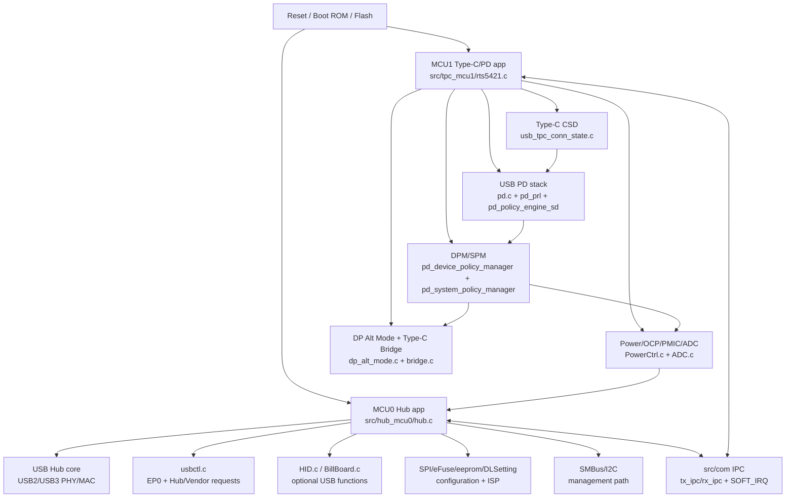
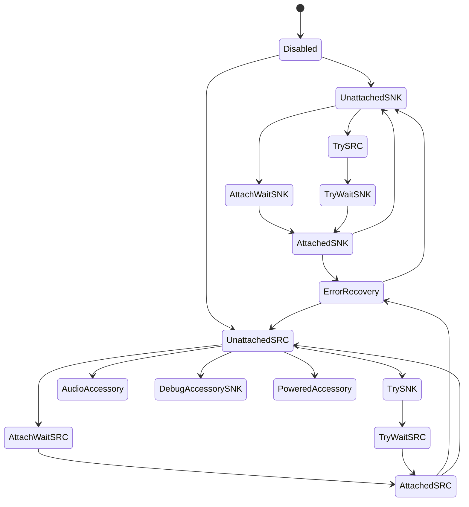
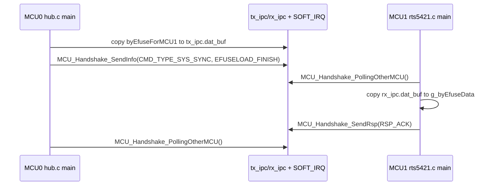

# RL6551_branch Code Analyzer 单文件报告

- 工程路径：`D:\CodeX\Firmware\RL6551_branch`
- 分析工具：`Code Analyzer` / `$code-analyzer`
- 生成日期：2026-06-04
- 静态扫描结果：识别 `1407` 个 C 函数/符号；本工程未发现 RTL 源文件。

> 本报告前半部分是人工整理后的架构和运行 flow，后半部分附上 Code Analyzer 生成的完整入口调用图、依赖图和函数目录，方便继续查每个函数的行号、功能提示和直接调用关系。

## 1. 一句话概括

`RL6551_branch` 是 Realtek RL6551/RTS542x 系列 USB Hub + USB Type-C/USB PD 双 MCU 固件工程。MCU0 负责 USB Hub、USB2/USB3 PHY/MAC、EP0 控制传输、Hub/HID/Billboard、SPI/eFuse/ISP、SMBus 等 Hub 侧功能；MCU1 负责 Type-C 连接状态机、USB PD 协议栈、DPM/SPM、VBUS/PMIC/OCP、DP Alt Mode 和 Type-C Bridge。两个 MCU 通过 `src/com` 中的共享 IPC buffer 与 SOFT_IRQ/PFI/INT0/INT1 机制同步。

## 2. 工程目录内容

| 路径 | 内容 | 作用 |
| --- | --- | --- |
| `src/com` | `com.h`、`com_reg.h`、`com.c`、`com_mem_handshake.c`、`com_mem_direct.c`、`Debug.h` | 公共宏、寄存器地址、调试宏、双 MCU IPC/handshake、共享 memory/direct access。 |
| `src/hub_mcu0` | `hub.c`、`usbctl.c`、`HID.c`、`BillBoard.c`、`SMBus.c`、`I2C.c`、`SPI.c`、`eeprom.c`、`eFuse.c` 等 | MCU0 Hub 固件主体，负责 USB Hub 枚举、控制传输、USB2/USB3 事件、HID/Billboard、存储和配置读取。 |
| `src/tpc_mcu1` | `rts5421.c`、`usb_tpc_conn_state.c`、`pd*.c`、`PowerCtrl.c`、`ADC.c`、`dp_alt_mode.c`、`bridge.c`、`SMBus.c` 等 | MCU1 Type-C/PD 固件主体，负责 CC 状态机、PD PRL/PE/DPM/SPM、Power/OCP/PMIC、Alt Mode/Bridge。 |
| `TapeOutRomCode` | `RL6551_B/C.bin`、`.hex`、`.map` | 已产出的 ROM/TapeOut binary、Intel HEX 和 map 文件，bin 大小为 64KB。 |
| `Utilities` | 多个 `.exe`、`nmake.exe`、`build_6551.exe`、bin 转换/签名/CRC 工具 | 构建、打包、bin 转换、tag、签名/CRC/认证检查等工具，未附源码。 |
| `docs/rl6551-analysis` | 旧分析文档、函数索引、生成脚本 | 已存在的分析资料，本次报告重新整合为单文件。 |

文件类型统计：`42` 个 `.h`、`41` 个 `.c`、`2` 个 `.A51`、`2` 个 `.LST`、`2` 个 `.map`、`2` 个 `.hex`、`3` 个 `.bin`、`10` 个 `.exe`，另有少量 Markdown/JSON/Python 文档产物。

## 3. 当前配置特征

关键配置来自 `src/com/com.h`：

| 配置 | 当前值/状态 | 含义 |
| --- | --- | --- |
| `SYS_APP_TAG` | `SYS_APP_DUAL_BANK_TPC_HUB_128K_BINARY` | 双 bank、TPC + Hub、128K 应用镜像。 |
| `_IC_CODE_` | enabled | 面向实际 IC 代码路径。 |
| `_ROM_CODE_` | disabled | 当前主要走 Flash/download application 路径，不是纯 ROM 分支。 |
| `_RTS5423_DEMO_BOARD_` | enabled | 当前板型为 RTS5423 demo board，QFN88，UFP Type-C，DFP1 Type-C，DFP2/3/4 Type-A。 |
| `_ISP_VALIDATION_CMD_EN_` | enabled | 支持 ISP validation command。 |
| `_INFORM_HUB_PWR_STS_EN_` | enabled | MCU1 向 Hub MCU0 通知电源状态。 |
| `_TPC_PORT_BC_FUNC_` | enabled | TPC port BC/charging 相关功能打开。 |
| `_DEMO_BOARD_USING_EXT_U3MUX_` | enabled | Demo board 使用外部 USB3 mux。 |
| `_DS_USB_CTL_PATCH_FOR_MUX_` | enabled | 针对 mux/下行口控制的 patch。 |

## 4. 总体架构



静态符号分布：

| 模块 | 函数数 | 说明 |
| --- | ---: | --- |
| `src/tpc_mcu1` | 1018 | Type-C/PD/Power/Bridge 是最大模块，PD PE 状态函数最多。 |
| `src/hub_mcu0` | 375 | Hub、USB 控制传输、HID/Billboard、存储/配置。 |
| `src/com` | 14 | 公共 IPC、寄存器和直接内存访问。 |

Top 源文件：`pd_policy_engine_sd.c` 381 个函数，`usbctl.c` 116 个函数，`usb_tpc_conn_state.c` 108 个函数，`hub.c` 98 个函数，`rts5421.c` 69 个函数。

## 5. 启动与运行 Flow

### 5.1 MCU0 Hub 启动 flow

入口：`src/hub_mcu0/hub.c:main()`，函数范围约 `907-2081`。

1. 关闭 watchdog：`XBYTE[WTDG_CTL] = WDOG_DISABLE`。
2. 非 ROM 路径执行 `mcu1_boot_ctrl()`，控制 MCU1 boot 起始地址/clock。
3. 调用 `InitHub()`：内部调用 `InitMCU()`、`InitGlobalVariable(INIT_SYS_VARIABLE)`、`InitSys()`、`smbus_init()` 等。
4. 非 ROM 分支对 USB2 PHY/USB3 power cut 相关寄存器做 patch。
5. 双 MCU sync point 1：MCU0 将 `byEfuseForMCU1` 拷贝到 `tx_ipc.dat_buf`，调用 `MCU_Handshake_SendInfo(CMD_TYPE_SYS_SYNC, SYS_SYNC_CHECKMODE_EFUSELOAD_FINISH, ...)` 通知 MCU1，再用 `MCU_Handshake_PollingOtherMCU()` 等待 ACK。
6. 判断 VBUS/local power 状态：
   - VBUS on：进入 `HUB_USB_FUNCTION_MODE`，初始化 USB3/USB2 变量，必要时启用 CDP charging，然后调用 `InitUSBFunction()`。
   - VBUS off：进入 `HUB_CHARGER_MODE`，做 power cut、OCP 控制和 charging mode 初始化。
7. USB function mode 下使能中断 `IE = 0x8F`，进入 `while(1)` 主循环。

### 5.2 MCU0 主循环职责

MCU0 的 `while(1)` 不是协议主状态机，而是 Hub 运行态事件维护线程，核心处理：

- GPIO 控制 Billboard connect。
- 动态启停 DSP port。
- HID/ISP ECDSA 验证任务。
- SuperSpeed U3 suspend/resume：`UP_LTSSM_IRQ0 & LTSSM_ENTER_U3_INT` 后调用 `USBProSuspend()` / `USBProResume()`。
- SuperSpeed disconnect：清 `DEV_DISCONNECT_INT`，reset EP0/EPB，清 remote wakeup，重新初始化 USB3 变量。
- Remote wakeup：`CheckRemoteWakeupEvent()` 后发送 Function Wake notification。
- SuperSpeed connect：清 error counter，恢复 watchdog。
- USB2 suspend/resume/reset：处理 `HS_USP_IRQ`。
- Charging CDP 根据 local power/OCP 开关。
- Dlink 条件判断和必要时通过 watchdog reset 重启。

### 5.3 MCU1 Type-C/PD 启动 flow

入口：`src/tpc_mcu1/rts5421.c:main()`，函数范围约 `1326-1464`。

1. 关闭 watchdog。
2. 调用 `sys_init_app_mode()`，根据 ROM/Flash、低功耗、board mode 初始化应用模式。
3. 调用 `sys_share_mode_select()`，配置 TXD/SMBus/I2C share pin。
4. 调用 `sys_init_mcu()`，配置 8051 timer、INT0/INT1 priority 等。
5. 双 MCU sync point 1：调用 `MCU_Handshake_PollingOtherMCU()` 等待 MCU0 eFuse 数据；若 `_SYS_EFUSE_LOAD_EN_` 打开则拷贝 `rx_ipc.dat_buf` 到 `g_byEfuseData`；再 `MCU_Handshake_SendRsp(RSP_ACK, ...)` 回 ACK。
6. 调用 `sys_init_rts5421()`：初始化 port index stack、切高频、全局变量、系统配置、DP Alt lane、power detect/control、SMBus/I2C，随后遍历端口调用 `tpc_init_csd(INIT_CSD)`。
7. `sys_init_rts5421()` 末尾使能 `IE = 0x8F` 和 `EPFI = 1`，进入主循环。

### 5.4 MCU1 主循环职责

MCU1 每轮主循环先处理 SMBus/I2C slave，再遍历 `MAX_PORT`，每个端口先 `switch_xdata_reg_bank(i)`，再运行：

- `device_policy_manager_pro()`：DPM 主线程，提交 DPM -> PE 请求，并消费 PE -> DPM 响应。
- `pm_discharge_vbus_thread()`：VBUS discharge。
- `pm_ocp_inform_hub_thread()`：OCP 事件通知 Hub。
- `hub_pwr_sts_based_dsp_ctrl_pro()`：依据 Hub power status 控制 DSP。
- UFP 端口：`usb_BB_connection_thread()` 和 `sys_check_inform_hub_status()`。
- DFP 端口：`dsp_tpc_port_power_ctrl()`。
- `dpm_src_set_sink_tx_ok_thread()`：PD3.0 Source SinkTxOK 延迟恢复。
- 端口循环外：`system_policy_manager_pro()`、`dfp_pwr_cycle_when_ufp_conn_sts_chg()`、`typec_bridge_pro()`。

## 6. 中断 Flow

### 6.1 MCU0 ISR

| ISR | 位置 | 功能 |
| --- | --- | --- |
| `interrupt0()` | `src/hub_mcu0/hub.c:2366` | 处理 SMBus write、IPC INT0、VBUS/power IRQ、USB3 LTSSM/LMP、hot reset、downstream port IRQ 等。 |
| `interrupt1()` | `src/hub_mcu0/hub.c:3779` | 处理 USB control path，尤其 SS/HS EP0 setup，并分发到 `USB_SS_ProSetupPKT()`、`USB_HS_ProSetupPKT()`、`USB_BillBoard_HS_ProSetupPKT()`、`USB_HID_ProSetupPKT()`。 |
| `sys_int_pfi_isr()` | `src/hub_mcu0/hub.c:4216` | 高优先级 PFI，主要处理 handshake PFI，调用 `pfi_ipc_handler()`。 |
| `Timer_0_Int()` | `src/hub_mcu0/hub.c:10758` | 10ms timeout，服务 `WaitTimeOut()` 等计时逻辑。 |
| `Timer_1_Int()` | `src/hub_mcu0/hub.c:10892` | watchdog reset、周期计数、LED/charging/delay task。 |
| `Timer_2_Int()` | `src/hub_mcu0/hub.c:11405` | 可选 50ms/resume patch 相关计时。 |

### 6.2 MCU1 ISR

| ISR | 位置 | 功能 |
| --- | --- | --- |
| `sys_int_pfi_isr()` | `src/tpc_mcu1/rts5421.c:540` | 最高优先级；处理 PE Timer2 tick、IPC PFI、FRS/power-loss fast path、SOP'/idle k-code patch 等。 |
| `sys_int0_isr()` | `src/tpc_mcu1/rts5421.c:726` | 遍历有 INT0 事件的端口，切 bank 后调用 `tpc_conn_state_machine()` 和 `pd_interrupt_pro()`，随后处理 OCP、power monitor、PMIC alert、IPC INT0。 |
| `sys_int1_isr()` | `src/tpc_mcu1/rts5421.c:883` | 遍历 INT1 端口，UFP 端口运行 `dp_alt_sts_pro()`，随后处理 IPC INT1 和 Type-C Bridge soft IRQ。 |
| `sys_timer0_isr()` | `src/tpc_mcu1/rts5421.c:1008` | timeout/system wait 计数。 |
| `sys_timer1_isr()` | `src/tpc_mcu1/rts5421.c:1067` | PD/TPC/PM delay 计数、watchdog、hub bus power status、power cut thread 等周期任务。 |

## 7. 关键调用关系示意

```mermaid
flowchart TD
    HMain["MCU0 main()"] --> Mcu1Boot["mcu1_boot_ctrl()"]
    HMain --> InitHub["InitHub()"]
    InitHub --> InitMCU["InitMCU()"]
    InitHub --> InitSys["InitSys()"]
    HMain --> HSync["MCU_Handshake_SendInfo(): eFuse sync"]
    HSync --> HPoll["MCU_Handshake_PollingOtherMCU()"]
    HMain --> VbusDecision["VBUS/local power decision"]
    VbusDecision -->|"VBUS on"| InitUsb["InitUSBFunction()"]
    InitUsb --> Usb2["InitUSB2PHY() + InitUSB20Controller()"]
    InitUsb --> Usb3["InitUSB3PHY() + InitUSB30Controller() + ConnectToUSB3()"]
    VbusDecision -->|"VBUS off"| Charger["InitChargingMode() + power cut"]
    HMain --> HLoop["MCU0 while(1)"]

    TMain["MCU1 main()"] --> AppMode["sys_init_app_mode()"]
    TMain --> Share["sys_share_mode_select()"]
    TMain --> TInitMcu["sys_init_mcu()"]
    TMain --> TPoll["wait MCU0 eFuse sync"]
    TPoll --> TRsp["MCU_Handshake_SendRsp(ACK)"]
    TMain --> Init5421["sys_init_rts5421()"]
    Init5421 --> InitVars["sys_init_global_variable()"]
    Init5421 --> InitSystem["sys_init_system()"]
    Init5421 --> PMCfg["pm_power_control_configure() / pm_power_detect_configure()"]
    Init5421 --> TpcInit["tpc_init_csd() per port"]
    TMain --> TLoop["MCU1 while(1)"]

    HSync <--> IPC["tx_ipc/rx_ipc + SOFT_IRQ"]
    TPoll <--> IPC
    HInt0["MCU0 interrupt0()"] --> IPC
    TInt0["MCU1 sys_int0_isr()"] --> IPC

    TInt0 --> TPCSM["tpc_conn_state_machine()"]
    TInt0 --> PDIRQ["pd_interrupt_pro()"]
    PDIRQ --> PDEvent["pd_event_pro()"]
    PDIRQ --> Chunk["pd_chunked_state_diagram()"]
    PDIRQ --> PE["pd_pesd_state_diagram()"]
    TLoop --> DPM["device_policy_manager_pro()"]
    DPM --> Submit["dpm_req_pe_submit_req_pro()"]
    DPM --> Rsp["dpm_req_pe_rcv_rsp_pro()"]
    TLoop --> SPM["system_policy_manager_pro()"]
    TLoop --> Bridge["typec_bridge_pro()"]
```



## 8. Type-C / PD 详细 Flow

### 8.1 Type-C CSD 状态机

`sys_int0_isr()` 在当前 port 的 INT0/ADC comparator 触发后调用 `tpc_conn_state_machine()`。该函数根据 `g_byUSBTPCCSD` 分派到：

- `tpc_csd_disabled()`
- `tpc_csd_error_recovery()`
- `tpc_csd_unattached_snk()` / `tpc_csd_attach_wait_snk()` / `tpc_csd_attached_snk()`
- `tpc_csd_unattached_src()` / `tpc_csd_attach_wait_src()` / `tpc_csd_attached_src()`
- `tpc_csd_try_src()` / `tpc_csd_try_wait_snk()` / `tpc_csd_try_snk()` / `tpc_csd_try_wait_src()`
- `tpc_csd_audio_accessory()`、`tpc_csd_debug_accessory_snk()`、`tpc_csd_powered_accessory()` 等 accessory/debug 状态。



### 8.2 PD interrupt dispatcher

`pd_interrupt_pro()` 一次最多处理 `PD_EVENT_PRO_CNT = 3` 轮事件：

1. `pd_event_pro()`：从硬件 IRQ 和 soft event 中取一个 PD event。
2. `pd_chunked_state_diagram()`：处理 PD3.0 chunked extended message。
3. 若 `g_ePDEvent != PD_EVENT_INVALID`，进入 `pd_pesd_state_diagram()`。

`pd_event_pro()` 的事件优先级大致为：Hard Reset -> FRS detect -> Cable Reset -> Rx Msg -> Tx End -> SenderResponseTimeout -> PE Timer timeout -> DPM request -> VBUS power good -> Timer1 timeout。

### 8.3 PD Policy Engine 状态分发

`pd_pesd_state_diagram()` 根据 `g_stpesd.pesd_main_state` 分发：

| PE main state | 分发函数 |
| --- | --- |
| `PE_READY` | `pd_pesd_src_ready()` 或 `pd_pesd_snk_ready()` |
| `PE_PWR_NEGO` | `pd_pesd_src_pwr_nego()` 或 `pd_pesd_snk_pwr_nego()` |
| `PE_PR_SWAP` / `PE_DR_SWAP` / `PE_VCONN_SWAP` | 对应 swap 状态函数 |
| `PE_SOFT_RST` / `PE_HARD_RST` | soft/hard reset 处理 |
| `GET/GIVE_SRC_CAP`、`GET/GIVE_SNK_CAP` | capability 交换 |
| `PE_VDM_IN_PRO` | `pd_pesd_vdm_state_diagram()` |
| `PE_DFP_TO_CB_IN_PRO` | `pd_pesd_sopp_state_diagram()` |
| PD3.0 extended states | status、battery、manufacturer info、security、PPS、country、revision 等 |
| PDFU states | `pd_pesd_pdfu_initiator()` / `pd_pesd_pdfu_responder()` |

## 9. IPC / 双 MCU 同步

`src/com/com_mem_handshake.c` 定义共享 IPC 变量：

- `tx_ipc` 位于 `SENT_IRQ_TYPE_BASE`
- `rx_ipc` 位于 `RCV_IRQ_TYPE_BASE`

核心函数：

| 函数 | 作用 |
| --- | --- |
| `MCU_Handshake_SendInfo()` | 将 command 写入 `tx_ipc`，设置目标 MCU 的 soft IRQ enable，最后写 `SOFT_IRQ_CTL` 触发。 |
| `MCU_Handshake_SendRsp()` | 将 response 写入 `tx_ipc`，复用当前收到的 command 信息，触发 soft IRQ。 |
| `MCU_Handshake_PollingOtherMCU()` | 轮询 `SOFT_IRQ & IRQ_RECEIVED_FOR_HANDSHAKE`，等待另一 MCU 同步完成，默认约 2.5s。 |
| `pfi_ipc_handler()` | PFI 通道的 IPC handler。 |
| `int0_ipc_handler()` | INT0 通道 IPC handler，收到 `CMD_TYPE_SYS_SYNC` 时调用 `int0_ipc_cmd_sync_pro()`。 |
| `int1_ipc_handler()` | INT1 通道 IPC handler。 |

启动同步链路：



## 10. 关键函数索引

| 函数 | 位置 | 功能 | 直接调用重点 |
| --- | --- | --- | --- |
| `main` | `src/hub_mcu0/hub.c:907` | MCU0 入口，初始化 Hub、同步 MCU1、判断 VBUS/local power、进入 USB function 或 charging mode。 | `mcu1_boot_ctrl`、`InitHub`、`MCU_Handshake_SendInfo`、`MCU_Handshake_PollingOtherMCU`、`InitUSBFunction`、`CheckRemoteWakeupEvent` |
| `InitHub` | `src/hub_mcu0/hub.c:4328` | MCU0 系统初始化入口。 | `InitMCU`、`InitGlobalVariable`、`InitSys`、`smbus_init` |
| `InitUSBFunction` | `src/hub_mcu0/hub.c:5647` | 初始化 USB2/USB3 PHY、controller、interrupt、calibration，最后连接 USB3。 | `InitUSB2PHY`、`InitUSB20Controller`、`InitUSB3PHY`、`InitUSB30Controller`、`ConnectToUSB3` |
| `interrupt0` | `src/hub_mcu0/hub.c:2366` | MCU0 外部中断 0，Hub/power/USB3 事件。 | `SMBusTransferPro`、`int0_ipc_handler`、`InitGlobalVariable`、`InitInt` |
| `interrupt1` | `src/hub_mcu0/hub.c:3779` | MCU0 外部中断 1，USB EP0 setup。 | `USB_SS_ProSetupPKT`、`USB_HS_ProSetupPKT`、`USB_BillBoard_HS_ProSetupPKT`、`USB_HID_ProSetupPKT` |
| `main` | `src/tpc_mcu1/rts5421.c:1326` | MCU1 入口，初始化 app/share/mcu、等待 MCU0 eFuse sync、初始化 Type-C/PD，进入 per-port loop。 | `sys_init_app_mode`、`sys_share_mode_select`、`sys_init_mcu`、`sys_init_rts5421`、`device_policy_manager_pro`、`system_policy_manager_pro`、`typec_bridge_pro` |
| `sys_init_rts5421` | `src/tpc_mcu1/rts5421.c:1849` | MCU1 系统初始化，配置全局变量、power、SMBus/I2C、每端口 CSD。 | `sys_init_global_variable`、`sys_init_system`、`pm_power_control_configure`、`pm_power_detect_configure`、`tpc_init_csd` |
| `sys_int0_isr` | `src/tpc_mcu1/rts5421.c:726` | MCU1 INT0，Type-C/PD 主中断路径。 | `tpc_conn_state_machine`、`pd_interrupt_pro`、`pm_ocp_interrupt_pro`、`int0_ipc_handler` |
| `sys_int1_isr` | `src/tpc_mcu1/rts5421.c:883` | MCU1 INT1，DP Alt/Bridge/IPC。 | `dp_alt_sts_pro`、`int1_ipc_handler`、`int1_bridge_handler` |
| `tpc_conn_state_machine` | `src/tpc_mcu1/usb_tpc_conn_state.c:4832` | Type-C CC/CSD 状态机分发。 | `tpc_csd_*` 系列状态函数 |
| `pd_interrupt_pro` | `src/tpc_mcu1/pd.c:65` | PD 中断事件 dispatcher。 | `pd_event_pro`、`pd_chunked_state_diagram`、`pd_pesd_state_diagram` |
| `pd_event_pro` | `src/tpc_mcu1/pd_prl_interface.c:1598` | 从 PD IRQ/timeout/DPM request 抽取一个事件。 | `pd_prl_reset_hd`、`pd_rx_msg`、`pd_tx_pkt_end_pro`、`dpm_req_pe_check_req` |
| `pd_pesd_state_diagram` | `src/tpc_mcu1/pd_policy_engine_sd.c:14845` | PD Policy Engine 主状态机。 | `pd_pesd_src_ready`、`pd_pesd_snk_ready`、`pd_pesd_*_swap`、`pd_pesd_vdm_state_diagram` |
| `device_policy_manager_pro` | `src/tpc_mcu1/pd_device_policy_manager.c:3118` | DPM 主循环入口。 | `dpm_req_pe_submit_req_pro`、`dpm_req_pe_rcv_rsp_pro` |
| `system_policy_manager_pro` | `src/tpc_mcu1/pd_system_policy_manager.c:1339` | 跨端口策略管理，处理 UFP/DFP 联动和 FRS 后 DFP error recovery。 | `spm_check_port_idle`、`spm_check_and_pro_port_change`、`spm_dongle_policy` |
| `typec_bridge_pro` | `src/tpc_mcu1/bridge.c:998` | Type-C Bridge/PPM 状态机。 | `ppm_command_pro`、`send_ep1_notification_to_host`、`asynchronous_event_pro` |
| `smbus_transfer_pro` | `src/tpc_mcu1/SMBus.c:148` | MCU1 SMBus command dispatcher。 | `smbus_vdcmd_enable`、`smbus_pd_xfr_pro`、`smbus_i2c_master_ctrl_pro`、`smbus_sys_xfr_pro` |

## 11. 跨文件调用热点

| Caller | Callee | 调用数 |
| --- | --- | ---: |
| `pd_policy_engine_sd.c` | `pd_prl_interface.c` | 161 |
| `pd_policy_engine_sd.c` | `pd_timer.c` | 130 |
| `pd_vdm_cb_policy_engine_sd.c` | `pd_policy_engine_sd.c` | 62 |
| `PowerCtrl.c` | `rts5421.c` | 49 |
| `pd_policy_engine_sd.c` | `pd_device_policy_manager.c` | 44 |
| `BillBoard.c` | `bridge.c` | 42 |
| `pd_policy_engine_sd.c` | `PowerCtrl.c` | 41 |
| `usb_tpc_conn_state.c` | `PowerCtrl.c` | 41 |
| `SmbusPD.c` | `com.c` | 38 |
| `pd_policy_engine_sd.c` | `usb_tpc_conn_state.c` | 32 |
| `usbctl.c` | `hub.c` | 29 |
| `PowerCtrl.c` | `ADC.c` | 25 |
| `usbctl.c` | `SPI.c` | 23 |
| `usb_tpc_conn_state.c` | `ADC.c` | 23 |
| `usbctl.c` | `I2C.c` | 21 |

这些热点说明：PD PE 是最大控制中心，频繁调用 PRL、Timer、DPM、Power 和 Type-C 状态机；Hub 侧 `usbctl.c` 是 USB request 处理中心，依赖 `hub.c`、SPI/I2C 和配置模块。

## 12. 阅读建议

1. 看整体启动：`hub.c:main()` 和 `rts5421.c:main()`。
2. 看双 MCU 同步：`com_mem_handshake.c` + 两边的 `int0_ipc_cmd_sync_pro()`。
3. 看 Type-C attach/detach：`usb_tpc_conn_state.c:tpc_conn_state_machine()`。
4. 看 PD 消息：`pd.c:pd_interrupt_pro()` -> `pd_prl_interface.c:pd_event_pro()` -> `pd_policy_engine_sd.c:pd_pesd_state_diagram()`。
5. 看 Hub USB 枚举：`hub.c:InitUSBFunction()`、`hub.c:interrupt1()`、`hub_mcu0/usbctl.c`。
6. 看 power/OCP：`PowerCtrl.c`、`ADC.c`、`rts5421.c:sys_int_pfi_isr()`。

## 13. 限制和注意事项

- 本工程大量依赖 `#ifdef`、board macro、Keil 8051 扩展、`XBYTE/CBYTE` 寄存器访问和 bank switching；静态调用图不能完全还原运行时条件。
- 函数指针表、宏封装调用和硬件寄存器副作用需要结合编译配置、map 文件和硬件 trace 验证。
- `Utilities` 多为二进制工具，无源码，无法静态分析内部实现。
- `TapeOutRomCode` 是产物目录，可用于地址/map 对照，不代表源码调用关系。


---

# 附录：Code Analyzer 静态扫描摘要

# Code / Engineering Project Analysis

Project: `D:\CodeX\Firmware\RL6551_branch`

## Generated Files

- `function_catalog.md`: all recognized functions, software symbols, RTL modules/entities, purpose hints, and direct calls/instances.
- `entry_call_graph.md`: likely entries, ISRs, tasks, state-machine dispatchers, CLI roots, and RTL top modules.
- `rtl_hierarchy.md`: RTL module/entity hierarchy when RTL is present.
- `dependencies.md`: include/import dependencies and cross-file call/instance hotspots.
- `function_index.json`: machine-readable symbol index.

## Static Scan Summary

| Symbol kind | Count |
| --- | --- |
| c_function | 1407 |

| Top folder | Symbol count |
| --- | --- |
| src | 1407 |

Top source files:

| File | Symbol count |
| --- | --- |
| src/tpc_mcu1/pd_policy_engine_sd.c | 381 |
| src/hub_mcu0/usbctl.c | 116 |
| src/tpc_mcu1/usb_tpc_conn_state.c | 108 |
| src/hub_mcu0/hub.c | 98 |
| src/tpc_mcu1/rts5421.c | 69 |
| src/tpc_mcu1/PowerCtrl.c | 62 |
| src/tpc_mcu1/pd_device_policy_manager.c | 54 |
| src/tpc_mcu1/SmbusPD.c | 44 |
| src/tpc_mcu1/bridge.c | 43 |
| src/tpc_mcu1/pd_dpm_request.c | 42 |
| src/hub_mcu0/HID.c | 41 |
| src/hub_mcu0/BillBoard.c | 39 |
| src/tpc_mcu1/pd_vdm_cb_policy_engine_sd.c | 35 |
| src/tpc_mcu1/pd_system_policy_manager.c | 34 |
| src/tpc_mcu1/dp_alt_mode.c | 23 |
| src/tpc_mcu1/pd_alt_device_policy_manager.c | 23 |
| src/tpc_mcu1/pd_prl_interface.c | 23 |
| src/hub_mcu0/SMBus.c | 20 |
| src/hub_mcu0/I2C.c | 18 |
| src/hub_mcu0/eeprom.c | 14 |

> Review limitation: this is static text extraction. Confirm macro-heavy paths, conditional compilation, function pointers, generated code, RTL generate blocks, parameterized hierarchy, and runtime/hardware side effects manually.


---

# 附录：完整入口调用图和层级根

# Entry Call Graph / Hierarchy Roots

## Likely Roots

| Location | Kind | Symbol | Purpose hint | Direct calls / instances |
| --- | --- | --- | --- | --- |
| src/com/com_mem_handshake.c:216 | c_function | `int0_ipc_handler` | interrupt or interrupt-event handler | int0_ipc_cmd_sync_pro |
| src/com/com_mem_handshake.c:261 | c_function | `int1_ipc_handler` | interrupt or interrupt-event handler | - |
| src/hub_mcu0/hub.c:888 | c_function | `int0_ipc_cmd_sync_pro` | interrupt or interrupt-event handler | MCU_Handshake_SendRsp |
| src/hub_mcu0/hub.c:907 | c_function | `main` | entry point; initializes runtime and enters main loop | CheckRemoteWakeupEvent, DSPx_DyramicConfig, EnableUtmiDriveDspSe0, GPIO_ControlBillBoardConnect, InitChargingMode, InitGlobalVariable, InitHub, InitUSB3EyeMonitorControl, InitUSBFunction, InitUsbCtrl_HS_Variable, InitUsbCtrl_SS_Variable, LDM_Requester_Servive, LDM_Responder_Servive, MCU0_LOCAL_PWR_INITIAL, MCU0_USP_VBUS_INITIAL, MCU_Handshake_PollingOtherMCU, MCU_Handshake_SendInfo, ModifyOOBSSenVal_DSP, OCP_HW_Control, PWR_HW_Control, RW_CONT_ID_SN, SLB_TSET, SetChargerMode, TPCPHY_RegFastRead, TPCPHY_RegFastWrite, ThirdPartyEcdsaVerify_MST, ThirdPartyEcdsaVerify_RTK, USBPHY_RegFastRead, USBPHY_RegFastWrite, USBProResume |
| src/hub_mcu0/hub.c:2349 | c_function | `interrupt0` | interrupt or interrupt-event handler | InitGlobalVariable, InitInt, InitUsbCtrl_SS_Variable, MCU0_LOCAL_PWR_INT_PROCESS, MCU0_USP_ADC_INT_PROCESS, SMBusTransferPro, USB3_GEN2_RX_CAL_PRINT, USB3_GEN2_RX_OFFSET, USBPHY_RegFastRead, USBPHY_RegFastWrite, int0_ipc_handler |
| src/hub_mcu0/hub.c:3759 | c_function | `interrupt1` | interrupt or interrupt-event handler | FPGA_USB3PHY_RegisterRead, USB_BillBoard_HS_ProSetupPKT, USB_HID_ProSetupPKT, USB_HS_ProSetupPKT, USB_SS_ProSetupPKT, int1_ipc_handler |
| src/hub_mcu0/hub.c:4191 | c_function | `sys_int_pfi_isr` | interrupt or interrupt-event handler | pfi_ipc_handler |
| src/hub_mcu0/usbctl.c:5586 | c_function | `SetupISR_WaitTimeOut` | interrupt or interrupt-event handler | - |
| src/tpc_mcu1/pd.c:65 | c_function | `pd_interrupt_pro` | interrupt or interrupt-event handler | pd_chunked_state_diagram, pd_event_pro, pd_pesd_state_diagram |
| src/tpc_mcu1/pd_device_policy_manager.c:3173 | c_function | `dpm_src_set_sink_tx_ok_thread` | main-loop task or event process | dpm_src_set_sink_tx_ok |
| src/tpc_mcu1/pd_policy_engine_sd.c:6211 | c_function | `pd_pesd_sop_interrupt_sopp` | interrupt or interrupt-event handler | - |
| src/tpc_mcu1/pd_policy_engine_sd.c:6444 | c_function | `pd_pesd_pd_interrupt_vdm_pkt_rcvd` | interrupt or interrupt-event handler | dpm_req_pe_send_rsp, pd_check_modal_operation, pd_check_msg_type, pd_check_sop_pd_msg_expected, pd_clr_ams_in_progress, pd_hal_stop_sender_rsp_timer, pd_pesd_init_hard_reset, pd_pesd_init_soft_reset, pd_pesd_ready_rx_msg, pd_set_pesd_vdm_state, pd_ufp_ready_rx_vdm_msg |
| src/tpc_mcu1/pd_policy_engine_sd.c:6560 | c_function | `pd_pesd_pd_interrupt_vdm_dpm_req` | interrupt or interrupt-event handler | pd_clr_ams_in_progress |
| src/tpc_mcu1/pd_policy_engine_sd.c:6590 | c_function | `pd_pesd_pd_interrupt_vdm` | interrupt or interrupt-event handler | pd_pesd_pd_interrupt_vdm_dpm_req, pd_pesd_pd_interrupt_vdm_pkt_rcvd |
| src/tpc_mcu1/pd_policy_engine_sd.c:14617 | c_function | `pd_pesd_vdm_state_diagram` | state machine or state transition handler | pd_dfp_vdm_pesd, pd_pesd_pd_interrupt_vdm, pd_ufp_vdm_pesd |
| src/tpc_mcu1/pd_policy_engine_sd.c:14650 | c_function | `pd_pesd_sopp_state_diagram` | state machine or state transition handler | pd_dfp_to_cb_pesd |
| src/tpc_mcu1/pd_policy_engine_sd.c:14845 | c_function | `pd_pesd_state_diagram` | state machine or state transition handler | pd_pesd_bist, pd_pesd_dr_swap, pd_pesd_fr_swap, pd_pesd_get_bat_cap, pd_pesd_get_bat_status, pd_pesd_get_country_code, pd_pesd_get_country_info, pd_pesd_get_manufact_info, pd_pesd_get_pps_status, pd_pesd_get_revision, pd_pesd_get_snk_cap_extd, pd_pesd_get_snk_caps, pd_pesd_get_src_cap_extd, pd_pesd_get_src_caps, pd_pesd_get_status, pd_pesd_give_bat_cap, pd_pesd_give_bat_status, pd_pesd_give_country_code, pd_pesd_give_country_info, pd_pesd_give_manufact_info, pd_pesd_give_pps_status, pd_pesd_give_snk_cap_extd, pd_pesd_give_snk_caps, pd_pesd_give_src_cap_extd, pd_pesd_give_src_caps, pd_pesd_give_status, pd_pesd_hard_reset, pd_pesd_not_supported, pd_pesd_pdfu_initiator, pd_pesd_pdfu_responder |
| src/tpc_mcu1/pd_prl_interface.c:1848 | c_function | `pd_chunked_state_diagram` | state machine or state transition handler | dpm_req_pe_send_rsp, pd_hal_set_sender_rsp_timer, pd_hal_stop_sender_rsp_timer, pd_pesd_init_soft_reset, pd_pesd_ready_rx_msg, pd_pesd_transition_to_pe_ready, pd_set_chunked_state, pd_tx_extd_msg |
| src/tpc_mcu1/pd_timer.c:153 | c_function | `pd_pe_timer_reset_ISR0` | interrupt or interrupt-event handler | CLR_EPFI, RESTORE_EPFI, pd_pe_timer_cfg |
| src/tpc_mcu1/pd_timer.c:178 | c_function | `pd_pe_timer_reset_ISR1` | interrupt or interrupt-event handler | CLR_EA, CLR_EPFI, RESTORE_EA, RESTORE_EPFI, pd_pe_timer_cfg |
| src/tpc_mcu1/PowerCtrl.c:2891 | c_function | `pm_ocp_interrupt_pro` | interrupt or interrupt-event handler | pm_ocp_pro |
| src/tpc_mcu1/PowerCtrl.c:3022 | c_function | `pm_ocp_inform_hub_thread` | main-loop task or event process | pm_check_vbus_vsafe0v, pm_ocp_inform_hub_clr |
| src/tpc_mcu1/PowerCtrl.c:3143 | c_function | `pm_discharge_vbus_thread` | main-loop task or event process | CHECK_VBUS_DSCHG_EN, CLR_EA, RESTORE_EA, VBUS_DSCHG_EN, adc_get_voltage, pm_set_dschg_dis |
| src/tpc_mcu1/rts5421.c:246 | c_function | `int1_bridge_handler` | interrupt or interrupt-event handler | USB_Bridge_HS_ProSetupPKT |
| src/tpc_mcu1/rts5421.c:407 | c_function | `tpc_port_power_cut_enter_thread` | main-loop task or event process | tpc_port_check_enter_power_cut, tpc_port_power_cut_enter |
| src/tpc_mcu1/rts5421.c:540 | c_function | `sys_int_pfi_isr` | interrupt or interrupt-event handler | adc_disable_comparator, pd_det_idle_kcode_patch, pd_det_sopp_kcode_patch, pd_pe_timer_tick, pfi_ipc_handler, pfi_loop_debug, sys_port_index_stack_pop, sys_port_index_stack_push |
| src/tpc_mcu1/rts5421.c:726 | c_function | `sys_int0_isr` | interrupt or interrupt-event handler | CLR_EPFI, RESTORE_EPFI, adc_check_comparator_int, adc_check_comparator_int_en, int0_ipc_handler, pd_det_fake_hdrst_kcode_patch, pd_interrupt_pro, pm_ocp_interrupt_pro, pm_ocp_pro, pm_power_monitor_int, pm_usp_vbus_monitor_int, pmic_alert_pro, sys_port_index_stack_pop, sys_port_index_stack_push, tpc_conn_state_machine |
| src/tpc_mcu1/rts5421.c:883 | c_function | `sys_int1_isr` | interrupt or interrupt-event handler | CLR_EA, CLR_EPFI, RESTORE_EA, RESTORE_EPFI, dp_alt_sts_pro, int1_bridge_handler, int1_ipc_handler, sys_port_index_stack_pop, sys_port_index_stack_push |
| src/tpc_mcu1/rts5421.c:989 | c_function | `sys_timer0_isr` | interrupt or interrupt-event handler | CLR_EPFI, RESTORE_EPFI, sys_port_index_stack_pop, sys_port_index_stack_push |
| src/tpc_mcu1/rts5421.c:1049 | c_function | `sys_timer1_isr` | interrupt or interrupt-event handler | CLR_EA, CLR_EPFI, RESTORE_EA, RESTORE_EPFI, pm_ocp_pro, set_hub_bus_pwr_sts, sys_polling_delink_mode_cnt, sys_port_index_stack_pop, sys_port_index_stack_push, tpc_port_power_cut_enter_thread |
| src/tpc_mcu1/rts5421.c:1326 | c_function | `main` | entry point; initializes runtime and enters main loop | MCU_Handshake_PollingOtherMCU, MCU_Handshake_SendRsp, cache_miss, device_policy_manager_pro, dfp_pwr_cycle_when_ufp_conn_sts_chg, dpm_src_set_sink_tx_ok_thread, dsp_tpc_port_power_ctrl, hub_pwr_sts_based_dsp_ctrl_pro, i2c_slave_read_pro, i2c_slave_write_pro, main_loop_debug, pm_discharge_vbus_thread, pm_ocp_inform_hub_thread, smbus_transfer_pro, sys_check_inform_hub_status, sys_init_app_mode, sys_init_mcu, sys_init_rts5421, sys_share_mode_select, system_policy_manager_pro, typec_bridge_pro, usb_BB_connection_thread |
| src/tpc_mcu1/rts5421.c:2682 | c_function | `int0_ipc_cmd_sync_pro` | interrupt or interrupt-event handler | MCU_Handshake_SendRsp, tpc_direct_disabled |
| src/tpc_mcu1/usbctl.c:98 | c_function | `usb_BB_connection_thread` | main-loop task or event process | - |
| src/tpc_mcu1/usb_tpc_conn_state.c:401 | c_function | `tpc_clr_vbus_on_interrupt` | interrupt or interrupt-event handler | adc_clr_comparator_int |
| src/tpc_mcu1/usb_tpc_conn_state.c:430 | c_function | `tpc_clr_vbus_off_interrupt` | interrupt or interrupt-event handler | adc_clr_comparator_int |
| src/tpc_mcu1/usb_tpc_conn_state.c:459 | c_function | `tpc_clr_vbus_remove_interrupt` | interrupt or interrupt-event handler | adc_clr_comparator_int |
| src/tpc_mcu1/usb_tpc_conn_state.c:4832 | c_function | `tpc_conn_state_machine` | state machine or state transition handler | adc_check_comparator_int, adc_check_comparator_int_en, sys_delink_mode_exit, tpc_csd_attach_wait_accessory, tpc_csd_attach_wait_snk, tpc_csd_attach_wait_src, tpc_csd_attached_snk, tpc_csd_attached_src, tpc_csd_audio_accessory, tpc_csd_debug_accessory_snk, tpc_csd_disabled, tpc_csd_error_recovery, tpc_csd_oriented_debug_accessory_src, tpc_csd_powered_accessory, tpc_csd_try_snk, tpc_csd_try_src, tpc_csd_try_wait_snk, tpc_csd_try_wait_src, tpc_csd_unattached_accessory, tpc_csd_unattached_snk, tpc_csd_unattached_src, tpc_csd_unattached_wait_src, tpc_csd_unoriented_debug_accessory_src, tpc_init_csd, tpc_port_power_cut_exit |

## Mermaid Sketch


---

# 附录：完整依赖和跨文件调用热点

# Dependencies

## Include / Import Map

| File | Includes / Imports |
| --- | --- |
| docs/rl6551-analysis/generate_rl6551_analysis.py | __future__, json, re, collections, pathlib |
| src/com/com.c | absacc.h, ..\com\com.h, ..\com\com_reg.h, ..\com\debug.h, ..\hub_mcu0\Hub.h, ..\hub_mcu0\spi.h, ..\tpc_mcu1\rts5421.h |
| src/com/com_mem_direct.c | absacc.h, stdio.h, com.h |
| src/com/com_mem_handshake.c | intrins.h, absacc.h, stdio.h, com.h, com_reg.h, ..\com\debug.h, ..\hub_mcu0\Hub.h, ..\tpc_mcu1\rts5421.h |
| src/com/com_reg.h | intrins.h, com.h |
| src/com/Debug.h | ..\com\com.h |
| src/hub_mcu0/authentication.c | Hub.h, ../com/com.h, ../com/debug.h, ../com/com_reg.h, spi.h, authentication.h, HID.h |
| src/hub_mcu0/BillBoard.c | reg51.h, absacc.h, intrins.h, usbctl.h, hub.h, BillBoard.h, ../com/com.h, ../com/com_reg.h, ../com/debug.h, spi.h, eFuse.h, I2C.h, ProjectName.h, DLSetting.h, authentication.h |
| src/hub_mcu0/BillBoard.h | ../com/com.h, usbctl.h |
| src/hub_mcu0/DLSetting.c | ../com/com.h, ../com/com_reg.h, Hub.h, spi.h |
| src/hub_mcu0/eeprom.c | ../com/com.h, Hub.h, eeprom.h |
| src/hub_mcu0/eFuse.c | ../com/com.h, ../com/com_reg.h, eFuse.h, hub.h, ../com/debug.h |
| src/hub_mcu0/HID.c | HID.h, Hub.h, I2C.h, ProjectName.h, DLSetting.h, spi.h, ../com/com_reg.h, ../com/com.h, ../com/debug.h, authentication.h |
| src/hub_mcu0/HID.h | Hub.h, usbctl.h, BillBoard.h |
| src/hub_mcu0/hub.c | intrins.h, string.h, ../com/com.h, ../com/com_reg.h, ../com/debug.h, Hub.h, usbctl.h, spi.h, SMBus.h, I2C.h, authentication.h, BillBoard.h, HID.h, LDM.h, DLSetting.h, eFuse.h |
| src/hub_mcu0/Hub.h | reg51.h, absacc.h, stdio.h, ../com/com.h, DataTypedef.h |
| src/hub_mcu0/I2C.c | intrins.h, Hub.h, I2C.h, ../com/debug.h, ../com/com.h, HID.h |
| src/hub_mcu0/I2C.h | ../com/com_reg.h |
| src/hub_mcu0/LDM.c | Hub.h, usbctl.h, LDM.h, ../com/com.h |
| src/hub_mcu0/ProjectName.c | Hub.h |
| src/hub_mcu0/ProjectName.h | hub.h |
| src/hub_mcu0/putchar.c | ../com/com.h, reg51.h, Hub.h |
| src/hub_mcu0/SMBus.c | SMBus.h, hub.h, eFuse.h, Usbctl.h, ProjectName.h, DLSetting.h, ../com/com.h, ../com/com_reg.h, ../com/debug.h, spi.h, ../com/com_reg.h |
| src/hub_mcu0/SMBus.h | hub.h, ../com/com.h |
| src/hub_mcu0/SPI.c | intrins.h, ../com/com_reg.h, ../com/debug.h, Hub.h, spi.h, BillBoard.h |
| src/hub_mcu0/usbctl.c | ../com/com.h, ../com/com_reg.h, ../com/debug.h, Hub.h, usbctl.h, spi.h, eFuse.h, I2C.h, ProjectName.h, DLSetting.h, LDM.h, HID.h, authentication.h |
| src/hub_mcu0/usbctl.h | ../com/com.h |
| src/tpc_mcu1/ADC.c | ..\com\com.h, ..\com\com_reg.h, ..\com\debug.h, rts5421.h, rts5421reg.h, ADC.h |
| src/tpc_mcu1/ADC.h | ..\com\com.h, rts5421.h |
| src/tpc_mcu1/bridge.c | ..\com\com.h, ..\com\com_reg.h, ..\com\debug.h, configure.h, rts5421.h, rts5421reg.h, bridge.h, PowerCtrl.h, usb_tpc_conn_state.h, pd.h, pd_timer.h, pd_prl_interface.h, pd_tcpm_interface.h, pd_policy_engine_sd.h, pd_vdm_cb_policy_engine_sd.h, pd_dpm_request.h, pd_device_policy_manager.h, pd_alt_device_policy_manager.h, dp_alt_mode.h, memory_window.h |
| src/tpc_mcu1/configure.h | ..\com\com.h, rts5421.h, rts5421Reg.h, usb_tpc_conn_state.h, pd_policy_engine_sd.h, pd_vdm_cb_policy_engine_sd.h, pd_tcpm_interface.h |
| src/tpc_mcu1/dp_alt_mode.c | ..\com\com.h, ..\com\com_reg.h, ..\com\debug.h, configure.h, rts5421.h, rts5421Reg.h, ADC.h, PowerCtrl.h, usb_tpc_conn_state.h, pd.h, pd_timer.h, pd_prl_interface.h, pd_tcpm_interface.h, pd_policy_engine_sd.h, pd_vdm_cb_policy_engine_sd.h, pd_dpm_request.h, pd_device_policy_manager.h, pd_alt_device_policy_manager.h, dp_alt_mode.h, SMBus.h, smbusPD.h, memory_window.h |
| src/tpc_mcu1/dp_alt_mode.h | rts5421.h |
| src/tpc_mcu1/I2C.c | ..\com\com.h, ..\com\com_reg.h, ..\com\debug.h, rts5421.h, rts5421reg.h, I2C.h, SMBusSys.h, pd.h |
| src/tpc_mcu1/I2C.h | rts5421.h |
| src/tpc_mcu1/memory_map.c | memory_map.h |
| src/tpc_mcu1/memory_window.c | ..\com\com.h, rts5421.h, rts5421Reg.h, configure.h, memory_map.h, PowerCtrl.h, usb_tpc_conn_state.h, pd.h, pd_timer.h, pd_tcpm_interface.h, pd_prl_interface.h, pd_policy_engine_sd.h, pd_vdm_cb_policy_engine_sd.h, pd_device_policy_manager.h, pd_alt_device_policy_manager.h, dp_alt_mode.h, smbus.h |
| src/tpc_mcu1/pd.c | ..\com\com.h, ..\com\com_reg.h, ..\com\debug.h, configure.h, rts5421.h, rts5421Reg.h, PowerCtrl.h, usb_tpc_conn_state.h, pd.h, pd_timer.h, pd_prl_interface.h, pd_tcpm_interface.h, pd_policy_engine_sd.h, pd_vdm_cb_policy_engine_sd.h, pd_dpm_request.h, pd_device_policy_manager.h, pd_alt_device_policy_manager.h, dp_alt_mode.h, SMBus.h, smbusPD.h, memory_window.h |
| src/tpc_mcu1/pd.h | rts5421.h |
| src/tpc_mcu1/pd_alt_device_policy_manager.c | ..\com\com.h, ..\com\com_reg.h, ..\com\debug.h, configure.h, rts5421.h, rts5421Reg.h, PowerCtrl.h, usb_tpc_conn_state.h, pd.h, pd_timer.h, pd_prl_interface.h, pd_tcpm_interface.h, pd_policy_engine_sd.h, pd_vdm_cb_policy_engine_sd.h, pd_dpm_request.h, pd_device_policy_manager.h, pd_alt_device_policy_manager.h, dp_alt_mode.h, SMBus.h, SMBusSys.h, smbusPD.h, I2C.h, Usbctl.h, memory_window.h |
| src/tpc_mcu1/pd_device_policy_manager.c | ..\com\com.h, ..\com\com_reg.h, ..\com\debug.h, configure.h, rts5421.h, rts5421Reg.h, ADC.h, PowerCtrl.h, usb_tpc_conn_state.h, pd.h, pd_timer.h, pd_prl_interface.h, pd_tcpm_interface.h, pd_policy_engine_sd.h, pd_vdm_cb_policy_engine_sd.h, pd_dpm_request.h, pd_device_policy_manager.h, pd_alt_device_policy_manager.h, dp_alt_mode.h, SMBus.h, smbusPD.h, memory_window.h, pd_system_policy_manager.h |
| src/tpc_mcu1/pd_dpm_request.c | ..\com\com.h, ..\com\com_reg.h, ..\com\debug.h, configure.h, rts5421.h, rts5421Reg.h, ADC.h, PowerCtrl.h, usb_tpc_conn_state.h, pd.h, pd_timer.h, pd_prl_interface.h, pd_tcpm_interface.h, pd_policy_engine_sd.h, pd_vdm_cb_policy_engine_sd.h, pd_dpm_request.h, pd_device_policy_manager.h, pd_alt_device_policy_manager.h, dp_alt_mode.h, SMBus.h, smbusPD.h, memory_window.h, pd_system_policy_manager.h |
| src/tpc_mcu1/pd_policy_engine_sd.c | ..\com\com.h, ..\com\com_reg.h, ..\com\debug.h, configure.h, rts5421.h, rts5421Reg.h, ADC.h, PowerCtrl.h, usb_tpc_conn_state.h, pd.h, pd_timer.h, pd_prl_interface.h, pd_tcpm_interface.h, pd_policy_engine_sd.h, pd_vdm_cb_policy_engine_sd.h, pd_dpm_request.h, pd_device_policy_manager.h, pd_alt_device_policy_manager.h, dp_alt_mode.h, SMBus.h, smbusPD.h, memory_window.h, pd_system_policy_manager.h |
| src/tpc_mcu1/pd_policy_engine_sd.h | ..\com\com.h, pd.h |
| src/tpc_mcu1/pd_prl_interface.c | intrins.h, string.h, ..\com\com.h, ..\com\com_reg.h, ..\com\debug.h, configure.h, rts5421.h, rts5421Reg.h, PowerCtrl.h, usb_tpc_conn_state.h, pd.h, pd_timer.h, pd_prl_interface.h, pd_tcpm_interface.h, pd_policy_engine_sd.h, pd_vdm_cb_policy_engine_sd.h, pd_dpm_request.h, pd_device_policy_manager.h, pd_alt_device_policy_manager.h, dp_alt_mode.h, memory_window.h |
| src/tpc_mcu1/pd_prl_interface.h | pd.h |
| src/tpc_mcu1/pd_system_policy_manager.c | ..\com\com.h, ..\com\com_reg.h, ..\com\debug.h, configure.h, rts5421.h, rts5421Reg.h, pd.h, pd_timer.h, pd_vdm_cb_policy_engine_sd.h, dp_alt_mode.h, usb_tpc_conn_state.h, pd_tcpm_interface.h, pd_device_policy_manager.h, pd_dpm_request.h, usb_tpc_conn_state.h, PowerCtrl.h, pd.h, pd_prl_interface.h, pd_policy_engine_sd.h, SmbusPD.h, memory_window.h, pd_system_policy_manager.h |
| src/tpc_mcu1/pd_system_policy_manager.h | pd.h |
| src/tpc_mcu1/pd_tcpm_interface.c | ..\com\com.h, ..\com\com_reg.h, ..\com\debug.h, configure.h, rts5421.h, rts5421Reg.h, PowerCtrl.h, usb_tpc_conn_state.h, pd.h, pd_timer.h, pd_prl_interface.h, pd_tcpm_interface.h, pd_policy_engine_sd.h, pd_vdm_cb_policy_engine_sd.h, pd_dpm_request.h, pd_device_policy_manager.h, pd_alt_device_policy_manager.h, dp_alt_mode.h, smbusPD.h, memory_window.h |
| src/tpc_mcu1/pd_timer.c | ..\com\com.h, ..\com\com_reg.h, ..\com\debug.h, configure.h, rts5421.h, rts5421Reg.h, PowerCtrl.h, usb_tpc_conn_state.h, pd.h, pd_timer.h, pd_prl_interface.h, pd_tcpm_interface.h, pd_policy_engine_sd.h, pd_vdm_cb_policy_engine_sd.h, pd_dpm_request.h, pd_device_policy_manager.h, pd_alt_device_policy_manager.h, dp_alt_mode.h, memory_window.h |
| src/tpc_mcu1/pd_vdm_cb_policy_engine_sd.c | ..\com\com.h, ..\com\com_reg.h, ..\com\debug.h, configure.h, rts5421.h, rts5421Reg.h, ADC.h, PowerCtrl.h, usb_tpc_conn_state.h, pd.h, pd_timer.h, pd_prl_interface.h, pd_tcpm_interface.h, pd_policy_engine_sd.h, pd_vdm_cb_policy_engine_sd.h, pd_dpm_request.h, pd_device_policy_manager.h, pd_alt_device_policy_manager.h, dp_alt_mode.h, SMBus.h, smbusPD.h, I2C.h, Usbctl.h, memory_window.h |
| src/tpc_mcu1/pd_vdm_cb_policy_engine_sd.h | ..\com\com.h |
| src/tpc_mcu1/PowerCtrl.c | string.h, ..\com\com.h, ..\com\com_reg.h, ..\com\debug.h, configure.h, rts5421.h, rts5421Reg.h, ADC.h, PowerCtrl.h, usb_tpc_conn_state.h, pd.h, pd_timer.h, pd_prl_interface.h, pd_tcpm_interface.h, pd_policy_engine_sd.h, pd_vdm_cb_policy_engine_sd.h, pd_dpm_request.h, pd_device_policy_manager.h, pd_alt_device_policy_manager.h, dp_alt_mode.h, smbusPD.h, I2C.h, memory_window.h, pd_system_policy_manager.h |
| src/tpc_mcu1/PowerCtrl.h | ..\com\com.h, rts5421.h |
| src/tpc_mcu1/putchar.c | reg52.h, ..\com\com.h, ..\com\com_reg.h, rts5421.h, reg51.h |
| src/tpc_mcu1/rts5421.c | ..\com\com.h, ..\com\com_reg.h, ..\com\debug.h, memory_map.h, configure.h, rts5421.h, rts5421Reg.h, ADC.h, PowerCtrl.h, usb_tpc_conn_state.h, pd.h, pd_timer.h, pd_prl_interface.h, pd_tcpm_interface.h, pd_policy_engine_sd.h, pd_vdm_cb_policy_engine_sd.h, pd_dpm_request.h, pd_device_policy_manager.h, pd_alt_device_policy_manager.h, dp_alt_mode.h, SMBus.h, smbusPD.h, I2C.h, Usbctl.h, memory_window.h, pd_system_policy_manager.h, intrins.h, bridge.h |
| src/tpc_mcu1/rts5421.h | reg52.h, absacc.h, stdio.h, string.h, ..\com\com.h, ..\com\com_reg.h, rts5421Reg.h |
| src/tpc_mcu1/SMBus.c | ..\com\com.h, ..\com\com_reg.h, ..\com\debug.h, rts5421.h, rts5421Reg.h, pd.h, SMBus.h, SmbusPD.h, SmbusSys.h, I2C.h |
| src/tpc_mcu1/SMBus.h | rts5421.h |
| src/tpc_mcu1/SmbusPD.c | ..\com\com.h, ..\com\com_reg.h, ..\com\debug.h, configure.h, rts5421.h, rts5421Reg.h, ADC.h, PowerCtrl.h, usb_tpc_conn_state.h, pd.h, pd_timer.h, pd_prl_interface.h, pd_tcpm_interface.h, pd_policy_engine_sd.h, pd_vdm_cb_policy_engine_sd.h, pd_dpm_request.h, pd_device_policy_manager.h, pd_alt_device_policy_manager.h, dp_alt_mode.h, SMBus.h, smbusPD.h, Usbctl.h, memory_window.h |
| src/tpc_mcu1/SmbusPD.h | rts5421.h |
| src/tpc_mcu1/SmbusSys.c | ..\com\com.h, ..\com\com_reg.h, ..\com\debug.h, configure.h, rts5421.h, rts5421Reg.h, ADC.h, PowerCtrl.h, usb_tpc_conn_state.h, pd.h, pd_timer.h, pd_prl_interface.h, pd_tcpm_interface.h, pd_policy_engine_sd.h, pd_vdm_cb_policy_engine_sd.h, pd_dpm_request.h, pd_device_policy_manager.h, pd_alt_device_policy_manager.h, dp_alt_mode.h, I2C.h, SMBus.h, SMBusSys.h, smbusPD.h, memory_window.h |
| src/tpc_mcu1/SmbusSys.h | ..\com\com.h, rts5421.h |
| src/tpc_mcu1/usbctl.c | ..\com\com.h, ..\com\com_reg.h, ..\com\debug.h, rts5421.h, rts5421Reg.h, configure.h, PowerCtrl.h, usb_tpc_conn_state.h, pd.h, pd_timer.h, pd_tcpm_interface.h, pd_prl_interface.h, pd_policy_engine_sd.h, pd_vdm_cb_policy_engine_sd.h, pd_device_policy_manager.h, pd_alt_device_policy_manager.h, dp_alt_mode.h, I2C.h, Usbctl.h, memory_window.h |
| src/tpc_mcu1/usb_tpc_conn_state.c | ..\com\com.h, ..\com\com_reg.h, ..\com\debug.h, configure.h, rts5421.h, rts5421Reg.h, ADC.h, PowerCtrl.h, usb_tpc_conn_state.h, pd.h, pd_timer.h, pd_prl_interface.h, pd_tcpm_interface.h, pd_policy_engine_sd.h, pd_device_policy_manager.h, dp_alt_mode.h, SMBus.h, smbusPD.h, memory_window.h, pd_system_policy_manager.h |
| src/tpc_mcu1/usb_tpc_conn_state.h | ..\com\com.h, rts5421.h |

## Cross-file Call / Instance Hotspots

| Caller file | Callee file | Call/instance count |
| --- | --- | --- |
| src/tpc_mcu1/pd_policy_engine_sd.c | src/tpc_mcu1/pd_prl_interface.c | 161 |
| src/tpc_mcu1/pd_policy_engine_sd.c | src/tpc_mcu1/pd_timer.c | 130 |
| src/tpc_mcu1/pd_vdm_cb_policy_engine_sd.c | src/tpc_mcu1/pd_policy_engine_sd.c | 62 |
| src/tpc_mcu1/PowerCtrl.c | src/tpc_mcu1/rts5421.c | 49 |
| src/tpc_mcu1/pd_policy_engine_sd.c | src/tpc_mcu1/pd_device_policy_manager.c | 44 |
| src/hub_mcu0/BillBoard.c | src/tpc_mcu1/bridge.c | 42 |
| src/tpc_mcu1/pd_policy_engine_sd.c | src/tpc_mcu1/PowerCtrl.c | 41 |
| src/tpc_mcu1/usb_tpc_conn_state.c | src/tpc_mcu1/PowerCtrl.c | 41 |
| src/tpc_mcu1/SmbusPD.c | src/com/com.c | 38 |
| src/tpc_mcu1/pd_policy_engine_sd.c | src/tpc_mcu1/usb_tpc_conn_state.c | 32 |
| src/hub_mcu0/usbctl.c | src/hub_mcu0/hub.c | 29 |
| src/tpc_mcu1/PowerCtrl.c | src/tpc_mcu1/ADC.c | 25 |
| src/hub_mcu0/usbctl.c | src/hub_mcu0/SPI.c | 23 |
| src/tpc_mcu1/usb_tpc_conn_state.c | src/tpc_mcu1/ADC.c | 23 |
| src/hub_mcu0/usbctl.c | src/hub_mcu0/I2C.c | 21 |
| src/tpc_mcu1/pd_alt_device_policy_manager.c | src/tpc_mcu1/pd_dpm_request.c | 20 |
| src/tpc_mcu1/pd_vdm_cb_policy_engine_sd.c | src/tpc_mcu1/pd_prl_interface.c | 20 |
| src/tpc_mcu1/SmbusSys.c | src/tpc_mcu1/SMBus.c | 20 |
| src/tpc_mcu1/bridge.c | src/hub_mcu0/BillBoard.c | 17 |
| src/tpc_mcu1/rts5421.c | src/com/com.c | 17 |
| src/hub_mcu0/hub.c | src/tpc_mcu1/rts5421.c | 16 |
| src/tpc_mcu1/pd_timer.c | src/com/com.c | 16 |
| src/tpc_mcu1/pd_policy_engine_sd.c | src/tpc_mcu1/pd_vdm_cb_policy_engine_sd.c | 15 |
| src/tpc_mcu1/usb_tpc_conn_state.c | src/tpc_mcu1/rts5421.c | 15 |
| src/hub_mcu0/HID.c | src/hub_mcu0/SPI.c | 13 |
| src/tpc_mcu1/rts5421.c | src/tpc_mcu1/PowerCtrl.c | 13 |
| src/hub_mcu0/BillBoard.c | src/hub_mcu0/SPI.c | 11 |
| src/tpc_mcu1/usb_tpc_conn_state.c | src/tpc_mcu1/pd_tcpm_interface.c | 11 |
| src/hub_mcu0/HID.c | src/hub_mcu0/I2C.c | 10 |
| src/tpc_mcu1/rts5421.c | src/tpc_mcu1/usb_tpc_conn_state.c | 10 |
| src/hub_mcu0/BillBoard.c | src/hub_mcu0/hub.c | 8 |
| src/hub_mcu0/hub.c | src/com/com.c | 8 |
| src/hub_mcu0/hub.c | src/hub_mcu0/I2C.c | 8 |
| src/hub_mcu0/hub.c | src/hub_mcu0/SPI.c | 8 |
| src/tpc_mcu1/pd_dpm_request.c | src/com/com.c | 8 |
| src/tpc_mcu1/pd_dpm_request.c | src/tpc_mcu1/pd_alt_device_policy_manager.c | 8 |
| src/tpc_mcu1/rts5421.c | src/com/com_mem_handshake.c | 8 |
| src/tpc_mcu1/usb_tpc_conn_state.c | src/tpc_mcu1/pd_device_policy_manager.c | 8 |
| src/tpc_mcu1/usb_tpc_conn_state.c | src/tpc_mcu1/pd_policy_engine_sd.c | 8 |
| src/hub_mcu0/hub.c | src/com/com_mem_handshake.c | 7 |
| src/tpc_mcu1/pd_alt_device_policy_manager.c | src/tpc_mcu1/rts5421.c | 7 |
| src/tpc_mcu1/pd_policy_engine_sd.c | src/tpc_mcu1/rts5421.c | 7 |
| src/tpc_mcu1/PowerCtrl.c | src/tpc_mcu1/I2C.c | 7 |
| src/tpc_mcu1/usb_tpc_conn_state.c | src/tpc_mcu1/pd.c | 7 |
| src/hub_mcu0/HID.c | src/hub_mcu0/authentication.c | 6 |
| src/hub_mcu0/SMBus.c | src/hub_mcu0/hub.c | 6 |
| src/hub_mcu0/SMBus.c | src/hub_mcu0/SPI.c | 6 |
| src/hub_mcu0/SPI.c | src/hub_mcu0/hub.c | 6 |
| src/tpc_mcu1/dp_alt_mode.c | src/tpc_mcu1/rts5421.c | 6 |
| src/tpc_mcu1/pd_policy_engine_sd.c | src/tpc_mcu1/pd_tcpm_interface.c | 6 |
| src/tpc_mcu1/pd_prl_interface.c | src/tpc_mcu1/pd_policy_engine_sd.c | 6 |
| src/tpc_mcu1/pd_vdm_cb_policy_engine_sd.c | src/tpc_mcu1/pd_alt_device_policy_manager.c | 6 |
| src/tpc_mcu1/rts5421.c | src/tpc_mcu1/I2C.c | 6 |
| src/tpc_mcu1/SmbusPD.c | src/tpc_mcu1/SMBus.c | 6 |
| src/tpc_mcu1/SmbusSys.c | src/tpc_mcu1/rts5421.c | 6 |
| src/hub_mcu0/BillBoard.c | src/hub_mcu0/I2C.c | 5 |
| src/hub_mcu0/hub.c | src/hub_mcu0/usbctl.c | 5 |
| src/tpc_mcu1/bridge.c | src/tpc_mcu1/rts5421.c | 5 |
| src/tpc_mcu1/I2C.c | src/tpc_mcu1/rts5421.c | 5 |
| src/tpc_mcu1/pd.c | src/tpc_mcu1/pd_dpm_request.c | 5 |
| src/tpc_mcu1/pd_dpm_request.c | src/tpc_mcu1/pd_policy_engine_sd.c | 5 |
| src/tpc_mcu1/pd_policy_engine_sd.c | src/tpc_mcu1/pd.c | 5 |
| src/tpc_mcu1/PowerCtrl.c | src/hub_mcu0/hub.c | 5 |
| src/hub_mcu0/usbctl.c | src/tpc_mcu1/rts5421.c | 4 |
| src/hub_mcu0/usbctl.c | src/com/com_mem_handshake.c | 4 |
| src/hub_mcu0/usbctl.c | src/hub_mcu0/eFuse.c | 4 |
| src/tpc_mcu1/bridge.c | src/hub_mcu0/hub.c | 4 |
| src/tpc_mcu1/I2C.c | src/hub_mcu0/hub.c | 4 |
| src/tpc_mcu1/pd.c | src/tpc_mcu1/pd_policy_engine_sd.c | 4 |
| src/tpc_mcu1/pd.c | src/tpc_mcu1/dp_alt_mode.c | 4 |
| src/tpc_mcu1/putchar.c | src/com/com.c | 4 |
| src/tpc_mcu1/rts5421.c | src/tpc_mcu1/bridge.c | 4 |
| src/tpc_mcu1/SmbusPD.c | src/tpc_mcu1/usb_tpc_conn_state.c | 4 |
| src/tpc_mcu1/SmbusSys.c | src/tpc_mcu1/I2C.c | 4 |
| src/hub_mcu0/hub.c | src/hub_mcu0/SMBus.c | 3 |
| src/hub_mcu0/hub.c | src/hub_mcu0/eFuse.c | 3 |
| src/tpc_mcu1/pd.c | src/tpc_mcu1/pd_prl_interface.c | 3 |
| src/tpc_mcu1/pd.c | src/tpc_mcu1/pd_tcpm_interface.c | 3 |
| src/tpc_mcu1/pd.c | src/tpc_mcu1/rts5421.c | 3 |
| src/tpc_mcu1/pd.c | src/tpc_mcu1/pd_device_policy_manager.c | 3 |
| src/tpc_mcu1/pd.c | src/tpc_mcu1/pd_vdm_cb_policy_engine_sd.c | 3 |
| src/tpc_mcu1/pd.c | src/tpc_mcu1/pd_timer.c | 3 |
| src/tpc_mcu1/pd_alt_device_policy_manager.c | src/tpc_mcu1/dp_alt_mode.c | 3 |
| src/tpc_mcu1/pd_device_policy_manager.c | src/tpc_mcu1/PowerCtrl.c | 3 |
| src/tpc_mcu1/pd_dpm_request.c | src/tpc_mcu1/SmbusPD.c | 3 |
| src/tpc_mcu1/pd_policy_engine_sd.c | src/tpc_mcu1/ADC.c | 3 |
| src/tpc_mcu1/pd_policy_engine_sd.c | src/hub_mcu0/hub.c | 3 |
| src/tpc_mcu1/pd_system_policy_manager.c | src/tpc_mcu1/rts5421.c | 3 |
| src/tpc_mcu1/PowerCtrl.c | src/com/com.c | 3 |
| src/tpc_mcu1/rts5421.c | src/tpc_mcu1/pd_policy_engine_sd.c | 3 |
| src/tpc_mcu1/rts5421.c | src/tpc_mcu1/ADC.c | 3 |
| src/tpc_mcu1/rts5421.c | src/tpc_mcu1/pd_prl_interface.c | 3 |


---

# 附录：RTL 层级扫描结果

# RTL Hierarchy

| Location | Module / Entity | Instantiated project modules |
| --- | --- | --- |

```mermaid
flowchart TD
```


---

# 附录：完整函数 / 符号 / 模块目录

# Function / Symbol / Module Catalog

## `src/com/com.c`

| Lines | Kind | Symbol | Purpose hint | Direct calls / instances |
| --- | --- | --- | --- | --- |
| 125-150 | c_function | `SYS_GET_GPIO_INPUT` | summary not inferred; inspect implementation and callers | - |
| 155-267 | c_function | `sys_chg_mcu_spi_clk` | summary not inferred; inspect implementation and callers | CLR_EA, RESTORE_EA, sys_timer2_delay_100us |
| 269-274 | c_function | `CLR_EA` | summary not inferred; inspect implementation and callers | - |
| 275-281 | c_function | `RESTORE_EA` | summary not inferred; inspect implementation and callers | - |
| 282-287 | c_function | `CLR_EPFI` | summary not inferred; inspect implementation and callers | - |
| 288-294 | c_function | `RESTORE_EPFI` | summary not inferred; inspect implementation and callers | - |

## `src/com/com_mem_handshake.c`

| Lines | Kind | Symbol | Purpose hint | Direct calls / instances |
| --- | --- | --- | --- | --- |
| 28-76 | c_function | `MCU_Handshake_SendInfo` | write, transmit, or send path | - |
| 77-120 | c_function | `MCU_Handshake_SendRsp` | write, transmit, or send path | - |
| 121-151 | c_function | `MCU_Handshake_PollingOtherMCU` | summary not inferred; inspect implementation and callers | - |
| 152-171 | c_function | `mcu_handshake_polling_other_mcu` | summary not inferred; inspect implementation and callers | sys_timer2_delay_100us |
| 172-215 | c_function | `pfi_ipc_handler` | summary not inferred; inspect implementation and callers | - |
| 216-260 | c_function | `int0_ipc_handler` | interrupt or interrupt-event handler | int0_ipc_cmd_sync_pro |
| 261-307 | c_function | `int1_ipc_handler` | interrupt or interrupt-event handler | - |
| 312-340 | c_function | `RscTryLock` | summary not inferred; inspect implementation and callers | - |

## `src/hub_mcu0/BillBoard.c`

| Lines | Kind | Symbol | Purpose hint | Direct calls / instances |
| --- | --- | --- | --- | --- |
| 292-346 | c_function | `BillBoard_HSCtrlXfer` | configuration or control helper | SetupISR_WaitTimeOut |
| 347-366 | c_function | `BillBoard_HSCtrlXferForGetDescriptor` | configuration or control helper | - |
| 367-388 | c_function | `USB_BillBoard_HS_ProSetupPKT` | configuration or control helper | BB_Vendor_Req, USB_BillBoard_HS_Std_Req |
| 389-443 | c_function | `USB_BillBoard_HS_Std_Req` | summary not inferred; inspect implementation and callers | USB_BillBoard_HS_Std_Req_GetConf, USB_BillBoard_HS_Std_Req_GetDescriptor, USB_BillBoard_HS_Std_Req_GetInterface, USB_BillBoard_HS_Std_Req_GetStatus, USB_BillBoard_HS_Std_Req_SetAddress, USB_BillBoard_HS_Std_Req_SetConf, USB_BillBoard_HS_Std_Req_SetInterface |
| 444-785 | c_function | `USB_BillBoard_HS_Std_Req_GetDescriptor` | summary not inferred; inspect implementation and callers | BillBoard_HSCtrlXfer, BillBoard_HSCtrlXferForGetDescriptor |
| 786-799 | c_function | `USB_BillBoard_HS_Std_Req_SetAddress` | configuration or control helper | BillBoard_HSCtrlXfer |
| 800-837 | c_function | `USB_BillBoard_HS_Std_Req_SetConf` | configuration or control helper | BillBoard_HSCtrlXfer |
| 838-860 | c_function | `USB_BillBoard_HS_Std_Req_GetInterface` | summary not inferred; inspect implementation and callers | BillBoard_HSCtrlXferForGetDescriptor |
| 861-896 | c_function | `USB_BillBoard_HS_Std_Req_SetInterface` | configuration or control helper | BillBoard_HSCtrlXfer |
| 897-1020 | c_function | `USB_BillBoard_HS_Std_Req_GetStatus` | summary not inferred; inspect implementation and callers | BillBoard_HSCtrlXferForGetDescriptor |
| 1021-1039 | c_function | `USB_BillBoard_HS_Std_Req_GetConf` | summary not inferred; inspect implementation and callers | BillBoard_HSCtrlXferForGetDescriptor |
| 1042-1071 | c_function | `GPIO_ControlBillBoardConnect` | summary not inferred; inspect implementation and callers | SYS_GET_GPIO_INPUT |
| 1075-1209 | c_function | `BB_Vendor_Req` | summary not inferred; inspect implementation and callers | BB_Vendor_Req_Erase_Flash, BB_Vendor_Req_GET_USB3_ADDR, BB_Vendor_Req_GetVendorSetting, BB_Vendor_Req_Get_FlashID, BB_Vendor_Req_IIC_CONFIG, BB_Vendor_Req_IIC_CurrREAD, BB_Vendor_Req_IIC_READ, BB_Vendor_Req_IIC_WRITE, BB_Vendor_Req_Isp_Validation, BB_Vendor_Req_PHY_Read, BB_Vendor_Req_PHY_Write, BB_Vendor_Req_READ_ROM, BB_Vendor_Req_READ_SRAM_MMR, BB_Vendor_Req_Read_Flash, BB_Vendor_Req_ReportHubSts, BB_Vendor_Req_Reset_To_Flash, BB_Vendor_Req_SetDL, BB_Vendor_Req_SetMCU_SPI_Clk, BB_Vendor_Req_SoftwareReset, BB_Vendor_Req_TPC_PHY_Read, BB_Vendor_Req_TPC_PHY_Write, BB_Vendor_Req_VendorCmdEnb, BB_Vendor_Req_WRITE_SRAM_MMR, BB_Vendor_Req_Write_Flash, BB_Vendor_Req_eFuse_Read, BB_Vendor_Req_eFuse_Write |
| 1210-1258 | c_function | `BB_Vendor_Req_VendorCmdEnb` | summary not inferred; inspect implementation and callers | BillBoard_HSCtrlXfer |
| 1259-1326 | c_function | `BB_Vendor_Req_SetDL` | configuration or control helper | BillBoard_HSCtrlXfer, MCU_Handshake_PollingOtherMCU, MCU_Handshake_SendInfo |
| 1327-1353 | c_function | `BB_Vendor_Req_SetMCU_SPI_Clk` | configuration or control helper | BillBoard_HSCtrlXfer, sys_chg_mcu_spi_clk |
| 1354-1369 | c_function | `BB_Vendor_Req_SoftwareReset` | configuration or control helper | BillBoard_HSCtrlXfer, WaitTimeOut |
| 1370-1427 | c_function | `BB_Vendor_Req_ReportHubSts` | summary not inferred; inspect implementation and callers | BillBoard_HSCtrlXfer, LoadDLSETTING |
| 1428-1479 | c_function | `BB_Vendor_Req_GetVendorSetting` | configuration or control helper | BillBoard_HSCtrlXfer |
| 1480-1519 | c_function | `BB_Vendor_Req_READ_SRAM_MMR` | read or receive path | BillBoard_HSCtrlXfer |
| 1520-1561 | c_function | `BB_Vendor_Req_WRITE_SRAM_MMR` | write, transmit, or send path | BillBoard_HSCtrlXfer |
| 1562-1603 | c_function | `BB_Vendor_Req_GET_USB3_ADDR` | summary not inferred; inspect implementation and callers | BillBoard_HSCtrlXfer |
| 1604-1664 | c_function | `BB_Vendor_Req_PHY_Read` | read or receive path | BillBoard_HSCtrlXfer, USB3PHY_RegisterRead, USBPHY_RegFastRead |
| 1665-1732 | c_function | `BB_Vendor_Req_PHY_Write` | write, transmit, or send path | BillBoard_HSCtrlXfer, USB3PHY_RegisterWrite, USBPHY_RegFastWrite |
| 1735-1782 | c_function | `BB_Vendor_Req_TPC_PHY_Read` | read or receive path | BillBoard_HSCtrlXfer, TPCPHY_RegFastRead |
| 1783-1842 | c_function | `BB_Vendor_Req_TPC_PHY_Write` | write, transmit, or send path | BillBoard_HSCtrlXfer, TPCPHY_RegFastWrite |
| 1844-1931 | c_function | `BB_Vendor_Req_eFuse_Read` | read or receive path | BillBoard_HSCtrlXfer, Read_eFuse |
| 1932-2029 | c_function | `BB_Vendor_Req_eFuse_Write` | write, transmit, or send path | BillBoard_HSCtrlXfer, Write_eFuse |
| 2030-2080 | c_function | `BB_Vendor_Req_READ_ROM` | read or receive path | BillBoard_HSCtrlXfer |
| 2083-2115 | c_function | `BB_Vendor_Req_IIC_CONFIG` | configuration or control helper | BillBoard_HSCtrlXfer, I2C_CLK_Config, WaitTimeOut |
| 2116-2159 | c_function | `BB_Vendor_Req_IIC_WRITE` | write, transmit, or send path | BillBoard_HSCtrlXfer, I2C_SendAddress, I2C_Write |
| 2160-2212 | c_function | `BB_Vendor_Req_IIC_READ` | read or receive path | BillBoard_HSCtrlXfer, I2C_Read |
| 2213-2251 | c_function | `BB_Vendor_Req_IIC_CurrREAD` | read or receive path | BillBoard_HSCtrlXfer, I2C_Read |
| 2253-2280 | c_function | `BB_Vendor_Req_Get_FlashID` | summary not inferred; inspect implementation and callers | BillBoard_HSCtrlXfer, SPIFlash_GetSPIFlashID |
| 2281-2333 | c_function | `BB_Vendor_Req_Erase_Flash` | summary not inferred; inspect implementation and callers | BillBoard_HSCtrlXfer, SPIFlash_Read, flash_crc_check, spi_flash_erase |
| 2334-2394 | c_function | `BB_Vendor_Req_Read_Flash` | read or receive path | BillBoard_HSCtrlXfer, SPIFlash_Read |
| 2395-2606 | c_function | `BB_Vendor_Req_Write_Flash` | write, transmit, or send path | BillBoard_HSCtrlXfer, SPIFlash_PageProgram, flash_crc_check, spi_flash_erase |
| 2610-2696 | c_function | `BB_Vendor_Req_Isp_Validation` | summary not inferred; inspect implementation and callers | BillBoard_HSCtrlXfer, ISP_ECDSA_VERIFY, LoadProjectName, SPIFlash_PageProgram, SPIFlash_Read, flash_crc_check |
| 2698-2754 | c_function | `BB_Vendor_Req_Reset_To_Flash` | configuration or control helper | BillBoard_HSCtrlXfer |

## `src/hub_mcu0/DLSetting.c`

| Lines | Kind | Symbol | Purpose hint | Direct calls / instances |
| --- | --- | --- | --- | --- |
| 464-472 | c_function | `LoadDLSETTING` | input/config parsing or loading path | - |

## `src/hub_mcu0/HID.c`

| Lines | Kind | Symbol | Purpose hint | Direct calls / instances |
| --- | --- | --- | --- | --- |
| 387-441 | c_function | `USB_HID_CtrlXfer` | configuration or control helper | SetupISR_WaitTimeOut |
| 442-461 | c_function | `USB_HID_CtrlXferForGetDescriptor` | configuration or control helper | - |
| 462-479 | c_function | `USB_HID_ProSetupPKT` | configuration or control helper | USB_HID_Class_Req, USB_HID_Std_Req |
| 480-533 | c_function | `USB_HID_Std_Req` | summary not inferred; inspect implementation and callers | USB_HID_Std_Req_ClearFeature, USB_HID_Std_Req_GetConf, USB_HID_Std_Req_GetDescriptor, USB_HID_Std_Req_GetInterface, USB_HID_Std_Req_GetStatus, USB_HID_Std_Req_SetAddress, USB_HID_Std_Req_SetConf, USB_HID_Std_Req_SetFeature, USB_HID_Std_Req_SetInterface |
| 534-845 | c_function | `USB_HID_Std_Req_GetDescriptor` | summary not inferred; inspect implementation and callers | USB_HID_CtrlXferForGetDescriptor |
| 846-859 | c_function | `USB_HID_Std_Req_SetAddress` | configuration or control helper | USB_HID_CtrlXfer |
| 860-897 | c_function | `USB_HID_Std_Req_SetConf` | configuration or control helper | USB_HID_CtrlXfer |
| 898-920 | c_function | `USB_HID_Std_Req_GetInterface` | summary not inferred; inspect implementation and callers | USB_HID_CtrlXferForGetDescriptor |
| 921-953 | c_function | `USB_HID_Std_Req_SetInterface` | configuration or control helper | USB_HID_CtrlXfer |
| 954-1082 | c_function | `USB_HID_Std_Req_GetStatus` | summary not inferred; inspect implementation and callers | USB_HID_CtrlXferForGetDescriptor |
| 1083-1101 | c_function | `USB_HID_Std_Req_GetConf` | summary not inferred; inspect implementation and callers | USB_HID_CtrlXferForGetDescriptor |
| 1102-1143 | c_function | `USB_HID_Std_Req_SetFeature` | configuration or control helper | USB_HID_CtrlXfer |
| 1144-1195 | c_function | `USB_HID_Std_Req_ClearFeature` | summary not inferred; inspect implementation and callers | USB_HID_CtrlXfer |
| 1196-1221 | c_function | `USB_HID_Class_Req` | summary not inferred; inspect implementation and callers | USB_HID_Class_Req_GetIdle, USB_HID_Class_Req_GetReport, USB_HID_Class_Req_SetIdle, USB_HID_Class_Req_SetReport |
| 1343-1365 | c_function | `RW_CONT_ID_SN` | summary not inferred; inspect implementation and callers | SPIFlash_Read |
| 1367-1446 | c_function | `USB_HID_Class_Req_GetReport` | summary not inferred; inspect implementation and callers | USB_HID_CtrlXfer, USB_HID_GetReport_BlockFlash_Status, USB_HID_GetReport_Get_Random_Number, USB_HID_GetReport_HubStatus, USB_HID_GetReport_IIC_Read, USB_HID_GetReport_Isp_Validation, USB_HID_GetReport_TBT_I2C_BLOCK_WRITE_Get_Rlt |
| 1447-1616 | c_function | `USB_HID_Class_Req_SetReport` | configuration or control helper | USB_HID_CtrlXfer, USB_HID_SetReport_BlockFlash_Erase, USB_HID_SetReport_BlockFlash_Status, USB_HID_SetReport_BlockFlash_Verify_MST, USB_HID_SetReport_BlockFlash_Verify_RTK, USB_HID_SetReport_BlockFlash_Write, USB_HID_SetReport_CmdEnb, USB_HID_SetReport_Erase_Flash, USB_HID_SetReport_Get_Random_Number, USB_HID_SetReport_HubStatus, USB_HID_SetReport_IIC_Read, USB_HID_SetReport_IIC_Write, USB_HID_SetReport_Isp_Validation, USB_HID_SetReport_Reset_To_Flash, USB_HID_SetReport_Set_MCU_SPI_Clock, USB_HID_SetReport_TBT_I2C_BLOCK_WRITE, USB_HID_SetReport_Write_Flash |
| 1617-1632 | c_function | `USB_HID_Class_Req_GetIdle` | summary not inferred; inspect implementation and callers | USB_HID_CtrlXferForGetDescriptor |
| 1633-1646 | c_function | `USB_HID_Class_Req_SetIdle` | configuration or control helper | USB_HID_CtrlXfer |
| 1647-1690 | c_function | `USB_HID_SetReport_CmdEnb` | configuration or control helper | - |
| 1691-1713 | c_function | `USB_HID_SetReport_HubStatus` | configuration or control helper | - |
| 1714-1765 | c_function | `USB_HID_GetReport_HubStatus` | summary not inferred; inspect implementation and callers | LoadDLSETTING, USB_HID_CtrlXfer |
| 1768-1788 | c_function | `USB_HID_SetReport_Set_MCU_SPI_Clock` | configuration or control helper | sys_chg_mcu_spi_clk |
| 1789-1821 | c_function | `USB_HID_SetReport_Erase_Flash` | configuration or control helper | SPIFlash_Read, flash_crc_check, spi_flash_erase |
| 1822-1948 | c_function | `USB_HID_SetReport_Write_Flash` | write, transmit, or send path | SPIFlash_PageProgram, SPIFlash_Read, USB_HID_CtrlXfer, flash_crc_check, spi_flash_erase |
| 1949-1967 | c_function | `USB_HID_GetReport_Isp_Validation` | summary not inferred; inspect implementation and callers | USB_HID_CtrlXfer |
| 1968-2076 | c_function | `USB_HID_SetReport_Isp_Validation` | configuration or control helper | ISP_ECDSA_VERIFY, LoadProjectName, SPIFlash_PageProgram, SPIFlash_Read, USB_HID_CtrlXfer, flash_crc_check |
| 2077-2128 | c_function | `USB_HID_SetReport_Reset_To_Flash` | configuration or control helper | USB_HID_CtrlXfer, WaitTimeOut |
| 2132-2188 | c_function | `USB_HID_SetReport_IIC_Write` | write, transmit, or send path | I2C_CLK_Config, I2C_SendAddress, I2C_Write, USB_HID_CtrlXfer |
| 2189-2227 | c_function | `USB_HID_SetReport_IIC_Read` | read or receive path | I2C_CLK_Config |
| 2228-2268 | c_function | `USB_HID_GetReport_IIC_Read` | read or receive path | I2C_Read, USB_HID_CtrlXfer |
| 2272-2341 | c_function | `USB_HID_SetReport_BlockFlash_Write` | write, transmit, or send path | SHA256_CALC, SPIFlash_PageProgram, USB_HID_CtrlXfer |
| 2342-2355 | c_function | `USB_HID_SetReport_BlockFlash_Erase` | configuration or control helper | spi_flash_erase |
| 2356-2414 | c_function | `USB_HID_SetReport_BlockFlash_Verify_MST` | configuration or control helper | I2C_CLK_Config, IMAGE_ECDSA_VERIFY, USB_HID_CtrlXfer |
| 2415-2464 | c_function | `USB_HID_SetReport_BlockFlash_Verify_RTK` | configuration or control helper | I2C_CLK_Config, IMAGE_ECDSA_VERIFY, USB_HID_CtrlXfer |
| 2465-2484 | c_function | `USB_HID_SetReport_BlockFlash_Status` | configuration or control helper | - |
| 2485-2547 | c_function | `USB_HID_SetReport_Get_Random_Number` | configuration or control helper | USB_HID_CtrlXfer |
| 2548-2603 | c_function | `USB_HID_GetReport_Get_Random_Number` | summary not inferred; inspect implementation and callers | SHA256_ACTIONS_MODE, USB_HID_CtrlXfer |
| 2604-2619 | c_function | `USB_HID_GetReport_BlockFlash_Status` | summary not inferred; inspect implementation and callers | USB_HID_CtrlXfer |
| 2623-2638 | c_function | `USB_HID_GetReport_TBT_I2C_BLOCK_WRITE_Get_Rlt` | write, transmit, or send path | - |
| 2639-2819 | c_function | `USB_HID_SetReport_TBT_I2C_BLOCK_WRITE` | write, transmit, or send path | I2C_CLK_Config, TBT_I2C_Read, TBT_I2C_Write, USB_HID_CtrlXfer |

## `src/hub_mcu0/I2C.c`

| Lines | Kind | Symbol | Purpose hint | Direct calls / instances |
| --- | --- | --- | --- | --- |
| 15-67 | c_function | `I2C_CLK_Config` | configuration or control helper | - |
| 68-98 | c_function | `I2C_SendAddress` | write, transmit, or send path | - |
| 99-216 | c_function | `I2C_Write` | write, transmit, or send path | - |
| 217-360 | c_function | `I2C_Read` | read or receive path | SYS_GET_GPIO_INPUT |
| 361-384 | c_function | `IIC_BlockOut` | summary not inferred; inspect implementation and callers | IIC_BlockWrite, IIC_GetStatus |
| 385-446 | c_function | `IIC_BlockIn` | summary not inferred; inspect implementation and callers | IIC_BlockRead, IIC_GetStatus |
| 447-495 | c_function | `IIC_GetStatus` | summary not inferred; inspect implementation and callers | - |
| 496-573 | c_function | `IIC_BlockWrite` | write, transmit, or send path | - |
| 574-624 | c_function | `IIC_BlockRead` | read or receive path | - |
| 628-696 | c_function | `I2C_Read2` | read or receive path | I2C_Read, SYS_GET_GPIO_INPUT |
| 697-747 | c_function | `I2C_Write2` | write, transmit, or send path | - |
| 751-804 | c_function | `TBT_I2C_Read` | read or receive path | - |
| 805-933 | c_function | `TBT_I2C_Write` | write, transmit, or send path | TBT_I2C_Read |
| 938-947 | c_function | `I2C_Init` | initialization of module, registers, or state | - |
| 948-976 | c_function | `I2C_ByteWrite` | write, transmit, or send path | - |
| 977-1011 | c_function | `I2C_ByteRead` | read or receive path | - |
| 1012-1036 | c_function | `I2C_WordWrite` | write, transmit, or send path | I2C_ByteWrite |
| 1037-1069 | c_function | `I2C_WordRead` | read or receive path | I2C_ByteRead, I2C_ByteWrite |

## `src/hub_mcu0/LDM.c`

| Lines | Kind | Symbol | Purpose hint | Direct calls / instances |
| --- | --- | --- | --- | --- |
| 30-37 | c_function | `LDM_Requester_Enable` | summary not inferred; inspect implementation and callers | - |
| 38-44 | c_function | `LDM_Requester_Disable` | summary not inferred; inspect implementation and callers | - |
| 46-251 | c_function | `LDM_Requester_Servive` | summary not inferred; inspect implementation and callers | - |
| 252-304 | c_function | `LDM_Responder_Servive` | summary not inferred; inspect implementation and callers | - |

## `src/hub_mcu0/ProjectName.c`

| Lines | Kind | Symbol | Purpose hint | Direct calls / instances |
| --- | --- | --- | --- | --- |
| 31-38 | c_function | `LoadProjectName` | input/config parsing or loading path | - |

## `src/hub_mcu0/SMBus.c`

| Lines | Kind | Symbol | Purpose hint | Direct calls / instances |
| --- | --- | --- | --- | --- |
| 47-135 | c_function | `SMBusTransferPro` | summary not inferred; inspect implementation and callers | LoadSmbusSettingInt, SMBusClrAddr, SMBusConnectBillBoard, SMBusDspLinkState, SMBusReadEfuse, SMBusReadFlash, SMBusReadPhyReg, SMBusReadSramReg, SMBusSoftReset, SMBusVerifyFw, SMBusWriteEfuse, SMBusWriteFlash, SMBusWritePhyReg, SMBusWriteSramReg, SMBus_GetFwVersion, SMbusDSPxDyramicConfig |
| 136-163 | c_function | `SMBusReadSramReg` | read or receive path | - |
| 164-189 | c_function | `SMBusWriteSramReg` | write, transmit, or send path | - |
| 190-227 | c_function | `SMBusReadPhyReg` | read or receive path | USB3PHY_RegisterRead, USBPHY_RegFastRead |
| 228-267 | c_function | `SMBusWritePhyReg` | write, transmit, or send path | USB3PHY_RegisterWrite, USBPHY_RegFastWrite |
| 268-325 | c_function | `SMBusReadEfuse` | read or receive path | Read_eFuse |
| 326-383 | c_function | `SMBusWriteEfuse` | write, transmit, or send path | Write_eFuse |
| 384-397 | c_function | `smbus_init` | initialization of module, registers, or state | - |
| 398-417 | c_function | `SMBus_GetFwVersion` | summary not inferred; inspect implementation and callers | - |
| 420-440 | c_function | `SMBusConnectBillBoard` | summary not inferred; inspect implementation and callers | - |
| 444-476 | c_function | `SMBusWriteFlash` | write, transmit, or send path | SPIFlash_PageProgram, flash_crc_check, spi_flash_erase |
| 477-482 | c_function | `SMBusReadFlash` | read or receive path | - |
| 483-496 | c_function | `SMBusClrAddr` | summary not inferred; inspect implementation and callers | - |
| 497-551 | c_function | `SMBusVerifyFw` | summary not inferred; inspect implementation and callers | LoadProjectName, SPIFlash_PageProgram, SPIFlash_Read, flash_crc_check |
| 552-571 | c_function | `SMBusSoftReset` | configuration or control helper | WaitTimeOut |
| 575-638 | c_function | `SMBusDspLinkState` | state machine or state transition handler | - |
| 642-649 | c_function | `SMbusDSPxDyramicConfig` | configuration or control helper | - |
| 650-706 | c_function | `DSPx_DyramicConfig` | configuration or control helper | DSPx_Disable, DSPx_Enable |
| 707-722 | c_function | `DSPx_Disable` | summary not inferred; inspect implementation and callers | - |
| 723-748 | c_function | `DSPx_Enable` | summary not inferred; inspect implementation and callers | - |

## `src/hub_mcu0/SPI.c`

| Lines | Kind | Symbol | Purpose hint | Direct calls / instances |
| --- | --- | --- | --- | --- |
| 27-230 | c_function | `SPIFlash_PageProgram` | summary not inferred; inspect implementation and callers | SPIFlash_ClearWriteProtect, SPIFlash_GetSPIFlashID, WaitTimeOut |
| 231-378 | c_function | `SPIFlash_Read` | read or receive path | WaitTimeOut |
| 379-450 | c_function | `SPIFlash_RanRead` | read or receive path | SPIFlash_Read |
| 451-533 | c_function | `SPIFlash_RanPageProgram` | summary not inferred; inspect implementation and callers | SPIFlash_PageProgram |
| 534-648 | c_function | `SPIFlash_ReadID` | read or receive path | WaitTimeOut |
| 649-664 | c_function | `SPIFlash_GetSPIFlashID` | summary not inferred; inspect implementation and callers | SPIFlash_ReadID |
| 665-679 | c_function | `spiflash_read_mode` | read or receive path | - |
| 680-851 | c_function | `spi_flash_erase` | summary not inferred; inspect implementation and callers | SPIFlash_ClearWriteProtect, SPIFlash_GetSPIFlashID, WaitTimeOut |
| 852-886 | c_function | `SPIFlash_EraseChip_Start` | summary not inferred; inspect implementation and callers | - |
| 887-892 | c_function | `SPIFlash_EraseChip_Polling` | summary not inferred; inspect implementation and callers | - |
| 893-1003 | c_function | `flash_crc_check` | condition or status check | WaitTimeOut |
| 1004-1046 | c_function | `SPIFlash_ClearWriteProtect` | write, transmit, or send path | WaitTimeOut |

## `src/hub_mcu0/authentication.c`

| Lines | Kind | Symbol | Purpose hint | Direct calls / instances |
| --- | --- | --- | --- | --- |
| 30-38 | c_function | `ECDSA_ACTIONS_MODE` | summary not inferred; inspect implementation and callers | - |
| 39-46 | c_function | `SHA256_ACTIONS_MODE` | summary not inferred; inspect implementation and callers | ECDSA_ACTIONS_MODE |
| 50-89 | c_function | `SHA256_CALC` | summary not inferred; inspect implementation and callers | SHA256_ACTIONS_MODE |
| 90-255 | c_function | `IMAGE_ECDSA_VERIFY` | summary not inferred; inspect implementation and callers | ECDSA_ACTIONS_MODE |
| 257-603 | c_function | `ISP_ECDSA_VERIFY` | summary not inferred; inspect implementation and callers | ECDSA_ACTIONS_MODE, SHA256_ACTIONS_MODE, SPIFlash_Read |
| 605-995 | c_function | `ISP_ECDSA_VERIFY` | summary not inferred; inspect implementation and callers | ECDSA_ACTIONS_MODE, SHA256_ACTIONS_MODE, SPIFlash_Read |

## `src/hub_mcu0/eFuse.c`

| Lines | Kind | Symbol | Purpose hint | Direct calls / instances |
| --- | --- | --- | --- | --- |
| 21-184 | c_function | `Read_eFuse` | read or receive path | WaitTimeOut |
| 185-323 | c_function | `Write_eFuse` | write, transmit, or send path | WaitTimeOut |

## `src/hub_mcu0/eeprom.c`

| Lines | Kind | Symbol | Purpose hint | Direct calls / instances |
| --- | --- | --- | --- | --- |
| 81-86 | c_function | `EEPROM_SetDataAddrWidth` | configuration or control helper | - |
| 87-114 | c_function | `EEPROM_BusEnable` | summary not inferred; inspect implementation and callers | - |
| 115-139 | c_function | `EEPROM_BusDisable` | summary not inferred; inspect implementation and callers | - |
| 140-175 | c_function | `eeprom_outbit` | summary not inferred; inspect implementation and callers | - |
| 176-212 | c_function | `eeprom_outbyte` | summary not inferred; inspect implementation and callers | eeprom_outbit |
| 213-256 | c_function | `eeprom_inbyte` | summary not inferred; inspect implementation and callers | - |
| 257-336 | c_function | `eeprom_cmd` | summary not inferred; inspect implementation and callers | eeprom_outbit |
| 337-404 | c_function | `EEPROM_Read` | read or receive path | EEPROM_BusDisable, EEPROM_BusEnable, eeprom_cmd, eeprom_inbyte |
| 405-483 | c_function | `EEPROM_Write` | write, transmit, or send path | EEPROM_BusDisable, EEPROM_BusEnable, EEPROM_Read, eeprom_cmd, eeprom_outbyte |
| 484-545 | c_function | `EEPROM_Erase` | summary not inferred; inspect implementation and callers | EEPROM_BusDisable, EEPROM_BusEnable, eeprom_cmd |
| 546-654 | c_function | `EEPROM_SearchDevcie` | summary not inferred; inspect implementation and callers | EEPROM_Read |
| 655-713 | c_function | `EEPROM_EnableWrite` | write, transmit, or send path | EEPROM_BusDisable, EEPROM_BusEnable, eeprom_cmd |
| 714-747 | c_function | `EEPROM_DisableWrite` | write, transmit, or send path | EEPROM_BusDisable, EEPROM_BusEnable, eeprom_cmd |
| 748-802 | c_function | `ReadInfoToSRAM2_EEPROM` | read or receive path | EEPROM_Read, EEPROM_SearchDevcie |

## `src/hub_mcu0/hub.c`

| Lines | Kind | Symbol | Purpose hint | Direct calls / instances |
| --- | --- | --- | --- | --- |
| 377-436 | c_function | `chg_mcu_clk` | summary not inferred; inspect implementation and callers | WaitTimeOut, sys_timer2_delay_100us |
| 437-490 | c_function | `chg_spi_clk` | summary not inferred; inspect implementation and callers | WaitTimeOut, sys_timer2_delay_100us |
| 494-599 | c_function | `FPGA_PHY_DDR_SearchFinalPhase` | summary not inferred; inspect implementation and callers | - |
| 600-744 | c_function | `RLE0720_APHY_DDR_Tx_Test` | write, transmit, or send path | Delay, FPGA_PHY_DDR_SearchFinalPhase, FPGA_USB3PHY_RegisterRead, FPGA_USB3PHY_RegisterWrite |
| 745-885 | c_function | `RLE0720_APHY_DDR_Rx_Test` | read or receive path | Delay, FPGA_PHY_DDR_SearchFinalPhase, FPGA_USB3PHY_RegisterWrite |
| 888-906 | c_function | `int0_ipc_cmd_sync_pro` | interrupt or interrupt-event handler | MCU_Handshake_SendRsp |
| 907-2081 | c_function | `main` | entry point; initializes runtime and enters main loop | CheckRemoteWakeupEvent, DSPx_DyramicConfig, EnableUtmiDriveDspSe0, GPIO_ControlBillBoardConnect, InitChargingMode, InitGlobalVariable, InitHub, InitUSB3EyeMonitorControl, InitUSBFunction, InitUsbCtrl_HS_Variable, InitUsbCtrl_SS_Variable, LDM_Requester_Servive, LDM_Responder_Servive, MCU0_LOCAL_PWR_INITIAL, MCU0_USP_VBUS_INITIAL, MCU_Handshake_PollingOtherMCU, MCU_Handshake_SendInfo, ModifyOOBSSenVal_DSP, OCP_HW_Control, PWR_HW_Control, RW_CONT_ID_SN, SLB_TSET, SetChargerMode, TPCPHY_RegFastRead, TPCPHY_RegFastWrite, ThirdPartyEcdsaVerify_MST, ThirdPartyEcdsaVerify_RTK, USBPHY_RegFastRead, USBPHY_RegFastWrite, USBProResume, USBProSuspend, WaitTimeOut, mcu1_boot_ctrl, mcu_handshake_polling_other_mcu, sys_chg_mcu_spi_clk, sys_timer2_delay_100us |
| 2084-2132 | c_function | `MCU0_USP_VBUS_INITIAL` | initialization of module, registers, or state | MCU0_ADC_VOLTAGE_POLLING |
| 2133-2175 | c_function | `MCU0_USP_ADC_INT_PROCESS` | main-loop task or event process | - |
| 2177-2231 | c_function | `MCU0_LOCAL_PWR_INITIAL` | initialization of module, registers, or state | MCU0_ADC_VOLTAGE_POLLING |
| 2232-2297 | c_function | `MCU0_ADC_VOLTAGE_POLLING` | summary not inferred; inspect implementation and callers | - |
| 2298-2348 | c_function | `MCU0_LOCAL_PWR_INT_PROCESS` | main-loop task or event process | - |
| 2349-3758 | c_function | `interrupt0` | interrupt or interrupt-event handler | InitGlobalVariable, InitInt, InitUsbCtrl_SS_Variable, MCU0_LOCAL_PWR_INT_PROCESS, MCU0_USP_ADC_INT_PROCESS, SMBusTransferPro, USB3_GEN2_RX_CAL_PRINT, USB3_GEN2_RX_OFFSET, USBPHY_RegFastRead, USBPHY_RegFastWrite, int0_ipc_handler |
| 3759-4190 | c_function | `interrupt1` | interrupt or interrupt-event handler | FPGA_USB3PHY_RegisterRead, USB_BillBoard_HS_ProSetupPKT, USB_HID_ProSetupPKT, USB_HS_ProSetupPKT, USB_SS_ProSetupPKT, int1_ipc_handler |
| 4191-4227 | c_function | `sys_int_pfi_isr` | interrupt or interrupt-event handler | pfi_ipc_handler |
| 4228-4327 | c_function | `InitMCU` | initialization of module, registers, or state | - |
| 4328-4426 | c_function | `InitHub` | initialization of module, registers, or state | I2C_Init, I2C_WordWrite, InitGlobalVariable, InitMCU, InitSys, WaitTimeOut, boot_loader, smbus_init, sys_chg_mcu_spi_clk |
| 4429-4448 | c_function | `mcu1_boot_ctrl` | configuration or control helper | - |
| 4452-4505 | c_function | `mcu_boot_ctrl` | configuration or control helper | Delay |
| 4506-4576 | c_function | `copy_flash_to_other_bank` | summary not inferred; inspect implementation and callers | WaitTimeOut |
| 4577-5015 | c_function | `boot_loader` | input/config parsing or loading path | SPIFlash_ClearWriteProtect, SPIFlash_PageProgram, SPIFlash_Read, chg_spi_clk, copy_flash_to_other_bank, flash_crc_check, mcu_boot_ctrl, spi_flash_erase, spiflash_read_mode |
| 5020-5050 | c_function | `TpcLoadEfuseSetting` | input/config parsing or loading path | TPCPHY_RegFastRead, TPCPHY_RegFastWrite |
| 5055-5077 | c_function | `USB3PHY_RxOffset_Cal_Trigger` | read or receive path | USBPHY_RegFastRead, USBPHY_RegFastWrite |
| 5078-5145 | c_function | `USB3PHY_RxOffset_Waite_Cal_Ok` | read or receive path | USBPHY_RegFastRead, USBPHY_RegFastWrite |
| 5146-5216 | c_function | `USB3PHY_RxOffset_Frontend_Average` | read or receive path | - |
| 5217-5244 | c_function | `USB3PHY_RxOffset_Frontend_Write` | read or receive path | USBPHY_RegFastRead, USBPHY_RegFastWrite |
| 5245-5285 | c_function | `USB3PHY_RxOffset_Frontend_Read` | read or receive path | USBPHY_RegFastRead, USBPHY_RegFastWrite |
| 5286-5318 | c_function | `USB3PHY_RxOffset_DCVS_Write` | read or receive path | USBPHY_RegFastRead, USBPHY_RegFastWrite |
| 5319-5372 | c_function | `USB3PHY_RxOffset_DCVS_Read` | read or receive path | USBPHY_RegFastRead, USBPHY_RegFastWrite |
| 5373-5396 | c_function | `USB3PHY_RxOffset_FrontEnd_ManualMode` | read or receive path | USBPHY_RegFastRead, USBPHY_RegFastWrite |
| 5397-5441 | c_function | `USB3PHY_RxOffset_DCVS_ManualMode` | read or receive path | USBPHY_RegFastRead, USBPHY_RegFastWrite |
| 5442-5474 | c_function | `USB3PHY_RxOffset_Cal_Stage0` | read or receive path | USBPHY_RegFastRead, USBPHY_RegFastWrite |
| 5475-5533 | c_function | `USB3PHY_RxOffset_Cal_Stage1` | read or receive path | USBPHY_RegFastRead, USBPHY_RegFastWrite |
| 5534-5570 | c_function | `USB3PHY_RxOffset_Cal_Stage2` | read or receive path | USBPHY_RegFastRead, USBPHY_RegFastWrite |
| 5573-5604 | c_function | `SLB_TSET` | configuration or control helper | Delay, WaitTimeOut |
| 5607-5646 | c_function | `init_ic_package` | initialization of module, registers, or state | SYS_GET_GPIO_INPUT, WaitTimeOut |
| 5647-7105 | c_function | `InitUSBFunction` | initialization of module, registers, or state | ConnectToUSB3, Delay, FPGA_USB3PHY_RegisterWrite, InitInt, InitUSB20Controller, InitUSB2PHY, InitUSB30Controller, InitUSB3EyeMonitorControl, InitUSB3PHY, LoadEfuseOOBSTrimSenValSetting, ModifyOOBSSenVal_DSP, PWR_HW_Control, RLE0720_FPGA_DDR_Auto_Tuning, TPCPHY_RegFastRead, TPCPHY_RegFastWrite, USB3PHY_RxOffset_Cal_Stage0, USB3PHY_RxOffset_Cal_Stage1, USB3PHY_RxOffset_Cal_Stage2, USB3PHY_RxOffset_Cal_Trigger, USB3PHY_RxOffset_DCVS_ManualMode, USB3PHY_RxOffset_DCVS_Read, USB3PHY_RxOffset_DCVS_Write, USB3PHY_RxOffset_FrontEnd_ManualMode, USB3PHY_RxOffset_Frontend_Average, USB3PHY_RxOffset_Frontend_Read, USB3PHY_RxOffset_Frontend_Write, USB3PHY_RxOffset_Waite_Cal_Ok, USBPHY_RegFastRead, USBPHY_RegFastWrite, WaitTimeOut, sys_chg_mcu_spi_clk |
| 7106-7369 | c_function | `InitGlobalVariable` | initialization of module, registers, or state | - |
| 7370-8011 | c_function | `InitSys` | initialization of module, registers, or state | CheckSMBUSPatchTableValid, CheckSMBUSVendorInfoValid, DoUSBSelfLoopBackTest, I2C_Init, I2C_WordWrite, LoadVendorDataToTable, LoadVendorSetting, OLT_main, Read_eFuse, TpcLoadEfuseSetting, USB3Pipe3SelfLoopBackDSP, USB3Pipe3SelfLoopBackUSP, USB3_SLB_FlowTest, USBPHY_RegFastRead, USBPHY_RegFastWrite, init_ic_package, sys_chg_mcu_spi_clk |
| 8012-8138 | c_function | `InitInt` | initialization of module, registers, or state | - |
| 8139-8268 | c_function | `InitUSB20Controller` | initialization of module, registers, or state | EnableUtmiDriveDspSe0 |
| 8269-8467 | c_function | `InitUSB30Controller` | initialization of module, registers, or state | OCP_HW_Control |
| 8468-8542 | c_function | `ConnectToUSB3` | summary not inferred; inspect implementation and callers | Delay |
| 8562-8880 | c_function | `InitUSB3PHY` | initialization of module, registers, or state | USBPHY_RegFastWrite |
| 8882-9350 | c_function | `InitUSB3PHY` | initialization of module, registers, or state | FPGA_USB3PHY_RegisterWrite |
| 9355-9407 | c_function | `InitUSB3EyeMonitorControl` | initialization of module, registers, or state | USBPHY_RegFastRead, USBPHY_RegFastWrite |
| 9409-9630 | c_function | `InitUSB2PHY` | initialization of module, registers, or state | HSPHYSignalDetectCal, Read_eFuse, USB3PHY_RegisterWrite, USBPHY_RegFastRead, USBPHY_RegFastWrite |
| 9631-9655 | c_function | `USBProSuspend` | summary not inferred; inspect implementation and callers | - |
| 9656-9676 | c_function | `USBProResume` | summary not inferred; inspect implementation and callers | - |
| 9677-9739 | c_function | `WaitTimeOut` | timer, timeout, or delay handling | - |
| 9740-9852 | c_function | `USB3PHY_RegisterRead` | read or receive path | - |
| 9853-9943 | c_function | `USB3PHY_RegisterWrite` | write, transmit, or send path | - |
| 9948-9963 | c_function | `USB3PHY_RegisterConfigure` | configuration or control helper | USB3PHY_RegisterRead, USB3PHY_RegisterWrite |
| 9965-9970 | c_function | `FPGA_USB3PHY_RegisterWrite` | write, transmit, or send path | USB3PHY_RegisterWrite |
| 9971-9976 | c_function | `FPGA_USB3PHY_RegisterRead` | read or receive path | USB3PHY_RegisterRead |
| 9979-9983 | c_function | `FPGA_USB3PHY_RegisterConfigure` | configuration or control helper | USB3PHY_RegisterConfigure |
| 9985-10091 | c_function | `RLE0720_FPGA_DDR_Auto_Tuning` | summary not inferred; inspect implementation and callers | Delay, FPGA_USB3PHY_RegisterWrite, RLE0720_APHY_DDR_Rx_Test, RLE0720_APHY_DDR_Tx_Test |
| 10093-10422 | c_function | `HSPHYSignalDetectCal` | summary not inferred; inspect implementation and callers | USB3PHY_RegisterRead, USB3PHY_RegisterWrite, USBPHY_RegFastRead, USBPHY_RegFastWrite |
| 10425-10470 | c_function | `USBPHY_RegFastWrite` | write, transmit, or send path | - |
| 10471-10507 | c_function | `USBPHY_RegFastRead` | read or receive path | - |
| 10508-10538 | c_function | `TPCPHY_RegFastWrite` | write, transmit, or send path | - |
| 10539-10566 | c_function | `TPCPHY_RegFastRead` | read or receive path | - |
| 10567-10736 | c_function | `InitChargingMode` | initialization of module, registers, or state | PWR_HW_Control, SetChargerMode, USBPHY_RegFastRead, USBPHY_RegFastWrite, WaitTimeOut |
| 10740-10746 | c_function | `SSPHY_NonXtalRegWrite` | write, transmit, or send path | USB3PHY_RegisterWrite |
| 10747-10752 | c_function | `SSPHY_NonXtalRegRead` | read or receive path | USB3PHY_RegisterRead, USB3PHY_RegisterWrite |
| 10755-10885 | c_function | `Timer_0_Int` | timer, timeout, or delay handling | - |
| 10886-11402 | c_function | `Timer_1_Int` | timer, timeout, or delay handling | PWR_HW_Control, sys_chg_mcu_spi_clk, sys_timer2_delay_100us |
| 11405-11447 | c_function | `Timer_2_Int` | timer, timeout, or delay handling | - |
| 11451-11480 | c_function | `DelayUS` | timer, timeout, or delay handling | WaitTimeOut |
| 11484-11575 | c_function | `LoadSmbusSetting` | input/config parsing or loading path | - |
| 11576-11758 | c_function | `LoadSmbusSettingInt` | input/config parsing or loading path | CheckSMBUSPatchTableValid, CheckSMBUSVendorInfoValid |
| 11760-11804 | c_function | `LoadVendorDataToTable` | input/config parsing or loading path | LoadDLSETTING |
| 11807-11852 | c_function | `CheckSMBUSVendorInfoValid` | condition or status check | - |
| 11853-11893 | c_function | `CheckSMBUSPatchTableValid` | condition or status check | - |
| 11895-12615 | c_function | `LoadVendorSetting` | input/config parsing or loading path | USBPHY_RegFastRead, USBPHY_RegFastWrite |
| 12618-12677 | c_function | `LoadEfuseOOBSTrimSenValSetting` | input/config parsing or loading path | Read_eFuse, USBPHY_RegFastRead, USBPHY_RegFastWrite |
| 12681-12705 | c_function | `ModifyOOBSSenVal_DSP` | summary not inferred; inspect implementation and callers | USBPHY_RegFastRead, USBPHY_RegFastWrite |
| 12709-12726 | c_function | `SLB_DELAY` | timer, timeout, or delay handling | - |
| 12727-13489 | c_function | `DoUSBSelfLoopBackTest` | summary not inferred; inspect implementation and callers | Delay, InitUSB2PHY, InitUSBFunction_FT1, TPCPHY_RegFastWrite, USBPHY_RegFastRead, USBPHY_RegFastWrite, WaitTimeOut, sys_chg_mcu_spi_clk |
| 13494-13593 | c_function | `USB3_SLB_FlowTest` | summary not inferred; inspect implementation and callers | InitUSB3EyeMonitorControl, InitUSB3PHY, USBPHY_RegFastRead, USBPHY_RegFastWrite, WaitTimeOut |
| 13597-13835 | c_function | `USB3Pipe3SelfLoopBackUSP` | summary not inferred; inspect implementation and callers | InitUSB3EyeMonitorControl, InitUSB3PHY, USB3PHY_RegisterRead, USBPHY_RegFastRead, USBPHY_RegFastWrite, WaitTimeOut |
| 13839-14148 | c_function | `USB3Pipe3SelfLoopBackDSP` | summary not inferred; inspect implementation and callers | InitUSB3EyeMonitorControl, InitUSB3PHY, USB3PHY_RegisterRead, USBPHY_RegFastRead, USBPHY_RegFastWrite, WaitTimeOut |
| 14167-14185 | c_function | `SLB_DELAY` | timer, timeout, or delay handling | - |
| 14186-14435 | c_function | `OLT_main` | summary not inferred; inspect implementation and callers | Delay, InitUSBFunction_FT1, TPCPHY_RegFastRead, TPCPHY_RegFastWrite, WaitTimeOut |
| 14437-14474 | c_function | `SetChargerMode` | configuration or control helper | - |
| 14477-14526 | c_function | `WaitVOPOutputDebounce` | summary not inferred; inspect implementation and callers | Delay |
| 14528-14535 | c_function | `Delay` | timer, timeout, or delay handling | - |
| 14536-14586 | c_function | `OCP_HW_Control` | summary not inferred; inspect implementation and callers | - |
| 14587-14617 | c_function | `PWR_HW_Control` | summary not inferred; inspect implementation and callers | - |
| 14623-14849 | c_function | `ThirdPartyEcdsaVerify_RTK` | summary not inferred; inspect implementation and callers | I2C_Read2, I2C_Write2, SPIFlash_Read |
| 14850-15021 | c_function | `ThirdPartyEcdsaVerify_MST` | summary not inferred; inspect implementation and callers | I2C_Read2, I2C_Write2, SPIFlash_Read |
| 15025-15068 | c_function | `sys_timer2_delay_100us` | timer, timeout, or delay handling | - |
| 15072-15391 | c_function | `InitUSBFunction_FT1` | initialization of module, registers, or state | Delay, InitUSB2PHY, InitUSB3EyeMonitorControl, InitUSB3PHY, USB3PHY_RxOffset_Cal_Stage0, USB3PHY_RxOffset_Cal_Stage1, USB3PHY_RxOffset_Cal_Stage2, USB3PHY_RxOffset_Cal_Trigger, USB3PHY_RxOffset_DCVS_ManualMode, USB3PHY_RxOffset_DCVS_Read, USB3PHY_RxOffset_DCVS_Write, USB3PHY_RxOffset_FrontEnd_ManualMode, USB3PHY_RxOffset_Frontend_Average, USB3PHY_RxOffset_Frontend_Read, USB3PHY_RxOffset_Frontend_Write, USB3PHY_RxOffset_Waite_Cal_Ok, USBPHY_RegFastRead, USBPHY_RegFastWrite, WaitTimeOut, sys_chg_mcu_spi_clk |
| 15395-15408 | c_function | `EnableUtmiDriveDspSe0` | summary not inferred; inspect implementation and callers | - |
| 15409-15419 | c_function | `DisableUtmiDriveDspSe0` | summary not inferred; inspect implementation and callers | - |
| 15421-15469 | c_function | `CheckRemoteWakeupEvent` | condition or status check | - |
| 15470-15742 | c_function | `USB3_GEN2_RX_OFFSET` | read or receive path | Delay, InitUSB3PHY, ModifyOOBSSenVal_DSP, USB3PHY_RxOffset_Cal_Stage0, USB3PHY_RxOffset_Cal_Stage1, USB3PHY_RxOffset_Cal_Stage2, USB3PHY_RxOffset_Cal_Trigger, USB3PHY_RxOffset_DCVS_ManualMode, USB3PHY_RxOffset_DCVS_Read, USB3PHY_RxOffset_DCVS_Write, USB3PHY_RxOffset_FrontEnd_ManualMode, USB3PHY_RxOffset_Frontend_Average, USB3PHY_RxOffset_Frontend_Read, USB3PHY_RxOffset_Frontend_Write, USB3PHY_RxOffset_Waite_Cal_Ok, USB3_GEN2_RX_CAL_PRINT, USBPHY_RegFastRead, USBPHY_RegFastWrite |
| 15745-15770 | c_function | `USB3_GEN2_RX_CAL_PRINT` | read or receive path | USBPHY_RegFastRead |

## `src/hub_mcu0/putchar.c`

| Lines | Kind | Symbol | Purpose hint | Direct calls / instances |
| --- | --- | --- | --- | --- |
| 25-88 | c_function | `putchar` | summary not inferred; inspect implementation and callers | - |
| 92-105 | c_function | `putchar` | summary not inferred; inspect implementation and callers | - |
| 110-126 | c_function | `putchar` | summary not inferred; inspect implementation and callers | - |

## `src/hub_mcu0/usbctl.c`

| Lines | Kind | Symbol | Purpose hint | Direct calls / instances |
| --- | --- | --- | --- | --- |
| 768-784 | c_function | `InitUsbCtrl_SS_Variable` | initialization of module, registers, or state | - |
| 785-794 | c_function | `InitUsbCtrl_HS_Variable` | initialization of module, registers, or state | - |
| 795-835 | c_function | `USB_SS_ProSetupPKT` | configuration or control helper | USB_SS_Class_Req, USB_SS_Std_Req, USB_SS_Vendor_Req |
| 836-977 | c_function | `USB_SS_Std_Req` | summary not inferred; inspect implementation and callers | USB_SS_Std_Req_ClearFeature, USB_SS_Std_Req_GetConf, USB_SS_Std_Req_GetDescriptor, USB_SS_Std_Req_GetInterface, USB_SS_Std_Req_GetStatus, USB_SS_Std_Req_IsochDelay, USB_SS_Std_Req_SetAddress, USB_SS_Std_Req_SetConf, USB_SS_Std_Req_SetFeature, USB_SS_Std_Req_SetInterface, USB_SS_Std_Req_SetSel |
| 978-1554 | c_function | `USB_SS_Std_Req_GetDescriptor` | summary not inferred; inspect implementation and callers | FlowCtrlForCtrlXfer |
| 1555-1679 | c_function | `USB_SS_Std_Req_SetAddress` | configuration or control helper | Delay, FlowCtrlForCtrlXfer |
| 1680-1685 | c_function | `USB_SS_Std_Req_IsochDelay` | timer, timeout, or delay handling | FlowCtrlForCtrlXfer |
| 1686-1710 | c_function | `USB_SS_Std_Req_SetSel` | configuration or control helper | FlowCtrlForCtrlXfer |
| 1711-1858 | c_function | `USB_SS_Std_Req_SetConf` | configuration or control helper | FlowCtrlForCtrlXfer, InitUsbCtrl_SS_Variable |
| 1859-1871 | c_function | `USB_SS_Std_Req_GetInterface` | summary not inferred; inspect implementation and callers | FlowCtrlForCtrlXfer |
| 1872-1896 | c_function | `USB_SS_Std_Req_SetInterface` | configuration or control helper | FlowCtrlForCtrlXfer |
| 1897-2110 | c_function | `USB_SS_Std_Req_GetStatus` | summary not inferred; inspect implementation and callers | FlowCtrlForCtrlXfer |
| 2111-2129 | c_function | `USB_SS_Std_Req_GetConf` | summary not inferred; inspect implementation and callers | FlowCtrlForCtrlXfer |
| 2130-2444 | c_function | `USB_SS_Std_Req_SetFeature` | configuration or control helper | FlowCtrlForCtrlXfer |
| 2445-2635 | c_function | `USB_SS_Std_Req_ClearFeature` | summary not inferred; inspect implementation and callers | FlowCtrlForCtrlXfer |
| 2636-2932 | c_function | `USB_SS_Class_Req` | summary not inferred; inspect implementation and callers | FlowCtrlForCtrlXfer, USB_SS_Class_Req_Hub_ClearFeature, USB_SS_Class_Req_Hub_GetStatus, USB_SS_Class_Req_Hub_SetFeature |
| 2933-3337 | c_function | `USB_SS_Class_Req_Hub_SetFeature` | configuration or control helper | Delay, FlowCtrlForCtrlXfer, USBPHY_RegFastWrite, WaitTimeOut |
| 3338-3579 | c_function | `USB_SS_Class_Req_Hub_ClearFeature` | summary not inferred; inspect implementation and callers | FlowCtrlForCtrlXfer, WaitTimeOut |
| 3580-3847 | c_function | `USB_SS_Class_Req_Hub_GetStatus` | summary not inferred; inspect implementation and callers | FlowCtrlForCtrlXfer |
| 3848-4045 | c_function | `USB_SS_Vendor_Req` | summary not inferred; inspect implementation and callers | USB_SS_Vendor_Req_Erase_Flash, USB_SS_Vendor_Req_Erase_Flash_Polling, USB_SS_Vendor_Req_Erase_Flash_Start, USB_SS_Vendor_Req_GetPortSts, USB_SS_Vendor_Req_GetVendorSetting, USB_SS_Vendor_Req_Get_FlashID, USB_SS_Vendor_Req_IIC_BLOCK_IN, USB_SS_Vendor_Req_IIC_BLOCK_OUT, USB_SS_Vendor_Req_IIC_BLOCK_READ, USB_SS_Vendor_Req_IIC_BLOCK_WRITE, USB_SS_Vendor_Req_IIC_CONFIG, USB_SS_Vendor_Req_IIC_CurrREAD, USB_SS_Vendor_Req_IIC_GET_STATUS, USB_SS_Vendor_Req_IIC_READ, USB_SS_Vendor_Req_IIC_WRITE, USB_SS_Vendor_Req_PHY_Read, USB_SS_Vendor_Req_PHY_Write, USB_SS_Vendor_Req_READ_ROM, USB_SS_Vendor_Req_READ_SRAM_MMR, USB_SS_Vendor_Req_Read_Flash, USB_SS_Vendor_Req_ReportHubSts, USB_SS_Vendor_Req_Reset_To_Flash, USB_SS_Vendor_Req_SET_SSC, USB_SS_Vendor_Req_SetDL, USB_SS_Vendor_Req_SetMCU_SPI_Clk, USB_SS_Vendor_Req_Set_DL_Bank_Type, USB_SS_Vendor_Req_SoftwareReset, USB_SS_Vendor_Req_TPC_PHY_Read, USB_SS_Vendor_Req_TPC_PHY_Write, USB_SS_Vendor_Req_VendorCmdEnb, USB_SS_Vendor_Req_WRITE_SRAM_MMR, USB_SS_Vendor_Req_Write_Flash, USB_SS_Vendor_Req_eFuse_Read, USB_SS_Vendor_Req_eFuse_Write |
| 4046-4082 | c_function | `USB_SS_Vendor_Req_VendorCmdEnb` | summary not inferred; inspect implementation and callers | FlowCtrlForCtrlXfer |
| 4086-4094 | c_function | `USB_SS_Vendor_Req_SET_SSC` | configuration or control helper | FlowCtrlForCtrlXfer, I2C_WordWrite |
| 4097-4153 | c_function | `USB_SS_Vendor_Req_SetDL` | configuration or control helper | FlowCtrlForCtrlXfer, MCU_Handshake_PollingOtherMCU, MCU_Handshake_SendInfo |
| 4154-4179 | c_function | `USB_SS_Vendor_Req_SetMCU_SPI_Clk` | configuration or control helper | FlowCtrlForCtrlXfer, sys_chg_mcu_spi_clk |
| 4180-4225 | c_function | `USB_SS_Vendor_Req_SoftwareReset` | configuration or control helper | FlowCtrlForCtrlXfer, WaitTimeOut |
| 4226-4284 | c_function | `USB_SS_Vendor_Req_ReportHubSts` | summary not inferred; inspect implementation and callers | FlowCtrlForCtrlXfer, LoadDLSETTING |
| 4285-4312 | c_function | `USB_SS_Vendor_Req_GetVendorSetting` | configuration or control helper | FlowCtrlForCtrlXfer |
| 4313-4353 | c_function | `USB_SS_Vendor_Req_READ_SRAM_MMR` | read or receive path | FlowCtrlForCtrlXfer |
| 4354-4394 | c_function | `USB_SS_Vendor_Req_WRITE_SRAM_MMR` | write, transmit, or send path | FlowCtrlForCtrlXfer |
| 4395-4437 | c_function | `USB_SS_Vendor_Req_GetPortSts` | summary not inferred; inspect implementation and callers | FlowCtrlForCtrlXfer |
| 4438-4497 | c_function | `USB_SS_Vendor_Req_PHY_Read` | read or receive path | FlowCtrlForCtrlXfer, USB3PHY_RegisterRead, USBPHY_RegFastRead |
| 4498-4565 | c_function | `USB_SS_Vendor_Req_PHY_Write` | write, transmit, or send path | FlowCtrlForCtrlXfer, USB3PHY_RegisterWrite, USBPHY_RegFastWrite |
| 4568-4616 | c_function | `USB_SS_Vendor_Req_TPC_PHY_Read` | read or receive path | FlowCtrlForCtrlXfer, TPCPHY_RegFastRead |
| 4617-4673 | c_function | `USB_SS_Vendor_Req_TPC_PHY_Write` | write, transmit, or send path | FlowCtrlForCtrlXfer, TPCPHY_RegFastWrite |
| 4675-4705 | c_function | `USB_SS_Vendor_Req_eFuse_Read` | read or receive path | FlowCtrlForCtrlXfer, Read_eFuse |
| 4706-4738 | c_function | `USB_SS_Vendor_Req_eFuse_Write` | write, transmit, or send path | FlowCtrlForCtrlXfer, Write_eFuse |
| 4739-4807 | c_function | `USB_SS_Vendor_Req_READ_ROM` | read or receive path | FlowCtrlForCtrlXfer |
| 4810-4843 | c_function | `USB_SS_Vendor_Req_IIC_CONFIG` | configuration or control helper | FlowCtrlForCtrlXfer, I2C_CLK_Config, WaitTimeOut |
| 4844-4894 | c_function | `USB_SS_Vendor_Req_IIC_WRITE` | write, transmit, or send path | FlowCtrlForCtrlXfer, I2C_SendAddress, I2C_Write |
| 4895-4949 | c_function | `USB_SS_Vendor_Req_IIC_READ` | read or receive path | FlowCtrlForCtrlXfer, I2C_Read |
| 4950-4989 | c_function | `USB_SS_Vendor_Req_IIC_CurrREAD` | read or receive path | FlowCtrlForCtrlXfer, I2C_Read |
| 4990-5003 | c_function | `USB_SS_Vendor_Req_IIC_BLOCK_OUT` | summary not inferred; inspect implementation and callers | FlowCtrlForCtrlXfer, IIC_BlockOut |
| 5004-5017 | c_function | `USB_SS_Vendor_Req_IIC_BLOCK_IN` | summary not inferred; inspect implementation and callers | FlowCtrlForCtrlXfer, IIC_BlockIn |
| 5018-5032 | c_function | `USB_SS_Vendor_Req_IIC_GET_STATUS` | summary not inferred; inspect implementation and callers | FlowCtrlForCtrlXfer, IIC_GetStatus |
| 5033-5045 | c_function | `USB_SS_Vendor_Req_IIC_BLOCK_READ` | read or receive path | FlowCtrlForCtrlXfer, IIC_BlockRead |
| 5046-5058 | c_function | `USB_SS_Vendor_Req_IIC_BLOCK_WRITE` | write, transmit, or send path | FlowCtrlForCtrlXfer, IIC_BlockWrite |
| 5060-5089 | c_function | `USB_SS_Vendor_Req_Get_FlashID` | summary not inferred; inspect implementation and callers | FlowCtrlForCtrlXfer, SPIFlash_GetSPIFlashID |
| 5090-5160 | c_function | `USB_SS_Vendor_Req_Erase_Flash` | summary not inferred; inspect implementation and callers | FlowCtrlForCtrlXfer, SPIFlash_Read, flash_crc_check, spi_flash_erase |
| 5163-5183 | c_function | `USB_SS_Vendor_Req_Set_DL_Bank_Type` | configuration or control helper | FlowCtrlForCtrlXfer |
| 5184-5202 | c_function | `USB_SS_Vendor_Req_Erase_Flash_Start` | summary not inferred; inspect implementation and callers | FlowCtrlForCtrlXfer, SPIFlash_EraseChip_Start |
| 5203-5215 | c_function | `USB_SS_Vendor_Req_Erase_Flash_Polling` | summary not inferred; inspect implementation and callers | FlowCtrlForCtrlXfer, SPIFlash_EraseChip_Polling |
| 5217-5278 | c_function | `USB_SS_Vendor_Req_Read_Flash` | read or receive path | FlowCtrlForCtrlXfer, SPIFlash_Read |
| 5279-5399 | c_function | `USB_SS_Vendor_Req_Write_Flash` | write, transmit, or send path | FlowCtrlForCtrlXfer, SPIFlash_PageProgram, flash_crc_check, spi_flash_erase |
| 5400-5457 | c_function | `USB_SS_Vendor_Req_Reset_To_Flash` | configuration or control helper | FlowCtrlForCtrlXfer, WaitTimeOut |
| 5458-5585 | c_function | `FlowCtrlForCtrlXfer` | configuration or control helper | SetupISR_WaitTimeOut |
| 5586-5647 | c_function | `SetupISR_WaitTimeOut` | interrupt or interrupt-event handler | - |
| 5648-5686 | c_function | `USB_HS_ProSetupPKT` | configuration or control helper | USB_HS_Class_Req, USB_HS_Std_Req, USB_HS_Vendor_Req |
| 5687-5760 | c_function | `USB_HS_Std_Req` | summary not inferred; inspect implementation and callers | USB_HS_Std_Req_ClearFeature, USB_HS_Std_Req_GetConf, USB_HS_Std_Req_GetDescriptor, USB_HS_Std_Req_GetInterface, USB_HS_Std_Req_GetStatus, USB_HS_Std_Req_SetAddress, USB_HS_Std_Req_SetConf, USB_HS_Std_Req_SetFeature, USB_HS_Std_Req_SetInterface |
| 5761-6313 | c_function | `USB_HS_Std_Req_GetDescriptor` | summary not inferred; inspect implementation and callers | HSCtrlXfer, HSCtrlXferForGetDescriptor |
| 6314-6327 | c_function | `USB_HS_Std_Req_SetAddress` | configuration or control helper | HSCtrlXfer |
| 6328-6408 | c_function | `USB_HS_Std_Req_SetConf` | configuration or control helper | DisableUtmiDriveDspSe0, EnableUtmiDriveDspSe0, HSCtrlXfer, InitUsbCtrl_HS_Variable |
| 6409-6434 | c_function | `USB_HS_Std_Req_GetInterface` | summary not inferred; inspect implementation and callers | HSCtrlXferForGetDescriptor |
| 6435-6501 | c_function | `USB_HS_Std_Req_SetInterface` | configuration or control helper | HSCtrlXfer |
| 6502-6630 | c_function | `USB_HS_Std_Req_GetStatus` | summary not inferred; inspect implementation and callers | HSCtrlXferForGetDescriptor |
| 6631-6649 | c_function | `USB_HS_Std_Req_GetConf` | summary not inferred; inspect implementation and callers | HSCtrlXferForGetDescriptor |
| 6650-6774 | c_function | `USB_HS_Std_Req_SetFeature` | configuration or control helper | Delay, HSCtrlXfer |
| 6775-6838 | c_function | `USB_HS_Std_Req_ClearFeature` | summary not inferred; inspect implementation and callers | HSCtrlXfer |
| 6839-6895 | c_function | `USB_HS_Class_Req` | summary not inferred; inspect implementation and callers | USB_HS_Class_Req_ClearFeature, USB_HS_Class_Req_ClearTTBuffer, USB_HS_Class_Req_GetHubDescriptor, USB_HS_Class_Req_GetStatus, USB_HS_Class_Req_GetTTState, USB_HS_Class_Req_ResetTT, USB_HS_Class_Req_SetFeature, USB_HS_Class_Req_StopTT |
| 6896-7018 | c_function | `USB_HS_Class_Req_GetHubDescriptor` | summary not inferred; inspect implementation and callers | HSCtrlXferForGetDescriptor |
| 7019-7221 | c_function | `USB_HS_Class_Req_ClearFeature` | summary not inferred; inspect implementation and callers | HSCtrlXfer |
| 7222-7409 | c_function | `USB_HS_Class_Req_SetFeature` | configuration or control helper | HSCtrlXfer, sys_timer2_delay_100us |
| 7410-7571 | c_function | `USB_HS_Class_Req_GetStatus` | summary not inferred; inspect implementation and callers | HSCtrlXferForGetDescriptor |
| 7572-7624 | c_function | `USB_HS_Class_Req_ClearTTBuffer` | summary not inferred; inspect implementation and callers | HSCtrlXfer |
| 7625-7684 | c_function | `USB_HS_Class_Req_GetTTState` | state machine or state transition handler | HSCtrlXferForGetDescriptor |
| 7685-7737 | c_function | `USB_HS_Class_Req_ResetTT` | configuration or control helper | HSCtrlXfer |
| 7738-7788 | c_function | `USB_HS_Class_Req_StopTT` | summary not inferred; inspect implementation and callers | HSCtrlXfer |
| 7789-7965 | c_function | `USB_HS_Vendor_Req` | summary not inferred; inspect implementation and callers | USB_HS_Vendor_Req_Erase_Flash, USB_HS_Vendor_Req_Erase_Flash_Polling, USB_HS_Vendor_Req_Erase_Flash_Start, USB_HS_Vendor_Req_GET_USB3_ADDR, USB_HS_Vendor_Req_GetVendorSetting, USB_HS_Vendor_Req_Get_FlashID, USB_HS_Vendor_Req_IIC_BLOCK_IN, USB_HS_Vendor_Req_IIC_BLOCK_OUT, USB_HS_Vendor_Req_IIC_BLOCK_READ, USB_HS_Vendor_Req_IIC_BLOCK_WRITE, USB_HS_Vendor_Req_IIC_CONFIG, USB_HS_Vendor_Req_IIC_CurrREAD, USB_HS_Vendor_Req_IIC_GET_STATUS, USB_HS_Vendor_Req_IIC_READ, USB_HS_Vendor_Req_IIC_WRITE, USB_HS_Vendor_Req_Isp_Validation, USB_HS_Vendor_Req_PHY_Read, USB_HS_Vendor_Req_PHY_Write, USB_HS_Vendor_Req_READ_ROM, USB_HS_Vendor_Req_READ_SRAM_MMR, USB_HS_Vendor_Req_Read_Flash, USB_HS_Vendor_Req_ReportHubSts, USB_HS_Vendor_Req_Reset_To_Flash, USB_HS_Vendor_Req_SPI_CTR_READ, USB_HS_Vendor_Req_SPI_CTR_SET_ADDR, USB_HS_Vendor_Req_SPI_CTR_WRITE, USB_HS_Vendor_Req_SetDL, USB_HS_Vendor_Req_SetMCU_SPI_Clk, USB_HS_Vendor_Req_Set_DL_Bank_Type, USB_HS_Vendor_Req_SoftwareReset, USB_HS_Vendor_Req_TPC_PHY_Read, USB_HS_Vendor_Req_TPC_PHY_Write, USB_HS_Vendor_Req_VendorCmdEnb, USB_HS_Vendor_Req_WRITE_SRAM_MMR, USB_HS_Vendor_Req_Write_Flash, USB_HS_Vendor_Req_eFuse_Read, USB_HS_Vendor_Req_eFuse_Write |
| 7966-8018 | c_function | `USB_HS_Vendor_Req_VendorCmdEnb` | summary not inferred; inspect implementation and callers | HSCtrlXfer |
| 8019-8086 | c_function | `USB_HS_Vendor_Req_SetDL` | configuration or control helper | HSCtrlXfer, MCU_Handshake_PollingOtherMCU, MCU_Handshake_SendInfo |
| 8087-8113 | c_function | `USB_HS_Vendor_Req_SetMCU_SPI_Clk` | configuration or control helper | HSCtrlXfer, sys_chg_mcu_spi_clk |
| 8114-8129 | c_function | `USB_HS_Vendor_Req_SoftwareReset` | configuration or control helper | HSCtrlXfer, WaitTimeOut |
| 8130-8191 | c_function | `USB_HS_Vendor_Req_ReportHubSts` | summary not inferred; inspect implementation and callers | HSCtrlXfer, LoadDLSETTING |
| 8192-8243 | c_function | `USB_HS_Vendor_Req_GetVendorSetting` | configuration or control helper | HSCtrlXfer |
| 8244-8283 | c_function | `USB_HS_Vendor_Req_READ_SRAM_MMR` | read or receive path | HSCtrlXfer |
| 8284-8325 | c_function | `USB_HS_Vendor_Req_WRITE_SRAM_MMR` | write, transmit, or send path | HSCtrlXfer |
| 8326-8367 | c_function | `USB_HS_Vendor_Req_GET_USB3_ADDR` | summary not inferred; inspect implementation and callers | HSCtrlXfer |
| 8368-8428 | c_function | `USB_HS_Vendor_Req_PHY_Read` | read or receive path | HSCtrlXfer, USB3PHY_RegisterRead, USBPHY_RegFastRead |
| 8429-8496 | c_function | `USB_HS_Vendor_Req_PHY_Write` | write, transmit, or send path | HSCtrlXfer, USB3PHY_RegisterWrite, USBPHY_RegFastWrite |
| 8499-8546 | c_function | `USB_HS_Vendor_Req_TPC_PHY_Read` | read or receive path | HSCtrlXfer, TPCPHY_RegFastRead |
| 8547-8606 | c_function | `USB_HS_Vendor_Req_TPC_PHY_Write` | write, transmit, or send path | HSCtrlXfer, TPCPHY_RegFastWrite |
| 8608-8695 | c_function | `USB_HS_Vendor_Req_eFuse_Read` | read or receive path | HSCtrlXfer, Read_eFuse |
| 8696-8793 | c_function | `USB_HS_Vendor_Req_eFuse_Write` | write, transmit, or send path | HSCtrlXfer, Write_eFuse |
| 8794-8844 | c_function | `USB_HS_Vendor_Req_READ_ROM` | read or receive path | HSCtrlXfer |
| 8847-8879 | c_function | `USB_HS_Vendor_Req_IIC_CONFIG` | configuration or control helper | HSCtrlXfer, I2C_CLK_Config, WaitTimeOut |
| 8880-8923 | c_function | `USB_HS_Vendor_Req_IIC_WRITE` | write, transmit, or send path | HSCtrlXfer, I2C_SendAddress, I2C_Write |
| 8924-8976 | c_function | `USB_HS_Vendor_Req_IIC_READ` | read or receive path | HSCtrlXfer, I2C_Read |
| 8977-9015 | c_function | `USB_HS_Vendor_Req_IIC_CurrREAD` | read or receive path | HSCtrlXfer, I2C_Read |
| 9016-9034 | c_function | `USB_HS_Vendor_Req_IIC_BLOCK_OUT` | summary not inferred; inspect implementation and callers | HSCtrlXfer, IIC_BlockOut |
| 9035-9047 | c_function | `USB_HS_Vendor_Req_IIC_BLOCK_IN` | summary not inferred; inspect implementation and callers | HSCtrlXfer, IIC_BlockIn |
| 9048-9061 | c_function | `USB_HS_Vendor_Req_IIC_GET_STATUS` | summary not inferred; inspect implementation and callers | HSCtrlXfer, IIC_GetStatus |
| 9062-9074 | c_function | `USB_HS_Vendor_Req_IIC_BLOCK_READ` | read or receive path | HSCtrlXfer, IIC_BlockRead |
| 9075-9091 | c_function | `USB_HS_Vendor_Req_IIC_BLOCK_WRITE` | write, transmit, or send path | HSCtrlXfer, IIC_BlockWrite |
| 9093-9120 | c_function | `USB_HS_Vendor_Req_Get_FlashID` | summary not inferred; inspect implementation and callers | HSCtrlXfer, SPIFlash_GetSPIFlashID |
| 9121-9149 | c_function | `USB_HS_Vendor_Req_SPI_CTR_SET_ADDR` | configuration or control helper | HSCtrlXfer |
| 9150-9221 | c_function | `USB_HS_Vendor_Req_SPI_CTR_WRITE` | write, transmit, or send path | HSCtrlXfer, WaitTimeOut |
| 9222-9290 | c_function | `USB_HS_Vendor_Req_SPI_CTR_READ` | read or receive path | HSCtrlXfer, WaitTimeOut |
| 9291-9361 | c_function | `USB_HS_Vendor_Req_Erase_Flash` | summary not inferred; inspect implementation and callers | HSCtrlXfer, SPIFlash_Read, flash_crc_check, spi_flash_erase |
| 9364-9384 | c_function | `USB_HS_Vendor_Req_Set_DL_Bank_Type` | configuration or control helper | HSCtrlXfer |
| 9385-9404 | c_function | `USB_HS_Vendor_Req_Erase_Flash_Start` | summary not inferred; inspect implementation and callers | HSCtrlXfer, SPIFlash_EraseChip_Start |
| 9405-9418 | c_function | `USB_HS_Vendor_Req_Erase_Flash_Polling` | summary not inferred; inspect implementation and callers | HSCtrlXfer, SPIFlash_EraseChip_Polling |
| 9420-9480 | c_function | `USB_HS_Vendor_Req_Read_Flash` | read or receive path | HSCtrlXfer, SPIFlash_Read |
| 9481-9706 | c_function | `USB_HS_Vendor_Req_Write_Flash` | write, transmit, or send path | HSCtrlXfer, SPIFlash_PageProgram, flash_crc_check, spi_flash_erase |
| 9710-9796 | c_function | `USB_HS_Vendor_Req_Isp_Validation` | summary not inferred; inspect implementation and callers | HSCtrlXfer, ISP_ECDSA_VERIFY, LoadProjectName, SPIFlash_PageProgram, SPIFlash_Read, flash_crc_check |
| 9798-9862 | c_function | `USB_HS_Vendor_Req_Reset_To_Flash` | configuration or control helper | HSCtrlXfer, WaitTimeOut |
| 9863-9917 | c_function | `HSCtrlXfer` | configuration or control helper | SetupISR_WaitTimeOut |
| 9918-9941 | c_function | `HSCtrlXferForGetDescriptor` | configuration or control helper | - |

## `src/tpc_mcu1/ADC.c`

| Lines | Kind | Symbol | Purpose hint | Direct calls / instances |
| --- | --- | --- | --- | --- |
| 39-87 | c_function | `adc_init` | initialization of module, registers, or state | adc_comparator_disable |
| 88-111 | c_function | `adc_disable` | summary not inferred; inspect implementation and callers | adc_comparator_disable |
| 112-201 | c_function | `adc_voltage_to_code` | summary not inferred; inspect implementation and callers | - |
| 202-219 | c_function | `adc_voltage_to_code_h` | summary not inferred; inspect implementation and callers | adc_voltage_to_code |
| 220-302 | c_function | `adc_code_to_voltage` | summary not inferred; inspect implementation and callers | - |
| 303-330 | c_function | `adc_get_code` | summary not inferred; inspect implementation and callers | - |
| 331-347 | c_function | `adc_get_voltage` | summary not inferred; inspect implementation and callers | adc_code_to_voltage, adc_get_code |
| 348-374 | c_function | `adc_enable_comparator` | summary not inferred; inspect implementation and callers | - |
| 375-395 | c_function | `adc_disable_comparator` | summary not inferred; inspect implementation and callers | - |
| 396-411 | c_function | `adc_check_comparator_int` | condition or status check | - |
| 412-427 | c_function | `adc_check_comparator_int_en` | condition or status check | - |
| 428-443 | c_function | `adc_clr_comparator_int` | summary not inferred; inspect implementation and callers | - |
| 444-463 | c_function | `adc_comparator_disable` | summary not inferred; inspect implementation and callers | adc_disable_comparator |

## `src/tpc_mcu1/I2C.c`

| Lines | Kind | Symbol | Purpose hint | Direct calls / instances |
| --- | --- | --- | --- | --- |
| 21-128 | c_function | `i2c_master_init` | initialization of module, registers, or state | - |
| 129-271 | c_function | `i2c_master_write` | write, transmit, or send path | sys_timer2_delay_100us, sys_wait_timeout |
| 272-467 | c_function | `i2c_master_read` | read or receive path | SYS_GET_GPIO_INPUT, sys_timer2_delay_100us |
| 468-696 | c_function | `i2c_master_combined_rw` | summary not inferred; inspect implementation and callers | SYS_GET_GPIO_INPUT, sys_timer2_delay_100us |
| 699-910 | c_function | `i2c_master_test` | summary not inferred; inspect implementation and callers | Delay, i2c_master_combined_rw, i2c_master_init, i2c_master_read, i2c_master_write |
| 939-957 | c_function | `i2c_slave_init` | initialization of module, registers, or state | - |
| 958-992 | c_function | `i2c_slave_write_pro` | main-loop task or event process | - |
| 993-1036 | c_function | `i2c_slave_read_pro` | main-loop task or event process | - |

## `src/tpc_mcu1/PowerCtrl.c`

| Lines | Kind | Symbol | Purpose hint | Direct calls / instances |
| --- | --- | --- | --- | --- |
| 108-115 | c_function | `i2c_gpio_expander_pca9557_write` | write, transmit, or send path | i2c_master_write |
| 116-121 | c_function | `i2c_gpio_expander_pca9557_read` | read or receive path | i2c_master_combined_rw |
| 123-130 | c_function | `i2c_gpio_expander_pca9557_write` | write, transmit, or send path | i2c_master_write |
| 131-136 | c_function | `i2c_gpio_expander_pca9557_read` | read or receive path | i2c_master_combined_rw |
| 138-153 | c_function | `expander_pca9557_output_enable` | summary not inferred; inspect implementation and callers | i2c_gpio_expander_pca9557_read, i2c_gpio_expander_pca9557_write |
| 154-167 | c_function | `expander_pca9557_output_disable` | summary not inferred; inspect implementation and callers | i2c_gpio_expander_pca9557_read, i2c_gpio_expander_pca9557_write |
| 168-188 | c_function | `expander_pca9557_output_high` | summary not inferred; inspect implementation and callers | i2c_gpio_expander_pca9557_read, i2c_gpio_expander_pca9557_write |
| 189-209 | c_function | `expander_pca9557_output_low` | summary not inferred; inspect implementation and callers | i2c_gpio_expander_pca9557_read, i2c_gpio_expander_pca9557_write |
| 233-253 | c_function | `pmic_write_reg` | write, transmit, or send path | i2c_master_write |
| 254-276 | c_function | `pmic_read_reg` | read or receive path | i2c_master_combined_rw |
| 277-298 | c_function | `pmic_read_int_table` | read or receive path | pmic_read_reg |
| 299-460 | c_function | `pmic_alert_pro` | main-loop task or event process | pm_ocp_pro, pmic_read_int_table |
| 463-526 | c_function | `pm_src_power_good_configuration` | configuration or control helper | adc_enable_comparator, adc_voltage_to_code_h |
| 527-538 | c_function | `pm_check_src_power_good` | condition or status check | SYS_GET_GPIO_INPUT, adc_check_comparator_int |
| 539-550 | c_function | `pm_disable_src_power_good_check` | condition or status check | adc_disable_comparator |
| 551-599 | c_function | `pm_lp_sink_switch_ctrl` | configuration or control helper | - |
| 600-704 | c_function | `pm_vbus_sink_switch_ctrl` | configuration or control helper | - |
| 705-783 | c_function | `pm_set_power_switch_state` | state machine or state transition handler | pm_lp_sink_switch_ctrl, pm_vbus_sink_switch_ctrl |
| 784-1553 | c_function | `pm_power_control_configure` | configuration or control helper | COMB_GPIO_OUT_EN, COMB_GPIO_OUT_LOW, SYS_GPIO_OUT_CONFIG, SYS_GPIO_SET_INPUT, expander_pca9557_output_enable, expander_pca9557_output_high, expander_pca9557_output_low, i2c_master_init, pm_vbus_capacitor_switch_hw_init |
| 1554-1668 | c_function | `pm_power_detect_configure` | configuration or control helper | adc_init, pm_local_power_init, pm_usp_vbus_det_init |
| 1671-1741 | c_function | `pm_supply_sy9329_ctrl` | configuration or control helper | pmic_read_reg, pmic_write_reg |
| 1742-1874 | c_function | `pm_supply_ncp81239_ctrl` | configuration or control helper | pmic_read_reg, pmic_write_reg, sys_timer2_delay_100us |
| 1876-1948 | c_function | `pm_supply_gpio_ctrl` | configuration or control helper | SYS_GPIO_OUT_HIGH, SYS_GPIO_OUT_LOW |
| 1949-2024 | c_function | `pm_adjust_vbus_voltage` | summary not inferred; inspect implementation and callers | pm_disable_ocp_detect, pm_disable_sink_vbus, pm_set_dschg_dis, pm_set_dschg_en, pm_supply_gpio_ctrl, pm_supply_ncp81239_ctrl, pm_supply_sy9329_ctrl, pm_vbus_capacitor_switch_ctrl |
| 2025-2088 | c_function | `pm_turn_off_vbus` | summary not inferred; inspect implementation and callers | pm_disable_ocp_detect, pm_dongle_reset_power_supply, pm_set_dschg_en, pm_supply_gpio_ctrl, pm_supply_ncp81239_ctrl, pm_supply_sy9329_ctrl, pm_vbus_capacitor_switch_ctrl |
| 2091-2119 | c_function | `pm_dongle_adjust_vbus_voltage` | summary not inferred; inspect implementation and callers | spm_trig_the_other_port_req_power |
| 2120-2164 | c_function | `pm_dongle_reset_power_supply` | configuration or control helper | pm_set_dschg_en, spm_trig_the_other_port_req_power |
| 2166-2218 | c_function | `pm_enable_sink_vbus` | summary not inferred; inspect implementation and callers | pm_set_power_switch_state, pmic_write_reg |
| 2219-2244 | c_function | `pm_disable_sink_vbus` | summary not inferred; inspect implementation and callers | pm_set_power_switch_state |
| 2245-2277 | c_function | `pm_check_vbus_on` | condition or status check | adc_get_voltage, sys_timer2_delay_100us |
| 2278-2308 | c_function | `pm_check_vbus_vsafe0v` | condition or status check | adc_get_voltage, sys_timer2_delay_100us |
| 2309-2340 | c_function | `pm_check_frs_src_down_vsafe5v` | condition or status check | adc_get_voltage, sys_timer2_delay_100us |
| 2343-2380 | c_function | `pm_vbus_capacitor_switch_variable_init` | initialization of module, registers, or state | - |
| 2381-2424 | c_function | `pm_vbus_capacitor_switch_hw_init` | initialization of module, registers, or state | COMB_GPIO_OUT_EN, COMB_GPIO_OUT_HIGH, COMB_GPIO_OUT_LOW, SYS_GPIO_OUT_EN, SYS_GPIO_OUT_HIGH, SYS_GPIO_OUT_LOW, expander_pca9557_output_enable, expander_pca9557_output_high, expander_pca9557_output_low |
| 2425-2467 | c_function | `pm_vbus_capacitor_switch_ctrl` | configuration or control helper | COMB_GPIO_OUT_HIGH, COMB_GPIO_OUT_LOW, SYS_GPIO_OUT_HIGH, SYS_GPIO_OUT_LOW, expander_pca9557_output_high, expander_pca9557_output_low |
| 2469-2495 | c_function | `pm_local_power_init` | initialization of module, registers, or state | adc_enable_comparator, adc_voltage_to_code_h, pm_check_local_power_on, pm_update_pwr_status |
| 2499-2525 | c_function | `pm_usp_vbus_det_init` | initialization of module, registers, or state | adc_enable_comparator, adc_voltage_to_code_h, pm_check_vbus_on, set_hub_bus_pwr_sts, sys_inform_hub_status |
| 2527-2576 | c_function | `pm_check_local_power_on` | condition or status check | adc_get_voltage, sys_timer2_delay_100us |
| 2579-2649 | c_function | `pm_power_monitor_int` | summary not inferred; inspect implementation and callers | adc_check_comparator_int, adc_check_comparator_int_en, adc_enable_comparator, adc_voltage_to_code_h, pm_update_pwr_status |
| 2654-2679 | c_function | `pm_usp_vbus_monitor_int` | summary not inferred; inspect implementation and callers | adc_check_comparator_int, adc_check_comparator_int_en, adc_enable_comparator, adc_voltage_to_code_h, set_hub_bus_pwr_sts |
| 2681-2760 | c_function | `pm_update_pwr_status` | summary not inferred; inspect implementation and callers | dpm_update_pdo_dynamically, dpm_update_pdo_ext_pwr, pm_set_power_switch_state |
| 2763-2862 | c_function | `pm_enable_ocp_detect` | summary not inferred; inspect implementation and callers | adc_enable_comparator |
| 2863-2890 | c_function | `pm_disable_ocp_detect` | summary not inferred; inspect implementation and callers | adc_disable_comparator |
| 2891-2947 | c_function | `pm_ocp_interrupt_pro` | interrupt or interrupt-event handler | pm_ocp_pro |
| 2948-2977 | c_function | `pm_ocp_pro` | main-loop task or event process | pd_pesd_init_hard_reset, pm_disable_ocp_detect, pm_ocp_inform_hub_set, tpc_set_attached_src_detach, tpc_src_cc_eq_detect |
| 2980-2983 | c_function | `pm_ocp_inform_hub_init` | initialization of module, registers, or state | - |
| 2984-3002 | c_function | `pm_ocp_inform_hub_set` | configuration or control helper | - |
| 3003-3021 | c_function | `pm_ocp_inform_hub_clr` | summary not inferred; inspect implementation and callers | - |
| 3022-3028 | c_function | `pm_ocp_inform_hub_thread` | main-loop task or event process | pm_check_vbus_vsafe0v, pm_ocp_inform_hub_clr |
| 3033-3036 | c_function | `pm_enable_vp_detect` | summary not inferred; inspect implementation and callers | - |
| 3037-3041 | c_function | `pm_disable_vp_detect` | summary not inferred; inspect implementation and callers | - |
| 3042-3045 | c_function | `pm_vp_pro` | main-loop task or event process | - |
| 3049-3074 | c_function | `VBUS_DSCHG_EN` | summary not inferred; inspect implementation and callers | COMB_GPIO_OUT_HIGH, COMB_GPIO_OUT_LOW, SYS_GPIO_OUT_HIGH, SYS_GPIO_OUT_LOW |
| 3075-3100 | c_function | `VBUS_DSCHG_DIS` | summary not inferred; inspect implementation and callers | COMB_GPIO_OUT_HIGH, COMB_GPIO_OUT_LOW, SYS_GPIO_OUT_HIGH, SYS_GPIO_OUT_LOW |
| 3101-3112 | c_function | `CHECK_VBUS_DSCHG_EN` | condition or status check | GET_COMB_GPIO_OUT_DATA, SYS_GET_GPIO_OUT |
| 3113-3130 | c_function | `pm_set_dschg_en` | configuration or control helper | VBUS_DSCHG_EN, adc_get_voltage |
| 3131-3142 | c_function | `pm_set_dschg_dis` | configuration or control helper | VBUS_DSCHG_DIS |
| 3143-3196 | c_function | `pm_discharge_vbus_thread` | main-loop task or event process | CHECK_VBUS_DSCHG_EN, CLR_EA, RESTORE_EA, VBUS_DSCHG_EN, adc_get_voltage, pm_set_dschg_dis |
| 3201-3283 | c_function | `pm_enable_fr_swap_detect` | summary not inferred; inspect implementation and callers | COMB_GPIO_OUT_EN, COMB_GPIO_OUT_HIGH, COMB_GPIO_OUT_LOW, SYS_GPIO_OUT_EN, SYS_GPIO_OUT_HIGH, SYS_GPIO_OUT_LOW |
| 3284-3309 | c_function | `pm_disable_fr_swap_detect` | summary not inferred; inspect implementation and callers | - |
| 3310-3521 | c_function | `pm_enable_pwr_loss_detect` | summary not inferred; inspect implementation and callers | COMB_GPIO_OUT_EN, SYS_GPIO_OUT_EN, _PHY_RegFastConfigure, sys_gpio_reg_ctrl |
| 3522-3553 | c_function | `pm_disable_pwr_loss_detect` | summary not inferred; inspect implementation and callers | COMB_GPIO_OUT_DIS, COMB_GPIO_OUT_LOW, SYS_GPIO_OUT_DIS, SYS_GPIO_OUT_LOW, _PHY_RegFastConfigure |

## `src/tpc_mcu1/SMBus.c`

| Lines | Kind | Symbol | Purpose hint | Direct calls / instances |
| --- | --- | --- | --- | --- |
| 40-52 | c_function | `i2c_smbus_pec` | summary not inferred; inspect implementation and callers | - |
| 54-61 | c_function | `smbus_set_xfer_status` | configuration or control helper | i2c_smbus_cal_pec_slave |
| 62-97 | c_function | `smbus_set_block_read_attr` | read or receive path | i2c_smbus_cal_pec_slave |
| 98-120 | c_function | `smbus_xfr_check_pec` | condition or status check | i2c_smbus_cal_pec_slave |
| 121-147 | c_function | `smbus_xfr_check_buf` | condition or status check | - |
| 148-194 | c_function | `smbus_transfer_pro` | main-loop task or event process | smbus_i2c_master_ctrl_pro, smbus_pd_xfr_pro, smbus_read_flash, smbus_set_xfer_status, smbus_sys_xfr_pro, smbus_vdcmd_enable |
| 195-228 | c_function | `smbus_init` | initialization of module, registers, or state | smbus_set_xfer_status |
| 229-233 | c_function | `smbus_vdcmd_enable` | summary not inferred; inspect implementation and callers | smbus_set_xfer_status |
| 236-248 | c_function | `smbus_get_sts_buf` | summary not inferred; inspect implementation and callers | - |
| 249-262 | c_function | `smbus_put_sts_buf` | summary not inferred; inspect implementation and callers | - |
| 263-280 | c_function | `smbus_update_sts_buf` | summary not inferred; inspect implementation and callers | smbus_get_sts_buf, smbus_put_sts_buf |
| 285-360 | c_function | `i2c_smbus_cal_pec_slave` | summary not inferred; inspect implementation and callers | i2c_smbus_pec |

## `src/tpc_mcu1/SmbusPD.c`

| Lines | Kind | Symbol | Purpose hint | Direct calls / instances |
| --- | --- | --- | --- | --- |
| 60-90 | c_function | `smbus_pd_clear_error_sts` | summary not inferred; inspect implementation and callers | - |
| 91-110 | c_function | `smbus_pd_set_cmd_sts` | configuration or control helper | smbus_pd_clear_error_sts |
| 111-173 | c_function | `smbus_pd_cmd_tcpm_reset` | configuration or control helper | CLR_EA, RESTORE_EA, pd_pesd_init_hard_reset, smbus_pd_clear_error_sts, smbus_pd_set_cmd_sts |
| 174-257 | c_function | `_smbus_pd_send_pd_cmd` | write, transmit, or send path | CLR_EA, RESTORE_EA, pd_pesd_check_pe_idle, smbus_pd_set_cmd_sts |
| 258-302 | c_function | `smbus_req_result_pro` | main-loop task or event process | smbus_pd_update_deferred_cmd_status |
| 303-317 | c_function | `smbus_pd_set_cmd_sts_complete` | configuration or control helper | - |
| 318-362 | c_function | `smbus_pd_update_cmd_status` | summary not inferred; inspect implementation and callers | smbus_set_block_read_attr, smbus_set_xfer_status |
| 363-401 | c_function | `smbus_pd_cmd_set_notification_enable` | configuration or control helper | smbus_pd_set_cmd_sts |
| 402-437 | c_function | `smbus_pd_cmd_get_port_capability` | summary not inferred; inspect implementation and callers | CLR_EA, RESTORE_EA, smbus_pd_set_cmd_sts |
| 438-471 | c_function | `smbus_pd_cmd_get_status` | summary not inferred; inspect implementation and callers | CLR_EA, RESTORE_EA, smbus_pd_set_cmd_sts |
| 472-549 | c_function | `smbus_pd_cmd_set_pdo` | configuration or control helper | pd_pesd_check_pd_disabled, smbus_pd_clear_error_sts, smbus_pd_set_cmd_sts |
| 550-645 | c_function | `smbus_pd_cmd_get_pdo` | summary not inferred; inspect implementation and callers | CLR_EA, RESTORE_EA, smbus_pd_set_cmd_sts |
| 646-684 | c_function | `smbus_pd_cmd_set_rdo` | configuration or control helper | smbus_pd_set_cmd_sts |
| 685-731 | c_function | `smbus_pd_cmd_get_rdo` | summary not inferred; inspect implementation and callers | CLR_EA, RESTORE_EA, smbus_pd_set_cmd_sts |
| 732-745 | c_function | `smbus_pd_cmd_clear_feature` | summary not inferred; inspect implementation and callers | - |
| 746-759 | c_function | `smbus_pd_cmd_set_feature` | configuration or control helper | - |
| 760-773 | c_function | `smbus_pd_cmd_get_battery_status` | summary not inferred; inspect implementation and callers | - |
| 774-798 | c_function | `smbus_tpc_get_csd` | state machine or state transition handler | CLR_EA, RESTORE_EA, smbus_pd_set_cmd_sts |
| 799-829 | c_function | `smbus_tpc_get_rp` | summary not inferred; inspect implementation and callers | CLR_EA, RESTORE_EA, smbus_pd_set_cmd_sts |
| 830-875 | c_function | `smbus_tpc_set_rp` | configuration or control helper | CLR_EA, RESTORE_EA, smbus_pd_set_cmd_sts, tpc_src_change_current_mode |
| 876-901 | c_function | `smbus_pd_cmd_get_op_mode` | summary not inferred; inspect implementation and callers | smbus_pd_set_cmd_sts |
| 902-934 | c_function | `smbus_pd_get_vdm` | summary not inferred; inspect implementation and callers | CLR_EA, RESTORE_EA, smbus_pd_set_cmd_sts |
| 935-977 | c_function | `smbus_pd_send_vdm` | write, transmit, or send path | smbus_pd_set_cmd_sts |
| 978-1276 | c_function | `smbus_pd_get_vdo` | summary not inferred; inspect implementation and callers | CLR_EA, RESTORE_EA, smbus_pd_set_cmd_sts |
| 1277-1467 | c_function | `smbus_pd_set_vdo` | configuration or control helper | smbus_pd_set_cmd_sts |
| 1468-1484 | c_function | `smbus_get_tpc_csd_mode` | state machine or state transition handler | smbus_pd_set_cmd_sts |
| 1485-1512 | c_function | `smbus_set_tpc_csd_mode` | state machine or state transition handler | CLR_EA, RESTORE_EA, smbus_pd_set_cmd_sts, tpc_init_csd |
| 1513-1519 | c_function | `smbus_set_tpc_reconnect` | configuration or control helper | smbus_pd_set_cmd_sts, tpc_direct_error_recovery |
| 1520-1527 | c_function | `smbus_set_tpc_disconnect` | configuration or control helper | smbus_pd_set_cmd_sts, tpc_direct_disabled |
| 1530-1562 | c_function | `smbus_get_power_ctrl_req` | configuration or control helper | CLR_EA, RESTORE_EA, smbus_pd_set_cmd_sts |
| 1563-1590 | c_function | `smbus_ack_power_ctrl_req` | configuration or control helper | smbus_pd_set_cmd_sts |
| 1591-1629 | c_function | `smbus_set_intrusive_mode` | configuration or control helper | smbus_pd_set_cmd_sts |
| 1630-1676 | c_function | `smbus_get_intrusive_mode` | summary not inferred; inspect implementation and callers | smbus_pd_set_cmd_sts |
| 1679-1695 | c_function | `smbus_pd_send_pd_cmd` | write, transmit, or send path | _smbus_pd_send_pd_cmd |
| 1696-1720 | c_function | `smbus_force_set_pwr_switch` | configuration or control helper | CLR_EA, RESTORE_EA, pm_set_power_switch_state, smbus_pd_set_cmd_sts |
| 1721-1745 | c_function | `smbus_get_ams_status` | summary not inferred; inspect implementation and callers | CLR_EA, RESTORE_EA, smbus_pd_set_cmd_sts |
| 1746-1852 | c_function | `smbus_pd_cmd_xfr_pro` | main-loop task or event process | smbus_ack_power_ctrl_req, smbus_force_set_pwr_switch, smbus_get_ams_status, smbus_get_intrusive_mode, smbus_get_power_ctrl_req, smbus_get_tpc_csd_mode, smbus_pd_cmd_get_op_mode, smbus_pd_cmd_get_pdo, smbus_pd_cmd_get_port_capability, smbus_pd_cmd_get_rdo, smbus_pd_cmd_set_notification_enable, smbus_pd_cmd_set_pdo, smbus_pd_cmd_set_rdo, smbus_pd_cmd_tcpm_reset, smbus_pd_get_vdm, smbus_pd_get_vdo, smbus_pd_send_pd_cmd, smbus_pd_send_vdm, smbus_pd_set_cmd_sts, smbus_pd_set_vdo, smbus_set_intrusive_mode, smbus_set_tpc_csd_mode, smbus_set_tpc_disconnect, smbus_set_tpc_reconnect, smbus_tpc_get_csd, smbus_tpc_get_rp, smbus_tpc_set_rp |
| 1853-1872 | c_function | `smbus_pd_status_xfr_pro` | main-loop task or event process | CLR_EA, RESTORE_EA, smbus_pd_cmd_get_status |
| 1873-1917 | c_function | `smbus_pd_ack_xfr_pro` | main-loop task or event process | smbus_pd_set_cmd_sts |
| 1918-1949 | c_function | `smbus_pd_update_deferred_cmd_status` | summary not inferred; inspect implementation and callers | smbus_set_block_read_attr, smbus_set_xfer_status |
| 1950-1982 | c_function | `smbus_pd_get_deferred_cmd_sts_xfr_pro` | main-loop task or event process | CLR_EA, RESTORE_EA, smbus_pd_set_cmd_sts |
| 1983-2025 | c_function | `smbus_pd_get_deferred_cmd_data_xfr_pro` | main-loop task or event process | CLR_EA, RESTORE_EA, smbus_pd_clear_error_sts, smbus_pd_set_cmd_sts |
| 2026-2066 | c_function | `smbus_pd_get_error_status_xfer` | summary not inferred; inspect implementation and callers | CLR_EA, RESTORE_EA, smbus_pd_set_cmd_sts |
| 2067-2148 | c_function | `smbus_pd_xfr_pro` | main-loop task or event process | smbus_pd_ack_xfr_pro, smbus_pd_clear_error_sts, smbus_pd_cmd_xfr_pro, smbus_pd_get_deferred_cmd_data_xfr_pro, smbus_pd_get_deferred_cmd_sts_xfr_pro, smbus_pd_get_error_status_xfer, smbus_pd_status_xfr_pro, smbus_pd_update_cmd_status, smbus_xfr_check_buf, smbus_xfr_check_pec |

## `src/tpc_mcu1/SmbusSys.c`

| Lines | Kind | Symbol | Purpose hint | Direct calls / instances |
| --- | --- | --- | --- | --- |
| 36-78 | c_function | `smbus_sys_xfr_pro` | main-loop task or event process | smbus_change_mcu_clk, smbus_get_ic_status, smbus_mux_ctrl, smbus_phy_reg_fast_read, smbus_phy_reg_fast_write, smbus_read_sram, smbus_set_xfer_status, smbus_write_sram, smbus_xfr_check_buf, smbus_xfr_check_pec |
| 79-105 | c_function | `smbus_read_sram` | read or receive path | smbus_set_block_read_attr, smbus_set_xfer_status |
| 106-131 | c_function | `smbus_write_sram` | write, transmit, or send path | smbus_set_xfer_status |
| 132-161 | c_function | `smbus_get_ic_status` | summary not inferred; inspect implementation and callers | set_ic_status_to_array, smbus_set_block_read_attr, smbus_set_xfer_status |
| 164-176 | c_function | `smbus_phy_reg_fast_write` | write, transmit, or send path | _PHY_RegFastWrite, smbus_set_xfer_status |
| 177-196 | c_function | `smbus_phy_reg_fast_read` | read or receive path | CLR_EA, RESTORE_EA, _PHY_RegFastRead, smbus_set_block_read_attr, smbus_set_xfer_status |
| 197-207 | c_function | `smbus_change_mcu_clk` | summary not inferred; inspect implementation and callers | smbus_set_xfer_status |
| 210-237 | c_function | `smbus_u3_mux_ctrl` | configuration or control helper | _PHY_RegFastWrite, smbus_set_xfer_status |
| 241-267 | c_function | `smbus_aux_mux_ctrl` | configuration or control helper | _PHY_RegFastConfigure, smbus_set_xfer_status |
| 271-291 | c_function | `smbus_u2_mux_ctrl` | configuration or control helper | _PHY_RegFastWrite, smbus_set_xfer_status |
| 293-324 | c_function | `smbus_mux_ctrl` | configuration or control helper | smbus_aux_mux_ctrl, smbus_u2_mux_ctrl, smbus_u3_mux_ctrl |
| 329-465 | c_function | `smbus_i2c_master_ctrl_pro` | main-loop task or event process | i2c_master_combined_rw, i2c_master_init, i2c_master_read, i2c_master_write, smbus_set_block_read_attr, smbus_set_xfer_status, smbus_xfr_check_pec |
| 469-497 | c_function | `smbus_read_flash` | read or receive path | smbus_set_block_read_attr, smbus_set_xfer_status |

## `src/tpc_mcu1/bridge.c`

| Lines | Kind | Symbol | Purpose hint | Direct calls / instances |
| --- | --- | --- | --- | --- |
| 101-111 | c_function | `check_bridge_idle` | condition or status check | - |
| 112-142 | c_function | `update_ppm_capability` | summary not inferred; inspect implementation and callers | - |
| 143-171 | c_function | `init_bridge` | initialization of module, registers, or state | pcr_pan_clear, update_ppm_capability |
| 172-178 | c_function | `clear_error_indicator` | summary not inferred; inspect implementation and callers | - |
| 179-210 | c_function | `reset_bridge` | configuration or control helper | clear_error_indicator, pcr_pan_clear |
| 211-218 | c_function | `check_bridge_configured` | condition or status check | - |
| 219-271 | c_function | `send_ep1_notification_to_host` | write, transmit, or send path | Delay |
| 272-284 | c_function | `return_to_bridge_idle` | summary not inferred; inspect implementation and callers | - |
| 285-301 | c_function | `pcr_pan_clear` | summary not inferred; inspect implementation and callers | - |
| 302-312 | c_function | `set_error_indicator` | configuration or control helper | pcr_pan_clear |
| 313-332 | c_function | `ppm_response_busy` | summary not inferred; inspect implementation and callers | pcr_pan_clear |
| 333-342 | c_function | `ppm_response_error` | summary not inferred; inspect implementation and callers | send_ep1_notification_to_host, set_error_indicator |
| 343-361 | c_function | `ppm_reset` | configuration or control helper | reset_bridge, send_ep1_notification_to_host |
| 362-371 | c_function | `ppm_cancel` | summary not inferred; inspect implementation and callers | pcr_pan_clear, send_ep1_notification_to_host |
| 372-377 | c_function | `ppm_connector_reset` | configuration or control helper | - |
| 378-387 | c_function | `ppm_ack_pcr_pan` | summary not inferred; inspect implementation and callers | pcr_pan_clear, send_ep1_notification_to_host |
| 388-410 | c_function | `ppm_set_notification_enable` | configuration or control helper | pcr_pan_clear |
| 411-433 | c_function | `ppm_get_capability` | summary not inferred; inspect implementation and callers | pcr_pan_clear, set_error_indicator |
| 434-485 | c_function | `ppm_get_connector_capability` | summary not inferred; inspect implementation and callers | pcr_pan_clear, set_error_indicator |
| 486-590 | c_function | `ppm_get_pdos` | summary not inferred; inspect implementation and callers | pcr_pan_clear, set_error_indicator |
| 591-673 | c_function | `ppm_get_connector_status` | summary not inferred; inspect implementation and callers | pcr_pan_clear, set_error_indicator |
| 674-691 | c_function | `ppm_get_error_status` | summary not inferred; inspect implementation and callers | pcr_pan_clear |
| 692-715 | c_function | `check_ppm_cmd_data` | condition or status check | - |
| 716-879 | c_function | `USB_HS_Class_Req_SendPPMCommand` | software entry, command handler, or workflow orchestrator | BillBoard_HSCtrlXfer, Delay, check_bridge_configured, check_ppm_cmd_data, ppm_cancel, ppm_reset |
| 880-884 | c_function | `USB_HS_Class_Req_SendPDData` | write, transmit, or send path | - |
| 885-889 | c_function | `USB_HS_Class_Req_GetPDData` | summary not inferred; inspect implementation and callers | - |
| 890-894 | c_function | `USB_HS_Class_Req_EnableBBNotification` | summary not inferred; inspect implementation and callers | - |
| 895-928 | c_function | `USB_BillBoard_HS_Class_Req` | summary not inferred; inspect implementation and callers | USB_HS_Class_Req_EnableBBNotification, USB_HS_Class_Req_GetPDData, USB_HS_Class_Req_SendPDData, USB_HS_Class_Req_SendPPMCommand |
| 929-973 | c_function | `ppm_command_pro` | main-loop task or event process | ppm_connector_reset, ppm_get_capability, ppm_get_connector_capability, ppm_get_connector_status, ppm_get_error_status, ppm_get_pdos, ppm_set_notification_enable, set_error_indicator |
| 974-997 | c_function | `asynchronous_event_pro` | main-loop task or event process | Delay, check_bridge_configured |
| 998-1102 | c_function | `typec_bridge_pro` | main-loop task or event process | CLR_EA, Delay, RESTORE_EA, asynchronous_event_pro, check_bridge_configured, clear_error_indicator, pcr_pan_clear, ppm_ack_pcr_pan, ppm_command_pro, send_ep1_notification_to_host |
| 1383-1440 | c_function | `BillBoard_HSCtrlXfer` | configuration or control helper | sys_wait_timeout |
| 1441-1460 | c_function | `BillBoard_HSCtrlXferForGetDescriptor` | configuration or control helper | - |
| 1461-1524 | c_function | `USB_BillBoard_HS_Std_Req` | summary not inferred; inspect implementation and callers | USB_BillBoard_HS_Std_Req_ClearFeature, USB_BillBoard_HS_Std_Req_GetConf, USB_BillBoard_HS_Std_Req_GetDescriptor, USB_BillBoard_HS_Std_Req_GetInterface, USB_BillBoard_HS_Std_Req_GetStatus, USB_BillBoard_HS_Std_Req_SetAddress, USB_BillBoard_HS_Std_Req_SetConf, USB_BillBoard_HS_Std_Req_SetFeature, USB_BillBoard_HS_Std_Req_SetInterface |
| 1525-1774 | c_function | `USB_BillBoard_HS_Std_Req_GetDescriptor` | summary not inferred; inspect implementation and callers | BillBoard_HSCtrlXferForGetDescriptor |
| 1775-1788 | c_function | `USB_BillBoard_HS_Std_Req_SetAddress` | configuration or control helper | BillBoard_HSCtrlXfer |
| 1789-1827 | c_function | `USB_BillBoard_HS_Std_Req_SetConf` | configuration or control helper | BillBoard_HSCtrlXfer |
| 1828-1850 | c_function | `USB_BillBoard_HS_Std_Req_GetInterface` | summary not inferred; inspect implementation and callers | BillBoard_HSCtrlXferForGetDescriptor |
| 1851-1886 | c_function | `USB_BillBoard_HS_Std_Req_SetInterface` | configuration or control helper | BillBoard_HSCtrlXfer |
| 1887-2016 | c_function | `USB_BillBoard_HS_Std_Req_GetStatus` | summary not inferred; inspect implementation and callers | BillBoard_HSCtrlXferForGetDescriptor |
| 2017-2042 | c_function | `USB_BillBoard_HS_Std_Req_GetConf` | summary not inferred; inspect implementation and callers | BillBoard_HSCtrlXferForGetDescriptor |
| 2043-2070 | c_function | `USB_BillBoard_HS_Std_Req_SetFeature` | configuration or control helper | BillBoard_HSCtrlXfer |
| 2071-2100 | c_function | `USB_BillBoard_HS_Std_Req_ClearFeature` | summary not inferred; inspect implementation and callers | BillBoard_HSCtrlXfer |

## `src/tpc_mcu1/dp_alt_mode.c`

| Lines | Kind | Symbol | Purpose hint | Direct calls / instances |
| --- | --- | --- | --- | --- |
| 26-41 | c_function | `dp_sts_event_fifo_init` | initialization of module, registers, or state | - |
| 42-62 | c_function | `dp_sts_event_fifo_push` | summary not inferred; inspect implementation and callers | - |
| 63-79 | c_function | `dp_sts_event_fifo_pop` | summary not inferred; inspect implementation and callers | - |
| 80-102 | c_function | `dp_alt_initint` | initialization of module, registers, or state | - |
| 103-159 | c_function | `dp_alt_initmac` | initialization of module, registers, or state | - |
| 160-178 | c_function | `dp_alt_initphy` | initialization of module, registers, or state | _PHY_RegFastConfigure |
| 179-185 | c_function | `dp_alt_initvariable` | initialization of module, registers, or state | dp_sts_event_fifo_init |
| 186-201 | c_function | `dp_alt_init` | initialization of module, registers, or state | dp_alt_initint, dp_alt_initmac, dp_alt_initphy, dp_alt_initvariable, dp_alt_sts_set |
| 202-262 | c_function | `dp_aux_u3mux_connect` | summary not inferred; inspect implementation and callers | _PHY_RegFastConfigure, sys_exter_10g_mux_ctrl |
| 263-293 | c_function | `dp_aux_u3mux_disconnect` | summary not inferred; inspect implementation and callers | _PHY_RegFastConfigure, sys_exter_10g_mux_ctrl |
| 294-319 | c_function | `dp_alt_hpd_drv` | summary not inferred; inspect implementation and callers | - |
| 320-744 | c_function | `dp_alt_sts_set` | configuration or control helper | dp_alt_hpd_drv, dp_aux_u3mux_connect, dp_aux_u3mux_disconnect, toggle_hub_bus_power_detect |
| 745-867 | c_function | `dp_alt_disconnect_sts_pro` | main-loop task or event process | dp_alt_sts_set, dp_sts_event_fifo_push |
| 868-959 | c_function | `dp_alt_ufp_d_auxp_connect_not_cfg_sts_pro` | main-loop task or event process | dp_alt_sts_set, dp_sts_event_fifo_push |
| 960-1054 | c_function | `dp_alt_ufp_d_hpd_connect_not_cfg_sts_pro` | main-loop task or event process | dp_alt_sts_set, dp_sts_event_fifo_push |
| 1055-1130 | c_function | `dp_alt_ufp_d_hpd_not_connect_cfg_sts_pro` | main-loop task or event process | dp_alt_sts_set, dp_sts_event_fifo_push |
| 1131-1207 | c_function | `dp_alt_dfp_d_auxn_not_connect_cfg_sts_pro` | main-loop task or event process | dp_alt_hpd_drv, dp_alt_sts_set, dp_sts_event_fifo_push |
| 1208-1281 | c_function | `dp_alt_dfp_d_auxn_connect_not_cfg_sts_pro` | main-loop task or event process | dp_alt_sts_set, dp_sts_event_fifo_push |
| 1282-1357 | c_function | `dp_alt_ufp_d_auxp_connect_conf_sts_pro` | main-loop task or event process | dp_alt_sts_set, dp_sts_event_fifo_push |
| 1358-1434 | c_function | `dp_alt_ufp_d_hpd_connect_conf_sts_pro` | main-loop task or event process | dp_alt_sts_set, dp_sts_event_fifo_push |
| 1435-1516 | c_function | `dp_alt_dfp_d_auxn_connect_conf_sts_pro` | main-loop task or event process | dp_alt_hpd_drv, dp_alt_sts_set, dp_sts_event_fifo_push |
| 1517-1583 | c_function | `dp_alt_sts_pro` | main-loop task or event process | dp_alt_dfp_d_auxn_connect_conf_sts_pro, dp_alt_dfp_d_auxn_connect_not_cfg_sts_pro, dp_alt_dfp_d_auxn_not_connect_cfg_sts_pro, dp_alt_disconnect_sts_pro, dp_alt_ufp_d_auxp_connect_conf_sts_pro, dp_alt_ufp_d_auxp_connect_not_cfg_sts_pro, dp_alt_ufp_d_hpd_connect_conf_sts_pro, dp_alt_ufp_d_hpd_connect_not_cfg_sts_pro, dp_alt_ufp_d_hpd_not_connect_cfg_sts_pro |
| 1586-1599 | c_function | `pass_dsp_attention_to_usp` | summary not inferred; inspect implementation and callers | dp_sts_event_fifo_push |

## `src/tpc_mcu1/pd.c`

| Lines | Kind | Symbol | Purpose hint | Direct calls / instances |
| --- | --- | --- | --- | --- |
| 65-116 | c_function | `pd_interrupt_pro` | interrupt or interrupt-event handler | pd_chunked_state_diagram, pd_event_pro, pd_pesd_state_diagram |
| 118-343 | c_function | `pd30_init_extd_msg_attr` | initialization of module, registers, or state | - |
| 345-481 | c_function | `pd_init_global_variable` | initialization of module, registers, or state | pd30_init_extd_msg_attr, pd_init_chunk_state, pd_tcpm_set_pd_connected_sts_and_op_mode |
| 482-517 | c_function | `pd_init_aphy_param` | initialization of module, registers, or state | _PHY_RegFastWrite |
| 518-607 | c_function | `pd_init_phy` | initialization of module, registers, or state | - |
| 608-705 | c_function | `pd_init_mac` | initialization of module, registers, or state | pd_rx_buf_init |
| 706-725 | c_function | `pd_init_system` | initialization of module, registers, or state | pd_init_mac, pd_init_phy |
| 726-778 | c_function | `pd_init_int` | initialization of module, registers, or state | - |
| 779-797 | c_function | `pd_init_chunk_state` | state machine or state transition handler | - |
| 798-834 | c_function | `pd_init_power_delivery` | initialization of module, registers, or state | dp_alt_init, dpm_init_global_variable, dpm_req_init_int, dpm_req_init_variable, pd_alt_mode_init, pd_init_chunk_state, pd_init_global_variable, pd_init_int, pd_init_system, pd_pdfu_init_global_variable, pd_pe_timer_init |
| 835-897 | c_function | `pd_hard_reset_ok` | configuration or control helper | dp_alt_init, dpm_init_global_variable, dpm_req_init_int, dpm_req_init_variable, pd_alt_mode_init, pd_init_int, pd_init_mac, pd_init_phy, pd_pe_timer_init, set_hub_bus_pwr_sts |
| 898-956 | c_function | `pd_start` | summary not inferred; inspect implementation and callers | pd_init_power_delivery, pd_pesd_snk_pwr_nego_startup, pd_pesd_src_pwr_nego_src_startup, pd_tcpm_set_pd_connected_sts_and_op_mode |
| 957-1059 | c_function | `pd_stop` | summary not inferred; inspect implementation and callers | SYS_GPIO_OUT_LOW, dp_alt_sts_set, dpm_init_global_variable, dpm_req_init_variable, pass_dsp_attention_to_usp, pd_alt_mode_init_variable, pd_init_global_variable, pd_pe_timer_reset_ISR1, pd_tcpm_set_pd_connected_sts_and_op_mode |

## `src/tpc_mcu1/pd_alt_device_policy_manager.c`

| Lines | Kind | Symbol | Purpose hint | Direct calls / instances |
| --- | --- | --- | --- | --- |
| 77-104 | c_function | `dp_alt_pcb_lane_setting` | configuration or control helper | SYS_GET_GPIO_INPUT, SYS_GPIO_SET_INPUT |
| 105-640 | c_function | `dpm_construct_vdm_msg` | summary not inferred; inspect implementation and callers | set_HP_v_wire |
| 641-696 | c_function | `dpm_construct_usvdm_msg` | summary not inferred; inspect implementation and callers | - |
| 697-757 | c_function | `check_received_dp_cap_vdo_validation` | condition or status check | - |
| 758-816 | c_function | `check_received_dp_sts_vdo_validation` | condition or status check | - |
| 817-1073 | c_function | `set_cfg_vdo` | configuration or control helper | - |
| 1074-1093 | c_function | `set_alt_status_info` | configuration or control helper | - |
| 1094-1609 | c_function | `dpm_req_pe_rcv_rsp_dfp_svdm_pro` | main-loop task or event process | check_received_dp_cap_vdo_validation, check_received_dp_sts_vdo_validation, pass_dsp_attention_to_usp, set_alt_status_info, set_cfg_vdo, sys_exter_10g_mux_ctrl, sys_timer2_delay_100us |
| 1612-1658 | c_function | `dpm_req_pe_rcv_rsp_dfp_usvdm_pro` | main-loop task or event process | - |
| 1660-1823 | c_function | `dpm_req_pe_rcv_rsp_dfp_vdm_pro` | main-loop task or event process | dpm_construct_usvdm_msg, dpm_req_check_result, dpm_req_check_status, dpm_req_consume, dpm_req_pe_rcv_rsp_dfp_svdm_pro, dpm_req_pe_rcv_rsp_dfp_usvdm_pro, dpm_req_pe_send_usvdm, dpm_req_pe_send_vdm, pd_pesd_init_hard_reset |
| 1824-1877 | c_function | `dpm_req_pe_rcv_rsp_dfp_soft_reset_pro` | main-loop task or event process | dpm_req_check_result, dpm_req_check_status, dpm_req_consume |
| 1878-1927 | c_function | `dpm_req_pe_inform_ufp_pro_result` | summary not inferred; inspect implementation and callers | dp_sts_event_fifo_pop |
| 1928-1987 | c_function | `dpm_req_pe_rcv_rsp_ufp_vdm_pro` | main-loop task or event process | dpm_req_check_result, dpm_req_check_status, dpm_req_consume, dpm_req_pe_inform_ufp_pro_result, dpm_req_pe_send_vdm |
| 1988-2020 | c_function | `dpm_req_pe_rcv_rsp_dfp_cb_success_pro` | main-loop task or event process | pe_cb_check_and_turn_off_vconn |
| 2021-2074 | c_function | `dpm_req_pe_rcv_rsp_dfp_cb_vdm_pro` | main-loop task or event process | dpm_req_check_result, dpm_req_check_status, dpm_req_consume, dpm_req_pe_rcv_rsp_dfp_cb_success_pro |
| 2075-2127 | c_function | `dpm_req_pe_rcv_rsp_dfp_cb_det_pro` | main-loop task or event process | dpm_req_check_result, dpm_req_check_status, dpm_req_consume |
| 2128-2157 | c_function | `dpm_req_pe_rcv_rsp_dfp_cbrst_pro` | main-loop task or event process | dpm_req_check_status, dpm_req_consume |
| 2158-2199 | c_function | `pe_req_dpm_rcv_req_normal_vdm_pro` | main-loop task or event process | pe_req_dpm_rcv_req_dfp_vdm_pro, pe_req_dpm_rcv_req_ufp_svdm_pro |
| 2200-2369 | c_function | `pe_req_dpm_rcv_req_dfp_vdm_pro` | main-loop task or event process | dpm_construct_vdm_msg, pass_dsp_attention_to_usp, set_cfg_vdo, sys_timer2_delay_100us |
| 2370-2840 | c_function | `pe_req_dpm_rcv_req_ufp_svdm_pro` | main-loop task or event process | dpm_construct_vdm_msg, set_HP_v_wire |
| 2843-3031 | c_function | `pe_req_dpm_rcv_req_ufp_usvdm_pro` | main-loop task or event process | _PHY_RegFastRead, _PHY_RegFastWrite, dpm_construct_usvdm_msg, set_ic_status_to_array |
| 3036-3057 | c_function | `pe_cb_check_and_turn_off_vconn` | condition or status check | tpc_turn_off_vconn |
| 3060-3245 | c_function | `set_HP_v_wire` | configuration or control helper | - |

## `src/tpc_mcu1/pd_device_policy_manager.c`

| Lines | Kind | Symbol | Purpose hint | Direct calls / instances |
| --- | --- | --- | --- | --- |
| 88-111 | c_function | `dpm_evaluate_fr_swap_hook` | summary not inferred; inspect implementation and callers | pd_msg_error_pro, pm_disable_pwr_loss_detect |
| 113-132 | c_function | `inform_dpm_not_supported_hook` | summary not inferred; inspect implementation and callers | - |
| 133-209 | c_function | `dpm_construct_pd_msg` | summary not inferred; inspect implementation and callers | - |
| 210-326 | c_function | `pd_dpm_construct_extd_msg` | summary not inferred; inspect implementation and callers | - |
| 327-344 | c_function | `dpm_check_vsafe5v` | condition or status check | - |
| 345-421 | c_function | `dpm_store_power` | summary not inferred; inspect implementation and callers | adc_enable_comparator, adc_voltage_to_code_h |
| 422-471 | c_function | `dpm_negotiated_power_changed` | summary not inferred; inspect implementation and callers | - |
| 472-505 | c_function | `dpm_get_nego_power_voltage` | summary not inferred; inspect implementation and callers | - |
| 506-541 | c_function | `dpm_calculate_pdo_power_capacity` | summary not inferred; inspect implementation and callers | - |
| 542-584 | c_function | `dpm_calculate_requested_power_capacity` | summary not inferred; inspect implementation and callers | - |
| 585-615 | c_function | `dpm_update_pdo_ext_pwr` | summary not inferred; inspect implementation and callers | - |
| 616-690 | c_function | `dpm_update_pdo_dynamically` | summary not inferred; inspect implementation and callers | - |
| 691-726 | c_function | `dpm_copy_pdo` | summary not inferred; inspect implementation and callers | - |
| 727-793 | c_function | `dpm_pdo_sort` | summary not inferred; inspect implementation and callers | - |
| 794-1086 | c_function | `dpm_check_contract_valid` | condition or status check | - |
| 1087-1110 | c_function | `dpm_check_can_source_pwr` | condition or status check | pm_check_local_power_on |
| 1111-1135 | c_function | `dpm_init_sink_acc_caps` | initialization of module, registers, or state | - |
| 1136-1176 | c_function | `dpm_check_cable_support_5A` | condition or status check | - |
| 1177-1301 | c_function | `dpm_init_pdo` | initialization of module, registers, or state | - |
| 1302-1655 | c_function | `dpm_init_global_variable` | initialization of module, registers, or state | dpm_init_sink_acc_caps |
| 1656-1694 | c_function | `pd_check_dpm_request_idle` | condition or status check | - |
| 1695-1784 | c_function | `dpm_evaluate_pr_swap_req` | summary not inferred; inspect implementation and callers | dpm_check_pdo_whether_more_than_3A, pm_check_local_power_on |
| 1785-1830 | c_function | `dpm_evaluate_dr_swap_req` | summary not inferred; inspect implementation and callers | - |
| 1831-1879 | c_function | `dpm_check_get_snk_caps_result` | condition or status check | - |
| 1880-1927 | c_function | `dpm_check_get_src_caps_result` | condition or status check | - |
| 1928-1969 | c_function | `dpm_check_if_do_get_snk_caps` | condition or status check | dpm_check_get_snk_caps_result |
| 1970-2001 | c_function | `dpm_check_if_do_get_src_caps` | condition or status check | dpm_check_get_src_caps_result |
| 2002-2062 | c_function | `dpm_check_pr_swap_result` | condition or status check | - |
| 2063-2100 | c_function | `dpm_check_vconn_swap_result` | condition or status check | - |
| 2103-2141 | c_function | `spm_check_if_do_pr_swap` | condition or status check | dpm_check_pr_swap_result |
| 2143-2234 | c_function | `dpm_check_if_do_pr_swap` | condition or status check | dpm_check_pr_swap_result |
| 2236-2272 | c_function | `dpm_check_if_do_vconn_swap` | condition or status check | dpm_check_vconn_swap_result |
| 2273-2304 | c_function | `dpm_check_if_do_sopp_soft_reset` | condition or status check | - |
| 2305-2328 | c_function | `dpm_check_if_do_cable_reset` | condition or status check | - |
| 2329-2364 | c_function | `dpm_check_if_do_sopp_discover_id` | condition or status check | - |
| 2365-2400 | c_function | `dpm_check_if_re_nego_pwr` | condition or status check | - |
| 2401-2452 | c_function | `dpm_check_dr_swap_result` | condition or status check | - |
| 2453-2555 | c_function | `dpm_check_if_do_dr_swap` | condition or status check | dpm_check_dr_swap_result, dpm_check_vconn_swap_result |
| 2556-2702 | c_function | `dpm_check_if_alt_process` | main-loop task or event process | dpm_check_vconn_swap_result |
| 2703-2747 | c_function | `dpm_check_send_vdm_result` | write, transmit, or send path | - |
| 2750-2761 | c_function | `dpm_check_if_update_dp_status` | condition or status check | dpm_check_send_vdm_result |
| 2762-2774 | c_function | `dpm_check_if_trig_dp_cfg` | condition or status check | dpm_check_send_vdm_result |
| 2777-2797 | c_function | `dpm_check_if_exit_mode_on_dsp` | condition or status check | - |
| 2800-2813 | c_function | `dpm_check_if_discover_iden` | condition or status check | - |
| 2815-2822 | c_function | `dpm_check_if_send_get_status` | write, transmit, or send path | - |
| 2823-2830 | c_function | `dpm_check_if_send_get_bat_status` | write, transmit, or send path | - |
| 2833-3117 | c_function | `dpm_req_pe_submit_req_pro` | main-loop task or event process | CLR_EA, RESTORE_EA, dpm_check_if_alt_process, dpm_check_if_do_cable_reset, dpm_check_if_do_dr_swap, dpm_check_if_do_get_snk_caps, dpm_check_if_do_get_src_caps, dpm_check_if_do_pr_swap, dpm_check_if_do_sopp_discover_id, dpm_check_if_do_sopp_soft_reset, dpm_check_if_do_vconn_swap, dpm_check_if_exit_mode_on_dsp, dpm_check_if_re_nego_pwr, dpm_check_if_send_get_bat_status, dpm_check_if_send_get_status, dpm_check_if_trig_dp_cfg, dpm_check_if_update_dp_status, pd_check_dpm_request_idle, pd_pesd_check_pe_idle, spm_check_if_do_pr_swap |
| 3118-3123 | c_function | `device_policy_manager_pro` | main-loop task or event process | dpm_req_pe_rcv_rsp_pro, dpm_req_pe_submit_req_pro |
| 3127-3140 | c_function | `dpm_src_delay_set_sink_tx_ok` | timer, timeout, or delay handling | - |
| 3141-3156 | c_function | `dpm_src_set_sink_tx_ok` | write, transmit, or send path | - |
| 3157-3172 | c_function | `dpm_src_set_sink_tx_ng` | write, transmit, or send path | - |
| 3173-3194 | c_function | `dpm_src_set_sink_tx_ok_thread` | main-loop task or event process | dpm_src_set_sink_tx_ok |
| 3195-3238 | c_function | `dpm_check_sink_tx_state` | state machine or state transition handler | dpm_src_set_sink_tx_ng, sys_timer2_delay_100us |
| 3241-3264 | c_function | `dpm_check_pdo_whether_more_than_3A` | condition or status check | dpm_init_pdo, dpm_update_pdo_ext_pwr |

## `src/tpc_mcu1/pd_dpm_request.c`

| Lines | Kind | Symbol | Purpose hint | Direct calls / instances |
| --- | --- | --- | --- | --- |
| 64-92 | c_function | `dpm_dump_req_sts` | summary not inferred; inspect implementation and callers | - |
| 93-132 | c_function | `dpm_req_update_dr_swap_result` | summary not inferred; inspect implementation and callers | CLR_EA, RESTORE_EA |
| 133-193 | c_function | `dpm_req_update_pr_swap_result` | summary not inferred; inspect implementation and callers | CLR_EA, RESTORE_EA |
| 194-247 | c_function | `dpm_req_update_get_sink_caps_result` | summary not inferred; inspect implementation and callers | CLR_EA, RESTORE_EA, pm_check_local_power_on |
| 248-299 | c_function | `dpm_req_update_get_src_caps_result` | summary not inferred; inspect implementation and callers | CLR_EA, RESTORE_EA |
| 302-308 | c_function | `dpm_req_update_get_status_result` | summary not inferred; inspect implementation and callers | - |
| 309-315 | c_function | `dpm_req_update_get_bat_status_result` | summary not inferred; inspect implementation and callers | - |
| 318-434 | c_function | `dpm_req_attribute_update` | summary not inferred; inspect implementation and callers | dpm_req_update_dr_swap_result, dpm_req_update_get_bat_status_result, dpm_req_update_get_sink_caps_result, dpm_req_update_get_src_caps_result, dpm_req_update_get_status_result, dpm_req_update_pr_swap_result, pd_set_ams_status |
| 435-495 | c_function | `dpm_req_interface_consume` | summary not inferred; inspect implementation and callers | dpm_req_attribute_update, smbus_req_result_pro |
| 566-587 | c_function | `dpm_req_consume` | summary not inferred; inspect implementation and callers | - |
| 588-610 | c_function | `dpm_req_check_status` | condition or status check | - |
| 611-635 | c_function | `dpm_req_check_result` | condition or status check | - |
| 636-661 | c_function | `dpm_req_pe_check_rsp` | condition or status check | - |
| 662-689 | c_function | `dpm_check_modal_operation` | condition or status check | - |
| 690-781 | c_function | `dpm_request_pd_ams` | summary not inferred; inspect implementation and callers | - |
| 782-804 | c_function | `dpm_req_src_send_src_caps` | write, transmit, or send path | dpm_request_pd_ams |
| 805-836 | c_function | `dpm_req_dr_swap` | summary not inferred; inspect implementation and callers | dpm_check_modal_operation, dpm_request_pd_ams |
| 837-869 | c_function | `dpm_req_pr_swap` | summary not inferred; inspect implementation and callers | dpm_request_pd_ams |
| 870-906 | c_function | `dpm_req_vconn_swap` | summary not inferred; inspect implementation and callers | dpm_request_pd_ams |
| 907-980 | c_function | `dpm_req_new_power` | summary not inferred; inspect implementation and callers | dpm_pdo_sel_order_sort, dpm_request_pd_ams, pe_request_dpm_construct_rdo, pe_request_dpm_evaluate_src_caps, pe_request_dpm_get_mismatch_rmt_src_caps, pe_request_dpm_get_satisfied_rmt_src_caps |
| 981-1005 | c_function | `dpm_req_get_src_caps` | summary not inferred; inspect implementation and callers | dpm_request_pd_ams |
| 1006-1030 | c_function | `dpm_req_get_sink_caps` | summary not inferred; inspect implementation and callers | dpm_request_pd_ams |
| 1031-1057 | c_function | `dpm_req_goto_min` | summary not inferred; inspect implementation and callers | dpm_request_pd_ams |
| 1058-1080 | c_function | `dpm_req_soft_reset` | configuration or control helper | dpm_request_pd_ams |
| 1081-1103 | c_function | `dpm_req_hard_reset` | configuration or control helper | dpm_request_pd_ams |
| 1104-1223 | c_function | `dpm_req_pe_send_vdm` | write, transmit, or send path | dpm_construct_vdm_msg, dpm_request_pd_ams |
| 1224-1316 | c_function | `dpm_req_pe_send_usvdm` | write, transmit, or send path | dpm_construct_usvdm_msg, dpm_request_pd_ams |
| 1317-1351 | c_function | `dpm_req_bist_mode` | summary not inferred; inspect implementation and callers | dpm_check_vsafe5v, dpm_request_pd_ams |
| 1352-1361 | c_function | `dpm_req_get_src_cap_extd` | summary not inferred; inspect implementation and callers | dpm_request_pd_ams |
| 1362-1372 | c_function | `dpm_req_get_snk_cap_extd` | summary not inferred; inspect implementation and callers | dpm_request_pd_ams |
| 1373-1383 | c_function | `dpm_req_get_status` | summary not inferred; inspect implementation and callers | dpm_request_pd_ams |
| 1384-1393 | c_function | `dpm_req_get_bat_cap` | summary not inferred; inspect implementation and callers | dpm_request_pd_ams |
| 1394-1403 | c_function | `dpm_req_get_bat_status` | summary not inferred; inspect implementation and callers | dpm_request_pd_ams |
| 1404-1414 | c_function | `dpm_req_get_manufact_info` | summary not inferred; inspect implementation and callers | dpm_request_pd_ams |
| 1415-1425 | c_function | `dpm_req_security_pro` | main-loop task or event process | dpm_request_pd_ams |
| 1426-1444 | c_function | `dpm_req_fw_update_pro` | main-loop task or event process | dpm_request_pd_ams |
| 1445-1528 | c_function | `dpm_req_pe_rcv_rsp_pro` | main-loop task or event process | dpm_dump_req_sts, dpm_req_check_status, dpm_req_consume, dpm_req_interface_consume, dpm_req_pe_check_rsp, dpm_req_pe_rcv_rsp_dfp_cb_det_pro, dpm_req_pe_rcv_rsp_dfp_cb_vdm_pro, dpm_req_pe_rcv_rsp_dfp_cbrst_pro, dpm_req_pe_rcv_rsp_dfp_soft_reset_pro, dpm_req_pe_rcv_rsp_dfp_vdm_pro, dpm_req_pe_rcv_rsp_ufp_vdm_pro |
| 1529-1577 | c_function | `dpm_req_init_variable` | initialization of module, registers, or state | - |
| 1578-1598 | c_function | `dpm_req_init_int` | initialization of module, registers, or state | - |
| 1599-1687 | c_function | `dpm_req_event_rlt_pro` | main-loop task or event process | dpm_req_interface_consume, smbus_pd_set_cmd_sts, smbus_pd_update_cmd_status |
| 1688-1798 | c_function | `dpm_convert_request` | summary not inferred; inspect implementation and callers | - |
| 1799-1937 | c_function | `dpm_req_event_pro` | main-loop task or event process | dpm_convert_request, dpm_dump_req_sts, dpm_req_bist_mode, dpm_req_dr_swap, dpm_req_event_rlt_pro, dpm_req_fw_update_pro, dpm_req_get_bat_cap, dpm_req_get_bat_status, dpm_req_get_manufact_info, dpm_req_get_sink_caps, dpm_req_get_snk_cap_extd, dpm_req_get_src_cap_extd, dpm_req_get_src_caps, dpm_req_get_status, dpm_req_goto_min, dpm_req_hard_reset, dpm_req_new_power, dpm_req_pe_send_usvdm, dpm_req_pe_send_vdm, dpm_req_pr_swap, dpm_req_security_pro, dpm_req_soft_reset, dpm_req_src_send_src_caps, dpm_req_vconn_swap, dpm_request_pd_ams |

## `src/tpc_mcu1/pd_policy_engine_sd.c`

| Lines | Kind | Symbol | Purpose hint | Direct calls / instances |
| --- | --- | --- | --- | --- |
| 133-237 | c_function | `pd_pdfu_init_global_variable` | initialization of module, registers, or state | - |
| 238-278 | c_function | `pd_pesd_set_power_contract` | configuration or control helper | - |
| 279-316 | c_function | `pd_pesd_update_chunk_or_unchunk_msg` | summary not inferred; inspect implementation and callers | pd_set_chunked_state |
| 317-348 | c_function | `pd_update_msg_spec_version` | summary not inferred; inspect implementation and callers | - |
| 349-366 | c_function | `pe_request_dpm_evaluate_vconn_swap` | summary not inferred; inspect implementation and callers | - |
| 367-393 | c_function | `pe_request_dpm_prs_snk_turn_on_source` | summary not inferred; inspect implementation and callers | pm_adjust_vbus_voltage, pm_dongle_adjust_vbus_voltage, pm_src_power_good_configuration |
| 394-412 | c_function | `pe_request_dpm_prs_src_turn_off_source` | summary not inferred; inspect implementation and callers | pm_src_power_good_configuration, pm_turn_off_vbus |
| 413-416 | c_function | `pe_request_dpm_frs_src_turn_off_source` | summary not inferred; inspect implementation and callers | pm_src_power_good_configuration |
| 417-427 | c_function | `pe_request_dpm_frs_snk_turn_on_source` | summary not inferred; inspect implementation and callers | pm_adjust_vbus_voltage, pm_disable_fr_swap_detect, pm_src_power_good_configuration |
| 428-445 | c_function | `pe_request_dpm_evaluate_pr_swap` | summary not inferred; inspect implementation and callers | dpm_evaluate_pr_swap_req |
| 446-466 | c_function | `pe_request_dpm_evaluate_dr_swap` | summary not inferred; inspect implementation and callers | dpm_evaluate_dr_swap_req |
| 467-524 | c_function | `pe_request_dpm_do_dr_swap` | summary not inferred; inspect implementation and callers | tpc_ss_connect, tpc_ss_disconnect |
| 525-552 | c_function | `pe_request_dpm_turn_on_vconn` | summary not inferred; inspect implementation and callers | tpc_turn_on_vconn |
| 553-573 | c_function | `pe_request_dpm_turn_off_vconn` | summary not inferred; inspect implementation and callers | tpc_turn_off_vconn |
| 574-607 | c_function | `pe_request_dpm_evaluate_get_source_caps` | summary not inferred; inspect implementation and callers | - |
| 608-642 | c_function | `pe_request_dpm_evaluate_get_sink_caps` | summary not inferred; inspect implementation and callers | - |
| 643-765 | c_function | `pe_request_dpm_construct_rdo` | summary not inferred; inspect implementation and callers | - |
| 766-917 | c_function | `pe_request_dpm_get_satisfied_rmt_src_caps` | summary not inferred; inspect implementation and callers | - |
| 918-1034 | c_function | `pe_request_dpm_get_mismatch_rmt_src_caps` | summary not inferred; inspect implementation and callers | - |
| 1035-1078 | c_function | `dpm_pdo_sel_order_sort` | summary not inferred; inspect implementation and callers | dpm_pdo_sort |
| 1079-1164 | c_function | `pe_request_dpm_evaluate_src_caps` | summary not inferred; inspect implementation and callers | dpm_check_contract_valid, dpm_pdo_sel_order_sort, pd_pesd_set_power_contract, pe_request_dpm_construct_rdo, pe_request_dpm_get_mismatch_rmt_src_caps, pe_request_dpm_get_satisfied_rmt_src_caps |
| 1165-1195 | c_function | `pe_request_dpm_snk_stdby` | summary not inferred; inspect implementation and callers | adc_disable_comparator, pm_check_local_power_on, pm_disable_sink_vbus, pm_enable_sink_vbus |
| 1196-1232 | c_function | `pe_request_dpm_sink_stdby_to_sink` | summary not inferred; inspect implementation and callers | adc_voltage_to_code_h, pm_enable_sink_vbus, tpc_enable_vbus_remove_det |
| 1233-1312 | c_function | `pe_request_dpm_src_caps` | summary not inferred; inspect implementation and callers | dpm_check_cable_support_5A, dpm_init_pdo, dpm_update_pdo_ext_pwr |
| 1313-1329 | c_function | `pe_request_dpm_evaluate_get_source_caps_extend` | summary not inferred; inspect implementation and callers | pd_is_dual_role_power |
| 1330-1333 | c_function | `pe_request_dpm_evaluate_get_status` | summary not inferred; inspect implementation and callers | - |
| 1334-1338 | c_function | `pe_request_dpm_evaluate_get_bat_cap` | summary not inferred; inspect implementation and callers | - |
| 1339-1343 | c_function | `pe_request_dpm_evaluate_get_bat_status` | summary not inferred; inspect implementation and callers | - |
| 1345-1409 | c_function | `pe_request_dpm_evaluate_get_manufact_info` | summary not inferred; inspect implementation and callers | pd_dpm_construct_extd_msg |
| 1411-1414 | c_function | `pe_request_dpm_evaluate_security_request` | summary not inferred; inspect implementation and callers | - |
| 1415-1427 | c_function | `pe_request_dpm_evaluate_get_pps_status` | summary not inferred; inspect implementation and callers | - |
| 1428-1431 | c_function | `pe_request_dpm_evaluate_get_country_code` | summary not inferred; inspect implementation and callers | - |
| 1432-1435 | c_function | `pe_request_dpm_evaluate_get_country_info` | summary not inferred; inspect implementation and callers | - |
| 1436-1457 | c_function | `pe_request_dpm_evaluate_get_sink_caps_extend` | summary not inferred; inspect implementation and callers | pd_is_dual_role_power |
| 1458-1462 | c_function | `pe_request_dpm_evaluate_get_fw_id` | summary not inferred; inspect implementation and callers | - |
| 1463-1467 | c_function | `pe_request_dpm_evaluate_pdfu_initiate` | initialization of module, registers, or state | - |
| 1468-1472 | c_function | `pe_request_dpm_evaluate_pdfu_data` | summary not inferred; inspect implementation and callers | - |
| 1473-1477 | c_function | `pe_request_dpm_evaluate_pdfu_data_nr` | summary not inferred; inspect implementation and callers | - |
| 1478-1482 | c_function | `pe_request_dpm_evaluate_pdfu_validate` | summary not inferred; inspect implementation and callers | - |
| 1483-1487 | c_function | `pe_request_dpm_evaluate_pdfu_abort` | summary not inferred; inspect implementation and callers | - |
| 1488-1634 | c_function | `pe_request_dpm_evaluate_snk_request` | summary not inferred; inspect implementation and callers | - |
| 1635-1693 | c_function | `pe_req_dpm_src_transition_supply` | summary not inferred; inspect implementation and callers | pd_pesd_init_soft_reset, pm_adjust_vbus_voltage, pm_dongle_adjust_vbus_voltage, pm_src_power_good_configuration |
| 1694-1714 | c_function | `pd_init_sopp_disc_iden` | initialization of module, registers, or state | - |
| 1715-1749 | c_function | `pd_pesd_transition_to_pe_ready` | read or receive path | dpm_src_delay_set_sink_tx_ok, pd_clr_ams_in_progress |
| 1750-1756 | c_function | `pd_pesd_set_timer_delay_for_pwr_dpm` | timer, timeout, or delay handling | - |
| 1757-1787 | c_function | `pd_pesd_check_pd_disabled` | condition or status check | - |
| 1788-1803 | c_function | `pd_pesd_check_ready` | read or receive path | - |
| 1804-1820 | c_function | `pd_set_ams_in_progress` | configuration or control helper | - |
| 1821-1837 | c_function | `pd_clr_ams_in_progress` | summary not inferred; inspect implementation and callers | - |
| 1838-1862 | c_function | `pd_pesd_check_pe_idle` | condition or status check | pd_pesd_check_ready |
| 1863-1882 | c_function | `pd_set_pesd_pd_state` | state machine or state transition handler | pd_clr_ams_in_progress, pd_set_ams_in_progress |
| 1883-1923 | c_function | `pd_set_pesd_vdm_state` | state machine or state transition handler | dpm_src_delay_set_sink_tx_ok, pd_clr_ams_in_progress, pd_pesd_set_timer_delay_for_pwr_dpm, pd_set_ams_in_progress |
| 1924-1956 | c_function | `pd_set_pesd_sopp_state` | state machine or state transition handler | dpm_src_delay_set_sink_tx_ok, pd_clr_ams_in_progress, pd_disable_sopp_detect, pd_set_ams_in_progress |
| 1957-1975 | c_function | `pd_pesd_reset_vdm_state` | state machine or state transition handler | - |
| 1976-1996 | c_function | `pd_pesd_reset_sopp_state` | state machine or state transition handler | - |
| 1997-2022 | c_function | `pd_source_init` | initialization of module, registers, or state | pd_clr_msg_id |
| 2023-2057 | c_function | `pd_sink_init` | initialization of module, registers, or state | pd_clr_msg_id |
| 2058-2090 | c_function | `pd_check_need_do_cable_detect` | condition or status check | tpc_is_vconn_on |
| 2091-2239 | c_function | `pd_pesd_do_hard_rst` | summary not inferred; inspect implementation and callers | dp_alt_init, pd_pesd_set_timer_delay_for_pwr_dpm, pm_disable_fr_swap_detect, pm_disable_pwr_loss_detect, pm_src_power_good_configuration, pm_turn_off_vbus, set_hub_bus_pwr_sts, tpc_disable_vbus_off_det, tpc_turn_off_vconn |
| 2240-2260 | c_function | `pd_msg_error_pro` | main-loop task or event process | pd_pesd_init_error_recovery, pd_pesd_init_hard_reset, pd_pesd_init_soft_reset |
| 2261-2312 | c_function | `pd_check_msg_type` | condition or status check | - |
| 2313-2395 | c_function | `pd_check_sop_pd_msg_expected` | condition or status check | - |
| 2396-2429 | c_function | `pd_check_sop_msg_expected` | condition or status check | pd_check_sop_pd_msg_expected |
| 2430-2449 | c_function | `pd_is_dual_role_power` | summary not inferred; inspect implementation and callers | - |
| 2450-2460 | c_function | `pd_check_modal_operation` | condition or status check | - |
| 2461-2464 | c_function | `pd_check_presently_vconn_source` | condition or status check | - |
| 2465-2502 | c_function | `pd_check_sop_p_msg_header` | condition or status check | - |
| 2503-2584 | c_function | `pd_check_sop_msg_header` | condition or status check | - |
| 2585-2639 | c_function | `pd_vconn_swap_accept_pro` | main-loop task or event process | pd_check_presently_vconn_source, pd_disable_sopp_detect, pd_pe_timer_add, pd_set_pesd_pd_state, pd_tx_msg, pe_request_dpm_turn_on_vconn |
| 2640-2663 | c_function | `pd_rx_soft_reset` | read or receive path | pd_check_sop_msg_header, pd_init_chunk_state, pd_msg_error_pro, pd_set_pesd_pd_state, pd_tx_msg |
| 2664-2704 | c_function | `pd_rx_soft_reset_rsp` | read or receive path | pd_check_sop_msg_header, pd_hal_set_sender_rsp_timer, pd_msg_error_pro, pd_pesd_init_hard_reset, pd_pesd_snk_wait_for_capabilities, pd_set_pesd_pd_state, pd_tx_msg |
| 2705-2714 | c_function | `pd_src_get_src_cap_reject` | summary not inferred; inspect implementation and callers | pd_check_sop_msg_header |
| 2715-2725 | c_function | `pd_snk_get_snk_cap_reject` | summary not inferred; inspect implementation and callers | pd_check_sop_msg_header |
| 2726-2764 | c_function | `pd_src_rx_pr_swap_ps_rdy` | read or receive path | pd_check_sop_msg_header, pd_pesd_init_error_recovery, pm_check_vbus_on, tpc_set_pwr_role, tpc_src_pr_swap_pro |
| 2765-2804 | c_function | `pd_src_rx_request` | read or receive path | pd_check_sop_msg_header, pd_update_msg_spec_version |
| 2805-2848 | c_function | `pd_src_respond_request` | summary not inferred; inspect implementation and callers | dpm_req_pe_send_rsp, pd_set_pesd_pd_state, pd_tx_msg |
| 2849-2942 | c_function | `pd_snk_rx_request_rsp` | read or receive path | adc_voltage_to_code_h, dpm_negotiated_power_changed, dpm_req_pe_send_rsp, pd_check_sop_msg_header, pd_msg_error_pro, pd_pe_timer_add, pd_pesd_init_soft_reset, pd_pesd_snk_wait_for_capabilities, pd_pesd_transition_to_pe_ready, pd_set_pesd_pd_state, pe_request_dpm_snk_stdby, tpc_enable_vbus_remove_det |
| 2943-2986 | c_function | `pd_snk_rx_pwr_nego_ps_rdy` | read or receive path | dpm_check_contract_valid, dpm_store_power, pd_check_sop_msg_header, pd_msg_error_pro, pd_pesd_set_power_contract, pd_tcpm_set_pd_connected_sts_and_op_mode |
| 2987-3029 | c_function | `pd_snk_rx_pr_swap_ps_rdy` | read or receive path | pd_check_sop_msg_header, pd_msg_error_pro, pd_pesd_init_soft_reset, pe_request_dpm_prs_snk_turn_on_source, sys_timer2_delay_100us, tpc_snk_pr_swap_pro |
| 3030-3049 | c_function | `pd_snk_rx_goto_min_ps_rdy` | read or receive path | pd_check_sop_msg_header, pd_msg_error_pro |
| 3050-3065 | c_function | `pd_rx_vconn_swap_ps_rdy` | read or receive path | pd_check_sop_msg_header |
| 3066-3158 | c_function | `pd_rx_pr_swap` | read or receive path | pd_check_sop_msg_header, pd_msg_error_pro, pd_set_pesd_pd_state, pd_tx_msg, pe_request_dpm_evaluate_pr_swap, pm_disable_fr_swap_detect, pm_disable_pwr_loss_detect |
| 3159-3193 | c_function | `pd_pesd_pr_swap_accept_pro` | main-loop task or event process | pd_pe_timer_add, pd_set_pesd_pd_state, pe_request_dpm_snk_stdby, pm_set_dschg_en, sys_timer2_delay_100us, tpc_snk_pr_swap_pro |
| 3194-3247 | c_function | `pd_rx_pr_swap_rsp` | read or receive path | dpm_req_pe_send_rsp, pd_check_sop_msg_header, pd_msg_error_pro, pd_pesd_init_soft_reset, pd_pesd_pr_swap_accept_pro, pd_pesd_transition_to_pe_ready, pm_disable_fr_swap_detect, pm_disable_pwr_loss_detect |
| 3248-3321 | c_function | `pd_rx_dr_swap` | read or receive path | pd_check_modal_operation, pd_check_sop_msg_header, pd_msg_error_pro, pd_pesd_init_hard_reset, pd_set_pesd_pd_state, pd_tx_msg, pe_request_dpm_evaluate_dr_swap |
| 3322-3358 | c_function | `pd_pesd_dr_swap_complete` | summary not inferred; inspect implementation and callers | pd_disable_sopp_detect, pd_enable_sopp_detect, pe_request_dpm_do_dr_swap |
| 3359-3409 | c_function | `pd_rx_dr_swap_rsp` | read or receive path | dpm_req_pe_send_rsp, pd_check_sop_msg_header, pd_msg_error_pro, pd_pesd_dr_swap_complete, pd_pesd_init_soft_reset, pd_pesd_transition_to_pe_ready |
| 3410-3472 | c_function | `pd_rx_vconn_swap` | read or receive path | pd_set_pesd_pd_state, pd_tx_msg, pe_request_dpm_evaluate_vconn_swap |
| 3473-3537 | c_function | `pd_rx_vconn_swap_rsp` | read or receive path | dpm_req_pe_send_rsp, pd_check_sop_msg_header, pd_msg_error_pro, pd_pesd_init_soft_reset, pd_pesd_reset_sopp_state, pd_pesd_transition_to_pe_ready, pd_vconn_swap_accept_pro |
| 3538-3562 | c_function | `pd_snk_rx_goto_min` | read or receive path | pd_check_sop_msg_header, pd_msg_error_pro, pd_pe_timer_add, pd_pesd_init_soft_reset, pd_set_pesd_pd_state |
| 3563-3678 | c_function | `pd_rx_bist` | read or receive path | dpm_check_vsafe5v, pd_check_sop_msg_header, pd_msg_error_pro, pd_pe_timer_add, pd_set_pesd_pd_state |
| 3679-3751 | c_function | `pd_rx_get_src_cap` | read or receive path | pd_check_sop_msg_header, pd_hal_set_sender_rsp_timer, pd_msg_error_pro, pd_set_pesd_pd_state, pd_tx_msg, pe_request_dpm_evaluate_get_source_caps |
| 3752-3787 | c_function | `pd_rx_src_caps` | read or receive path | dpm_check_contract_valid, pd_check_sop_msg_header, pd_pesd_set_power_contract, pd_update_msg_spec_version |
| 3788-3827 | c_function | `pd_rx_get_snk_cap` | read or receive path | pd_check_sop_msg_header, pd_msg_error_pro, pd_set_pesd_pd_state, pd_tx_msg, pe_request_dpm_evaluate_get_sink_caps |
| 3828-3855 | c_function | `pd_rx_snk_caps` | read or receive path | pd_check_sop_msg_header |
| 3856-3886 | c_function | `pd_rx_sopp_soft_rst_rsp` | read or receive path | pd_check_sop_p_msg_header |
| 3887-3949 | c_function | `pd_rx_sopp_iden_rsp` | read or receive path | pd_check_sop_p_msg_header |
| 3951-3969 | c_function | `pd_rx_not_supported` | read or receive path | inform_dpm_not_supported_hook, pd_check_sop_msg_header, pd_msg_error_pro |
| 3970-3989 | c_function | `pd_rx_get_revision` | read or receive path | pd_check_sop_msg_header, pd_msg_error_pro, pd_set_pesd_pd_state, pd_tx_msg |
| 3990-4008 | c_function | `pd_rx_get_source_info` | read or receive path | pd_check_sop_msg_header, pd_msg_error_pro, pd_set_pesd_pd_state, pd_tx_msg |
| 4009-4029 | c_function | `pd_respond_not_supported` | summary not inferred; inspect implementation and callers | pd_check_sop_msg_header, pd_msg_error_pro, pd_set_pesd_pd_state, pd_tx_msg |
| 4030-4051 | c_function | `pd_respond_reject` | summary not inferred; inspect implementation and callers | pd_check_sop_msg_header, pd_msg_error_pro, pd_set_pesd_pd_state, pd_tx_msg |
| 4055-4127 | c_function | `pd_rx_fr_swap` | read or receive path | dpm_evaluate_fr_swap_hook, pd_check_sop_msg_header, pd_msg_error_pro, pd_set_pesd_pd_state, pd_tx_msg |
| 4128-4178 | c_function | `pd_pesd_fr_swap_accept_pro` | main-loop task or event process | dpm_req_pe_send_rsp, pd_pe_timer_add, pd_pesd_init_error_recovery, pd_set_pesd_pd_state, pd_tx_msg, pm_check_vbus_on |
| 4179-4243 | c_function | `pd_rx_fr_swap_rsp` | read or receive path | dpm_req_pe_send_rsp, pd_check_sop_msg_header, pd_msg_error_pro, pd_pe_timer_add, pd_pesd_init_error_recovery, pd_pesd_init_soft_reset, pd_pesd_transition_to_pe_ready, pd_set_pesd_pd_state, tpc_disable_all_detect, tpc_pd_set_attached_snk_detect |
| 4244-4280 | c_function | `pd_src_rx_fr_swap_ps_rdy` | read or receive path | pd_check_sop_msg_header, pd_pesd_init_error_recovery, pm_check_vbus_on, tpc_src_pr_swap_pro |
| 4281-4304 | c_function | `pd_snk_rx_fr_swap_ps_rdy` | read or receive path | pd_check_sop_msg_header, pd_msg_error_pro, pd_pesd_init_soft_reset, pe_request_dpm_frs_snk_turn_on_source, tpc_snk_pr_swap_pro |
| 4312-4334 | c_function | `pd_rx_alert` | read or receive path | pd_check_sop_msg_header |
| 4335-4375 | c_function | `pd_rx_get_src_cap_extd` | read or receive path | pd_check_sop_msg_header, pd_dpm_construct_extd_msg, pd_msg_error_pro, pd_set_pesd_pd_state, pd_tx_extd_msg, pd_tx_msg, pe_request_dpm_evaluate_get_source_caps_extend |
| 4376-4399 | c_function | `pd_rx_src_cap_extd` | read or receive path | pd_check_sop_msg_header |
| 4400-4440 | c_function | `pd_rx_get_status` | read or receive path | pd_check_sop_msg_header, pd_dpm_construct_extd_msg, pd_msg_error_pro, pd_set_pesd_pd_state, pd_tx_extd_msg, pd_tx_msg, pe_request_dpm_evaluate_get_status |
| 4441-4464 | c_function | `pd_rx_status` | read or receive path | pd_check_sop_msg_header |
| 4465-4505 | c_function | `pd_rx_get_bat_status` | read or receive path | pd_check_sop_msg_header, pd_msg_error_pro, pd_set_pesd_pd_state, pd_tx_msg, pe_request_dpm_evaluate_get_bat_status |
| 4506-4529 | c_function | `pd_rx_bat_status` | read or receive path | pd_check_sop_msg_header |
| 4530-4571 | c_function | `pd_rx_get_bat_cap` | read or receive path | pd_check_sop_msg_header, pd_dpm_construct_extd_msg, pd_msg_error_pro, pd_set_pesd_pd_state, pd_tx_extd_msg, pd_tx_msg, pe_request_dpm_evaluate_get_bat_cap |
| 4572-4596 | c_function | `pd_rx_bat_cap` | read or receive path | pd_check_sop_msg_header |
| 4597-4637 | c_function | `pd_rx_get_manufact_info` | read or receive path | pd_check_sop_msg_header, pd_msg_error_pro, pd_set_pesd_pd_state, pd_tx_extd_msg, pd_tx_msg, pe_request_dpm_evaluate_get_manufact_info |
| 4638-4661 | c_function | `pd_rx_manufact_info` | read or receive path | pd_check_sop_msg_header |
| 4662-4702 | c_function | `pd_rx_security_req` | read or receive path | pd_check_sop_msg_header, pd_dpm_construct_extd_msg, pd_msg_error_pro, pd_set_pesd_pd_state, pd_tx_extd_msg, pd_tx_msg, pe_request_dpm_evaluate_security_request |
| 4703-4727 | c_function | `pd_rx_security_rsp` | read or receive path | pd_check_sop_msg_header |
| 4728-4769 | c_function | `pd_rx_get_pps_status` | read or receive path | pd_check_sop_msg_header, pd_dpm_construct_extd_msg, pd_msg_error_pro, pd_set_pesd_pd_state, pd_tx_extd_msg, pd_tx_msg, pe_request_dpm_evaluate_get_pps_status |
| 4770-4793 | c_function | `pd_rx_pps_status` | read or receive path | pd_check_sop_msg_header |
| 4794-4835 | c_function | `pd_rx_get_country_code` | read or receive path | pd_check_sop_msg_header, pd_dpm_construct_extd_msg, pd_msg_error_pro, pd_set_pesd_pd_state, pd_tx_extd_msg, pd_tx_msg, pe_request_dpm_evaluate_get_country_code |
| 4836-4859 | c_function | `pd_rx_country_code` | read or receive path | pd_check_sop_msg_header |
| 4860-4901 | c_function | `pd_rx_get_country_info` | read or receive path | pd_check_sop_msg_header, pd_dpm_construct_extd_msg, pd_msg_error_pro, pd_set_pesd_pd_state, pd_tx_extd_msg, pd_tx_msg, pe_request_dpm_evaluate_get_country_info |
| 4902-4925 | c_function | `pd_rx_country_info` | read or receive path | pd_check_sop_msg_header |
| 4926-4971 | c_function | `pd_rx_get_snk_cap_extd` | read or receive path | pd_check_sop_msg_header, pd_dpm_construct_extd_msg, pd_msg_error_pro, pd_set_pesd_pd_state, pd_tx_extd_msg, pd_tx_msg, pe_request_dpm_evaluate_get_sink_caps_extend |
| 4972-4999 | c_function | `pd_rx_snk_cap_extd` | read or receive path | pd_check_sop_msg_header |
| 5002-5046 | c_function | `pd_rx_get_fw_id` | read or receive path | pd_check_sop_msg_header, pd_dpm_construct_extd_msg, pd_msg_error_pro, pd_set_pesd_pd_state, pd_tx_extd_msg, pe_request_dpm_evaluate_get_fw_id |
| 5047-5070 | c_function | `pd_rx_get_fw_id_rsp` | read or receive path | pd_check_sop_msg_header |
| 5071-5136 | c_function | `pd_rx_pdfu_initiate` | initialization of module, registers, or state | pd_check_sop_msg_header, pd_dpm_construct_extd_msg, pd_msg_error_pro, pd_set_pesd_pd_state, pd_tx_extd_msg, pe_request_dpm_evaluate_pdfu_initiate |
| 5137-5160 | c_function | `pd_rx_pdfu_initiate_rsp` | initialization of module, registers, or state | pd_check_sop_msg_header |
| 5161-5326 | c_function | `pd_rx_pdfu_data` | read or receive path | pd_check_sop_msg_header, pd_dpm_construct_extd_msg, pd_msg_error_pro, pd_set_pesd_pd_state, pd_tx_extd_msg, pe_request_dpm_evaluate_pdfu_data, sys_wait_timeout |
| 5327-5332 | c_function | `pd_rx_pdfu_data_nr` | read or receive path | - |
| 5333-5356 | c_function | `pd_rx_pdfu_data_rsp` | read or receive path | pd_check_sop_msg_header |
| 5357-5432 | c_function | `pd_rx_pdfu_validate` | read or receive path | pd_check_sop_msg_header, pd_dpm_construct_extd_msg, pd_msg_error_pro, pd_set_pesd_pd_state, pd_tx_extd_msg, pe_request_dpm_evaluate_pdfu_validate |
| 5433-5456 | c_function | `pd_rx_pdfu_validate_rsp` | read or receive path | pd_check_sop_msg_header |
| 5457-5461 | c_function | `pd_rx_pdfu_abort` | read or receive path | - |
| 5462-5503 | c_function | `pd_rx_pdfu_unexpected_request` | read or receive path | pd_dpm_construct_extd_msg, pd_set_pesd_pd_state, pd_tx_extd_msg |
| 5504-5526 | c_function | `pd_rx_pdfu_request` | read or receive path | pd_rx_get_fw_id, pd_rx_pdfu_initiate, pd_rx_pdfu_unexpected_request |
| 5527-5542 | c_function | `pd_get_fw_id_rsp_pro` | main-loop task or event process | dpm_req_pe_send_rsp, pd_pesd_transition_to_pe_ready |
| 5543-5573 | c_function | `pd_pdfu_initiate_rsp_pro` | initialization of module, registers, or state | dpm_req_pe_send_rsp, pd_pe_timer_add, pd_pesd_transition_to_pe_ready, pd_set_pesd_pd_state |
| 5574-5605 | c_function | `pd_pdfu_data_rsp_pro` | main-loop task or event process | dpm_req_pe_send_rsp, pd_pe_timer_add, pd_pesd_transition_to_pe_ready, pd_set_pesd_pd_state |
| 5606-5636 | c_function | `pd_pdfu_validate_rsp_pro` | main-loop task or event process | dpm_req_pe_send_rsp, pd_pe_timer_add, pd_pesd_transition_to_pe_ready, pd_set_pesd_pd_state |
| 5639-5905 | c_function | `pd_src_ready_rx_msg` | read or receive path | pd_check_sop_msg_header, pd_dfp_ready_rx_vdm_msg, pd_msg_error_pro, pd_pesd_init_soft_reset, pd_pesd_transition_to_pe_ready, pd_respond_not_supported, pd_respond_reject, pd_rx_alert, pd_rx_bat_cap, pd_rx_bat_status, pd_rx_bist, pd_rx_dr_swap, pd_rx_fr_swap, pd_rx_get_bat_cap, pd_rx_get_bat_status, pd_rx_get_country_code, pd_rx_get_country_info, pd_rx_get_manufact_info, pd_rx_get_pps_status, pd_rx_get_revision, pd_rx_get_snk_cap, pd_rx_get_snk_cap_extd, pd_rx_get_source_info, pd_rx_get_src_cap, pd_rx_get_src_cap_extd, pd_rx_get_status, pd_rx_manufact_info, pd_rx_not_supported, pd_rx_pdfu_request, pd_rx_pr_swap, pd_rx_security_req, pd_rx_security_rsp, pd_rx_soft_reset, pd_rx_status, pd_rx_vconn_swap, pd_src_respond_request, pd_src_rx_request, pd_ufp_ready_rx_vdm_msg, pe_request_dpm_evaluate_snk_request |
| 5906-6185 | c_function | `pd_snk_ready_rx_msg` | read or receive path | pd_dfp_ready_rx_vdm_msg, pd_hal_set_sender_rsp_timer, pd_hal_stop_sender_rsp_timer, pd_msg_error_pro, pd_pesd_init_soft_reset, pd_pesd_transition_to_pe_ready, pd_respond_not_supported, pd_respond_reject, pd_rx_alert, pd_rx_bat_cap, pd_rx_bat_status, pd_rx_bist, pd_rx_dr_swap, pd_rx_fr_swap, pd_rx_get_bat_cap, pd_rx_get_bat_status, pd_rx_get_country_code, pd_rx_get_country_info, pd_rx_get_manufact_info, pd_rx_get_pps_status, pd_rx_get_revision, pd_rx_get_snk_cap, pd_rx_get_snk_cap_extd, pd_rx_get_source_info, pd_rx_get_src_cap, pd_rx_get_src_cap_extd, pd_rx_get_status, pd_rx_manufact_info, pd_rx_not_supported, pd_rx_pdfu_request, pd_rx_pr_swap, pd_rx_security_req, pd_rx_security_rsp, pd_rx_snk_cap_extd, pd_rx_soft_reset, pd_rx_src_cap_extd, pd_rx_src_caps, pd_rx_status, pd_rx_vconn_swap, pd_set_pesd_pd_state ...(+4) |
| 6186-6210 | c_function | `pd_pesd_ready_rx_msg` | read or receive path | pd_snk_ready_rx_msg, pd_src_ready_rx_msg |
| 6211-6269 | c_function | `pd_pesd_sop_interrupt_sopp` | interrupt or interrupt-event handler | - |
| 6270-6300 | c_function | `pd_pesd_sopp_comm_terminate_timeout` | timer, timeout, or delay handling | pd_set_pesd_sopp_state |
| 6301-6358 | c_function | `pd_pesd_sopp_comm_sop_pkt_rcvd` | read or receive path | pd_check_msg_type, pd_check_sop_msg_expected, pd_pesd_init_soft_reset, pd_pesd_ready_rx_msg, pd_pesd_reset_sopp_state |
| 6359-6383 | c_function | `pd_pesd_sopp_comm_terminate_rsp_rcvd` | read or receive path | pd_set_pesd_sopp_state |
| 6384-6443 | c_function | `pd_pesd_sop_preempt_sopp` | summary not inferred; inspect implementation and callers | pd_pesd_sop_interrupt_sopp, pd_pesd_sopp_comm_sop_pkt_rcvd, pd_pesd_sopp_comm_terminate_rsp_rcvd, pd_pesd_sopp_comm_terminate_timeout |
| 6444-6559 | c_function | `pd_pesd_pd_interrupt_vdm_pkt_rcvd` | interrupt or interrupt-event handler | dpm_req_pe_send_rsp, pd_check_modal_operation, pd_check_msg_type, pd_check_sop_pd_msg_expected, pd_clr_ams_in_progress, pd_hal_stop_sender_rsp_timer, pd_pesd_init_hard_reset, pd_pesd_init_soft_reset, pd_pesd_ready_rx_msg, pd_set_pesd_vdm_state, pd_ufp_ready_rx_vdm_msg |
| 6560-6589 | c_function | `pd_pesd_pd_interrupt_vdm_dpm_req` | interrupt or interrupt-event handler | pd_clr_ams_in_progress |
| 6590-6642 | c_function | `pd_pesd_pd_interrupt_vdm` | interrupt or interrupt-event handler | pd_pesd_pd_interrupt_vdm_dpm_req, pd_pesd_pd_interrupt_vdm_pkt_rcvd |
| 6643-6679 | c_function | `pd_pesd_transition_to_pe_src_disabled` | summary not inferred; inspect implementation and callers | pd_clr_ams_in_progress, pd_pe_timer_reset_ISR0, pd_set_pesd_pd_state, pd_tcpm_set_pd_connected_sts_and_op_mode, tpc_csd_powered_accessory_detach |
| 6680-6734 | c_function | `pd_pesd_src_pwr_nego_src_startup_send_caps` | write, transmit, or send path | pd_hal_set_sender_rsp_timer, pd_set_pesd_pd_state, pd_tx_msg, pe_request_dpm_src_caps |
| 6735-6780 | c_function | `pd_pesd_src_pwr_nego_src_startup` | summary not inferred; inspect implementation and callers | pd_pe_timer_add, pd_set_pesd_pd_state, pd_source_init |
| 6781-6894 | c_function | `pd_pesd_src_pwr_nego_send_caps` | write, transmit, or send path | dpm_req_pe_send_rsp, pd_disable_sopp_detect, pd_enable_sopp_detect, pd_hal_set_sender_rsp_timer, pd_pe_timer_add, pd_pe_timer_check, pd_pe_timer_del, pd_pesd_init_error_recovery, pd_pesd_init_hard_reset, pd_pesd_init_soft_reset, pd_pesd_transition_to_pe_src_disabled, pd_set_pesd_pd_state, pd_tcpm_set_pd_connected_sts_and_op_mode, pd_tx_msg |
| 6895-6932 | c_function | `pd_pesd_src_pwr_nego_send_goto_min` | write, transmit, or send path | dpm_req_pe_send_rsp, pd_pe_timer_add, pd_pesd_init_soft_reset, pd_pesd_ready_rx_msg, pd_pesd_transition_to_pe_ready, pd_set_pesd_pd_state |
| 6933-6989 | c_function | `pd_pesd_src_pwr_nego_send_caps_init` | initialization of module, registers, or state | dpm_req_pe_send_rsp, pd_pe_timer_add, pd_pesd_init_soft_reset, pd_pesd_ready_rx_msg, pd_pesd_transition_to_pe_ready, pd_set_pesd_pd_state, pd_tcpm_set_pd_connected_sts_and_op_mode |
| 6990-7093 | c_function | `pd_pesd_src_pwr_nego_discovery` | summary not inferred; inspect implementation and callers | pd_clr_msg_id, pd_hal_set_sender_rsp_timer, pd_hal_stop_sender_rsp_timer, pd_pe_timer_check, pd_pe_timer_del, pd_pesd_init_error_recovery, pd_pesd_init_hard_reset, pd_pesd_transition_to_pe_src_disabled, pd_set_pesd_pd_state, pd_tx_msg, pe_request_dpm_src_caps |
| 7094-7137 | c_function | `pd_pesd_src_pwr_nego_wait_request` | summary not inferred; inspect implementation and callers | dpm_req_pe_send_rsp, pd_hal_stop_sender_rsp_timer, pd_msg_error_pro, pd_pesd_init_hard_reset, pd_src_respond_request, pd_src_rx_request, pe_request_dpm_evaluate_snk_request |
| 7138-7192 | c_function | `pd_pesd_src_pwr_nego_wait_accept_sent` | summary not inferred; inspect implementation and callers | dpm_req_pe_send_rsp, pd_pe_timer_add, pd_pesd_init_hard_reset, pd_pesd_init_soft_reset, pd_set_pesd_pd_state, pe_req_dpm_src_transition_supply |
| 7193-7262 | c_function | `pd_pesd_src_pwr_nego_wait_wait_sent` | summary not inferred; inspect implementation and callers | dpm_req_pe_send_rsp, pd_hal_set_sender_rsp_timer, pd_hal_stop_sender_rsp_timer, pd_pesd_init_soft_reset, pd_pesd_transition_to_pe_ready, pd_set_pesd_pd_state, pd_src_ready_rx_msg, pd_tx_msg, pe_request_dpm_src_caps |
| 7263-7335 | c_function | `pd_pesd_src_pwr_nego_wait_reject_sent` | summary not inferred; inspect implementation and callers | dpm_req_pe_send_rsp, pd_hal_set_sender_rsp_timer, pd_hal_stop_sender_rsp_timer, pd_pesd_init_hard_reset, pd_pesd_init_soft_reset, pd_pesd_transition_to_pe_ready, pd_set_pesd_pd_state, pd_src_ready_rx_msg, pd_tx_msg, pe_request_dpm_src_caps |
| 7336-7371 | c_function | `pd_pesd_src_pwr_nego_transition_supply` | summary not inferred; inspect implementation and callers | dpm_req_pe_send_rsp, pd_pe_timer_add, pd_pe_timer_check, pd_pe_timer_del, pd_pesd_init_hard_reset, pd_set_pesd_pd_state, pe_req_dpm_src_transition_supply |
| 7372-7460 | c_function | `pd_pesd_src_pwr_nego_wait_power_ready` | read or receive path | dpm_req_pe_send_rsp, pd_pe_timer_add, pd_pe_timer_check, pd_pe_timer_del, pd_pesd_check_pd_disabled, pd_pesd_init_hard_reset, pd_set_pesd_pd_state, pd_tx_msg, pm_src_power_good_configuration |
| 7461-7501 | c_function | `pd_pesd_src_pwr_nego_dly_ps_rdy` | summary not inferred; inspect implementation and callers | dpm_req_pe_send_rsp, pd_pe_timer_check, pd_pe_timer_del, pd_pesd_init_hard_reset, pd_set_pesd_pd_state, pd_tx_msg |
| 7502-7548 | c_function | `pd_pesd_src_pwr_nego_complete` | summary not inferred; inspect implementation and callers | dpm_check_contract_valid, dpm_store_power, pd_disable_sopp_detect, pd_enable_sopp_detect, pd_pesd_set_power_contract, pd_pesd_set_timer_delay_for_pwr_dpm, pd_tcpm_set_pd_connected_sts_and_op_mode, pm_enable_ocp_detect, tpc_src_change_current_mode |
| 7549-7625 | c_function | `pd_pesd_src_pwr_nego_send_ps_rdy` | write, transmit, or send path | SYS_GPIO_OUT_LOW, dpm_req_pe_send_rsp, pd_pesd_init_hard_reset, pd_pesd_init_soft_reset, pd_pesd_src_pwr_nego_complete, pd_pesd_transition_to_pe_ready, pd_pesd_update_chunk_or_unchunk_msg, pd_src_ready_rx_msg, pm_enable_pwr_loss_detect |
| 7626-7642 | c_function | `pd_pesd_src_pwr_nego_wait_new_caps` | summary not inferred; inspect implementation and callers | - |
| 7643-7702 | c_function | `pd_pesd_src_pwr_nego_swap_src_timeout` | timer, timeout, or delay handling | dpm_req_pe_send_rsp, pd_enable_sopp_detect, pd_hal_set_sender_rsp_timer, pd_hal_stop_sender_rsp_timer, pd_pe_timer_check, pd_pe_timer_del, pd_pesd_src_pwr_nego_src_startup_send_caps, pd_set_pesd_pd_state, pd_tx_msg |
| 7703-7764 | c_function | `pd_pesd_src_pwr_nego_dly_send_src_caps` | write, transmit, or send path | pd_check_need_do_cable_detect, pd_enable_sopp_detect, pd_hal_set_sender_rsp_timer, pd_pe_timer_check, pd_pe_timer_del, pd_pesd_src_pwr_nego_src_startup_send_caps, pd_set_pesd_pd_state, pd_tx_msg |
| 7765-7808 | c_function | `pd_pesd_src_pwr_nego_rcv_soft_rst_rsp` | read or receive path | pd_enable_sopp_detect, pd_hal_set_sender_rsp_timer, pd_hal_stop_sender_rsp_timer, pd_pesd_src_pwr_nego_src_startup_send_caps, pd_rx_sopp_soft_rst_rsp, pd_set_pesd_pd_state, pd_tx_msg, sys_timer2_delay_100us |
| 7809-7871 | c_function | `pd_pesd_src_pwr_nego_send_cb_soft_rst` | write, transmit, or send path | pd_enable_sopp_detect, pd_hal_set_sender_rsp_timer, pd_hal_stop_sender_rsp_timer, pd_pesd_src_pwr_nego_rcv_soft_rst_rsp, pd_set_pesd_pd_state, pd_tx_msg |
| 7872-7945 | c_function | `pd_pesd_src_pwr_nego_wait_soft_rst_rsp` | summary not inferred; inspect implementation and callers | pd_hal_set_sender_rsp_timer, pd_pesd_src_pwr_nego_rcv_soft_rst_rsp, pd_pesd_src_pwr_nego_src_startup_send_caps, pd_set_pesd_pd_state, pd_tx_msg |
| 7946-7981 | c_function | `pd_pesd_src_pwr_nego_rcv_iden_rsp` | read or receive path | pd_hal_stop_sender_rsp_timer, pd_pesd_src_pwr_nego_src_startup_send_caps, pd_rx_sopp_iden_rsp, pd_set_pesd_pd_state, pe_cb_check_and_turn_off_vconn |
| 7982-8030 | c_function | `pd_pesd_src_pwr_nego_send_disc_iden` | write, transmit, or send path | pd_hal_stop_sender_rsp_timer, pd_pesd_src_pwr_nego_rcv_iden_rsp, pd_pesd_src_pwr_nego_src_startup_send_caps, pd_set_pesd_pd_state |
| 8031-8068 | c_function | `pd_pesd_src_pwr_nego_wait_iden_rsp` | summary not inferred; inspect implementation and callers | pd_hal_stop_sender_rsp_timer, pd_pesd_src_pwr_nego_rcv_iden_rsp, pd_pesd_src_pwr_nego_src_startup_send_caps, pd_set_pesd_pd_state |
| 8069-8170 | c_function | `pd_pesd_src_pwr_nego` | summary not inferred; inspect implementation and callers | pd_pesd_src_pwr_nego_discovery, pd_pesd_src_pwr_nego_dly_ps_rdy, pd_pesd_src_pwr_nego_dly_send_src_caps, pd_pesd_src_pwr_nego_send_caps, pd_pesd_src_pwr_nego_send_caps_init, pd_pesd_src_pwr_nego_send_cb_soft_rst, pd_pesd_src_pwr_nego_send_disc_iden, pd_pesd_src_pwr_nego_send_goto_min, pd_pesd_src_pwr_nego_send_ps_rdy, pd_pesd_src_pwr_nego_swap_src_timeout, pd_pesd_src_pwr_nego_transition_supply, pd_pesd_src_pwr_nego_wait_accept_sent, pd_pesd_src_pwr_nego_wait_iden_rsp, pd_pesd_src_pwr_nego_wait_new_caps, pd_pesd_src_pwr_nego_wait_power_ready, pd_pesd_src_pwr_nego_wait_reject_sent, pd_pesd_src_pwr_nego_wait_request, pd_pesd_src_pwr_nego_wait_soft_rst_rsp, pd_pesd_src_pwr_nego_wait_wait_sent |
| 8171-8216 | c_function | `pd_pesd_snk_pwr_nego_startup` | summary not inferred; inspect implementation and callers | pd_pe_timer_add, pd_set_pesd_pd_state, pd_sink_init |
| 8217-8243 | c_function | `pd_pesd_snk_wait_for_capabilities` | summary not inferred; inspect implementation and callers | pd_pe_timer_add, pd_set_pesd_pd_state |
| 8244-8395 | c_function | `pd_pesd_snk_pwr_nego_wait_for_caps` | summary not inferred; inspect implementation and callers | dpm_req_pe_send_rsp, pd_clr_ams_in_progress, pd_hal_set_sender_rsp_timer, pd_hal_stop_sender_rsp_timer, pd_msg_error_pro, pd_pe_timer_check, pd_pe_timer_del, pd_pesd_init_error_recovery, pd_pesd_init_hard_reset, pd_rx_src_caps, pd_set_pesd_pd_state, pd_tcpm_set_pd_connected_sts_and_op_mode, pd_tx_msg, pe_request_dpm_evaluate_src_caps |
| 8396-8429 | c_function | `pd_pesd_snk_pwr_nego_send_request_init` | initialization of module, registers, or state | dpm_req_pe_send_rsp, pd_pesd_init_soft_reset, pd_pesd_ready_rx_msg, pd_pesd_transition_to_pe_ready, pd_set_pesd_pd_state |
| 8430-8469 | c_function | `pd_pesd_snk_pwr_nego_send_request` | write, transmit, or send path | dpm_req_pe_send_rsp, pd_hal_stop_sender_rsp_timer, pd_pesd_init_soft_reset, pd_set_pesd_pd_state, pd_snk_rx_request_rsp |
| 8470-8502 | c_function | `pd_pesd_snk_pwr_nego_wait_req_rsp` | summary not inferred; inspect implementation and callers | dpm_req_pe_send_rsp, pd_hal_stop_sender_rsp_timer, pd_pesd_init_hard_reset, pd_snk_rx_request_rsp |
| 8503-8601 | c_function | `pd_pesd_snk_pwr_nego_wait_ps_rdy` | summary not inferred; inspect implementation and callers | SYS_GPIO_OUT_HIGH, dpm_req_pe_send_rsp, pd_disable_sopp_detect, pd_enable_sopp_detect, pd_pe_timer_add, pd_pe_timer_check, pd_pe_timer_del, pd_pesd_init_hard_reset, pd_pesd_set_timer_delay_for_pwr_dpm, pd_pesd_transition_to_pe_ready, pd_pesd_update_chunk_or_unchunk_msg, pd_set_pesd_pd_state, pd_snk_rx_goto_min_ps_rdy, pd_snk_rx_pwr_nego_ps_rdy, pe_request_dpm_sink_stdby_to_sink, pm_enable_fr_swap_detect, pm_enable_pwr_loss_detect |
| 8602-8653 | c_function | `pd_pesd_snk_pwr_nego_wait_vbsin_en` | summary not inferred; inspect implementation and callers | dpm_req_pe_send_rsp, pd_pe_timer_del, pd_pesd_ready_rx_msg, pd_pesd_transition_to_pe_ready, pm_set_power_switch_state |
| 8654-8699 | c_function | `pd_pesd_snk_pwr_nego` | summary not inferred; inspect implementation and callers | pd_pesd_snk_pwr_nego_send_request, pd_pesd_snk_pwr_nego_send_request_init, pd_pesd_snk_pwr_nego_wait_for_caps, pd_pesd_snk_pwr_nego_wait_ps_rdy, pd_pesd_snk_pwr_nego_wait_req_rsp, pd_pesd_snk_pwr_nego_wait_vbsin_en |
| 8700-8730 | c_function | `pd_pesd_init_soft_reset` | initialization of module, registers, or state | pd_hal_set_sender_rsp_timer, pd_hal_stop_sender_rsp_timer, pd_set_pesd_pd_state, pd_tx_msg |
| 8731-8765 | c_function | `pd_pesd_dpm_init_soft_reset` | initialization of module, registers, or state | pd_hal_set_sender_rsp_timer, pd_hal_stop_sender_rsp_timer, pd_set_pesd_pd_state, pd_tx_msg |
| 8766-8793 | c_function | `pd_pesd_soft_reset_rcvd_sr` | read or receive path | pd_rx_soft_reset |
| 8794-8826 | c_function | `pd_pesd_soft_reset_send_sr` | write, transmit, or send path | pd_hal_stop_sender_rsp_timer, pd_init_chunk_state, pd_pesd_init_hard_reset, pd_set_pesd_pd_state |
| 8827-8863 | c_function | `pd_pesd_soft_reset_send_sr_init` | initialization of module, registers, or state | dpm_req_pe_send_rsp, pd_hal_stop_sender_rsp_timer, pd_pesd_init_hard_reset, pd_pesd_ready_rx_msg, pd_pesd_transition_to_pe_ready, pd_set_pesd_pd_state |
| 8864-8889 | c_function | `pd_pesd_soft_reset_rcv_rsp` | read or receive path | dpm_req_pe_send_rsp, pd_hal_stop_sender_rsp_timer, pd_rx_soft_reset_rsp |
| 8890-8921 | c_function | `pd_pesd_soft_reset_wait_rsp` | configuration or control helper | dpm_req_pe_send_rsp, pd_hal_stop_sender_rsp_timer, pd_pesd_init_hard_reset, pd_pesd_soft_reset_rcv_rsp |
| 8922-8970 | c_function | `pd_pesd_soft_reset_wait_rsp_sent` | configuration or control helper | pd_hal_set_sender_rsp_timer, pd_hal_stop_sender_rsp_timer, pd_pesd_init_hard_reset, pd_pesd_snk_wait_for_capabilities, pd_pesd_soft_reset_rcv_rsp, pd_set_pesd_pd_state, pd_tx_msg |
| 8971-9007 | c_function | `pd_pesd_soft_reset` | configuration or control helper | pd_pesd_soft_reset_rcvd_sr, pd_pesd_soft_reset_send_sr, pd_pesd_soft_reset_send_sr_init, pd_pesd_soft_reset_wait_rsp, pd_pesd_soft_reset_wait_rsp_sent |
| 9008-9035 | c_function | `pd_pesd_init_hard_reset` | initialization of module, registers, or state | pd_set_pesd_pd_state |
| 9036-9098 | c_function | `pd_pesd_hard_reset_prl_hard_rst` | configuration or control helper | pd_hal_stop_sender_rsp_timer, pd_init_chunk_state, pd_pe_timer_add, pd_pe_timer_reset_ISR0, pd_pesd_do_hard_rst, pd_set_pesd_pd_state, pd_update_msg_spec_version, pm_src_power_good_configuration |
| 9099-9134 | c_function | `pd_pesd_hard_reset_ps_hard_rst` | configuration or control helper | pd_pe_timer_add, pd_pe_timer_check, pd_pe_timer_del, pd_pesd_do_hard_rst, pd_set_pesd_pd_state |
| 9135-9158 | c_function | `pd_pesd_hard_reset_src_pwr_off` | configuration or control helper | dpm_req_pe_send_rsp, pd_pe_timer_add, pd_pe_timer_check, pd_pe_timer_del, pd_pesd_init_error_recovery, pd_set_pesd_pd_state |
| 9159-9200 | c_function | `pd_pesd_hard_reset_src_recover` | configuration or control helper | pd_pe_timer_add, pd_pe_timer_check, pd_pe_timer_del, pd_set_pesd_pd_state, pm_adjust_vbus_voltage, pm_dongle_adjust_vbus_voltage, pm_src_power_good_configuration, tpc_turn_on_vconn |
| 9201-9242 | c_function | `pd_pesd_hard_reset_src_pwr_on` | configuration or control helper | dpm_req_pe_send_rsp, pd_hard_reset_ok, pd_pe_timer_add, pd_pe_timer_check, pd_pe_timer_del, pd_pesd_init_error_recovery, pd_pesd_src_pwr_nego_src_startup, pm_enable_ocp_detect, pm_ocp_pro, tpc_pd_set_attached_src_detect |
| 9243-9275 | c_function | `pd_pesd_hard_reset_snk_wait_pwr_off` | configuration or control helper | pd_pe_timer_add, pd_pe_timer_del, pd_set_pesd_pd_state, pm_src_power_good_configuration |
| 9276-9292 | c_function | `pd_pesd_hard_reset_snk_wait_pwr_on` | configuration or control helper | pd_hard_reset_ok, pd_pe_timer_del, pd_pesd_snk_pwr_nego_startup, tpc_pd_set_attached_snk_detect |
| 9293-9335 | c_function | `pd_pesd_hard_reset` | configuration or control helper | pd_pesd_hard_reset_prl_hard_rst, pd_pesd_hard_reset_ps_hard_rst, pd_pesd_hard_reset_snk_wait_pwr_off, pd_pesd_hard_reset_snk_wait_pwr_on, pd_pesd_hard_reset_src_pwr_off, pd_pesd_hard_reset_src_pwr_on, pd_pesd_hard_reset_src_recover |
| 9336-9355 | c_function | `pd_pesd_init_error_recovery` | initialization of module, registers, or state | pd_set_pesd_pd_state, tpc_direct_error_recovery |
| 9356-9391 | c_function | `pd_pesd_pr_swap_send_pr_swap` | write, transmit, or send path | dpm_req_pe_send_rsp, pd_pesd_init_soft_reset, pd_pesd_ready_rx_msg, pd_pesd_transition_to_pe_ready, pd_set_pesd_pd_state |
| 9392-9427 | c_function | `pd_pesd_pr_swap_wait_rsp` | summary not inferred; inspect implementation and callers | dpm_req_pe_send_rsp, pd_hal_stop_sender_rsp_timer, pd_pesd_transition_to_pe_ready, pd_rx_pr_swap_rsp |
| 9428-9468 | c_function | `pd_pesd_pr_swap_src_wait_src_transition` | summary not inferred; inspect implementation and callers | dpm_req_pe_send_rsp, pd_pe_timer_add, pd_pe_timer_check, pd_pe_timer_del, pd_pesd_init_hard_reset, pd_set_pesd_pd_state, pe_request_dpm_prs_src_turn_off_source |
| 9469-9520 | c_function | `pd_pesd_pr_swap_src_transition_to_off` | summary not inferred; inspect implementation and callers | dpm_req_pe_send_rsp, pd_pe_timer_add, pd_pe_timer_check, pd_pe_timer_del, pd_pesd_init_hard_reset, pd_pesd_init_soft_reset, pd_set_pesd_pd_state, tpc_set_pwr_role, tpc_src_pr_swap_pro |
| 9521-9564 | c_function | `pd_pesd_pr_swap_src_off_dly_ps_rdy` | summary not inferred; inspect implementation and callers | dpm_req_pe_send_rsp, pd_pe_timer_check, pd_pe_timer_del, pd_pesd_init_hard_reset, pd_set_pesd_pd_state, pd_tx_msg |
| 9565-9595 | c_function | `pd_pesd_pr_swap_src_rcv_ps_rdy` | read or receive path | dpm_req_pe_send_rsp, pd_disable_sopp_detect, pd_pesd_init_hard_reset, pd_pesd_snk_pwr_nego_startup, pd_src_rx_pr_swap_ps_rdy |
| 9596-9649 | c_function | `pd_pesd_pr_swap_snk_rcv_ps_rdy` | read or receive path | dpm_req_pe_send_rsp, pd_pe_timer_add, pd_pesd_init_hard_reset, pd_set_pesd_pd_state, pd_snk_rx_pr_swap_ps_rdy |
| 9650-9699 | c_function | `pd_pesd_pr_swap_src_send_ps_rdy` | write, transmit, or send path | dpm_req_pe_send_rsp, pd_pe_timer_add, pd_pesd_init_error_recovery, pd_pesd_init_hard_reset, pd_pesd_pr_swap_src_rcv_ps_rdy, pd_set_pesd_pd_state |
| 9700-9746 | c_function | `pd_pesd_pr_swap_src_wait_src_on` | summary not inferred; inspect implementation and callers | dpm_req_pe_send_rsp, pd_pe_timer_check, pd_pe_timer_del, pd_pesd_init_error_recovery, pd_pesd_pr_swap_src_rcv_ps_rdy |
| 9747-9791 | c_function | `pd_pesd_pr_swap_wait_accept_sent` | summary not inferred; inspect implementation and callers | pd_pesd_init_soft_reset, pd_pesd_pr_swap_accept_pro, pd_pesd_pr_swap_snk_rcv_ps_rdy |
| 9792-9833 | c_function | `pd_pesd_pr_swap_wait_reject_sent` | summary not inferred; inspect implementation and callers | pd_pesd_init_soft_reset, pd_pesd_ready_rx_msg, pd_pesd_transition_to_pe_ready |
| 9834-9880 | c_function | `pd_pesd_pr_swap_wait_wait_sent` | summary not inferred; inspect implementation and callers | dpm_check_pdo_whether_more_than_3A, pd_pesd_init_soft_reset, pd_pesd_ready_rx_msg, pd_pesd_transition_to_pe_ready |
| 9881-9930 | c_function | `pd_pesd_pr_swap_snk_wait_src_power_off` | summary not inferred; inspect implementation and callers | dpm_req_pe_send_rsp, pd_pe_timer_check, pd_pe_timer_del, pd_pesd_init_error_recovery, pd_pesd_init_hard_reset, pd_pesd_pr_swap_snk_rcv_ps_rdy |
| 9931-9988 | c_function | `pd_pesd_pr_swap_snk_turn_on_pwr` | summary not inferred; inspect implementation and callers | dpm_req_pe_send_rsp, pd_pe_timer_add, pd_pe_timer_check, pd_pe_timer_del, pd_pesd_init_error_recovery, pd_pesd_transition_to_pe_ready, pd_set_pesd_pd_state, pd_tx_msg, tpc_set_pwr_role |
| 9989-10037 | c_function | `pd_pesd_pr_swap_snk_on_dly_ps_rdy` | summary not inferred; inspect implementation and callers | dpm_req_pe_send_rsp, pd_pe_timer_check, pd_pe_timer_del, pd_pesd_init_error_recovery, pd_pesd_transition_to_pe_ready, pd_set_pesd_pd_state, pd_tx_msg |
| 10038-10085 | c_function | `pd_pesd_pr_swap_snk_send_ps_rdy` | write, transmit, or send path | dpm_req_pe_send_rsp, pd_enable_sopp_detect, pd_pesd_init_error_recovery, pd_pesd_src_pwr_nego_src_startup, tpc_snk_pr_swap_pro |
| 10086-10151 | c_function | `pd_pesd_pr_swap` | summary not inferred; inspect implementation and callers | pd_pesd_pr_swap_send_pr_swap, pd_pesd_pr_swap_snk_on_dly_ps_rdy, pd_pesd_pr_swap_snk_send_ps_rdy, pd_pesd_pr_swap_snk_turn_on_pwr, pd_pesd_pr_swap_snk_wait_src_power_off, pd_pesd_pr_swap_src_off_dly_ps_rdy, pd_pesd_pr_swap_src_send_ps_rdy, pd_pesd_pr_swap_src_transition_to_off, pd_pesd_pr_swap_src_wait_src_on, pd_pesd_pr_swap_src_wait_src_transition, pd_pesd_pr_swap_wait_accept_sent, pd_pesd_pr_swap_wait_reject_sent, pd_pesd_pr_swap_wait_rsp, pd_pesd_pr_swap_wait_wait_sent |
| 10152-10192 | c_function | `pd_pesd_dr_swap_send_dr_swap` | write, transmit, or send path | dpm_req_pe_send_rsp, pd_pesd_init_soft_reset, pd_pesd_ready_rx_msg, pd_pesd_transition_to_pe_ready, pd_set_pesd_pd_state |
| 10193-10228 | c_function | `pd_pesd_dr_swap_wait_rsp` | summary not inferred; inspect implementation and callers | dpm_req_pe_send_rsp, pd_hal_stop_sender_rsp_timer, pd_pesd_transition_to_pe_ready, pd_rx_dr_swap_rsp |
| 10229-10269 | c_function | `pd_pesd_dr_swap_wait_accept_sent` | summary not inferred; inspect implementation and callers | pd_pesd_dr_swap_complete, pd_pesd_init_soft_reset, pd_pesd_ready_rx_msg, pd_pesd_transition_to_pe_ready |
| 10270-10308 | c_function | `pd_pesd_dr_swap_wait_reject_sent` | summary not inferred; inspect implementation and callers | pd_pesd_init_soft_reset, pd_pesd_ready_rx_msg, pd_pesd_transition_to_pe_ready |
| 10309-10347 | c_function | `pd_pesd_dr_swap_wait_wait_sent` | summary not inferred; inspect implementation and callers | pd_pesd_init_soft_reset, pd_pesd_ready_rx_msg, pd_pesd_transition_to_pe_ready |
| 10348-10385 | c_function | `pd_pesd_dr_swap` | summary not inferred; inspect implementation and callers | pd_pesd_dr_swap_send_dr_swap, pd_pesd_dr_swap_wait_accept_sent, pd_pesd_dr_swap_wait_reject_sent, pd_pesd_dr_swap_wait_rsp, pd_pesd_dr_swap_wait_wait_sent |
| 10386-10422 | c_function | `pd_pesd_vconn_swap_rcv_ps_rdy` | read or receive path | dpm_req_pe_send_rsp, pd_pesd_init_hard_reset, pd_pesd_transition_to_pe_ready, pd_rx_vconn_swap_ps_rdy, pe_request_dpm_turn_off_vconn |
| 10423-10464 | c_function | `pd_pesd_vconn_swap_send_vconn_swap` | write, transmit, or send path | dpm_req_pe_send_rsp, pd_pesd_init_soft_reset, pd_pesd_ready_rx_msg, pd_pesd_reset_sopp_state, pd_pesd_transition_to_pe_ready, pd_set_pesd_pd_state |
| 10465-10502 | c_function | `pd_pesd_vconn_swap_wait_rsp` | summary not inferred; inspect implementation and callers | dpm_req_pe_send_rsp, pd_hal_stop_sender_rsp_timer, pd_pesd_reset_sopp_state, pd_pesd_transition_to_pe_ready, pd_rx_vconn_swap_rsp |
| 10503-10544 | c_function | `pd_pesd_vconn_swap_wait_accept_sent` | summary not inferred; inspect implementation and callers | pd_check_presently_vconn_source, pd_pesd_init_soft_reset, pd_pesd_vconn_swap_rcv_ps_rdy, pd_vconn_swap_accept_pro |
| 10545-10593 | c_function | `pd_pesd_vconn_swap_wait_wait_sent` | summary not inferred; inspect implementation and callers | pd_pesd_init_soft_reset, pd_pesd_ready_rx_msg, pd_pesd_reset_sopp_state, pd_pesd_transition_to_pe_ready |
| 10594-10641 | c_function | `pd_pesd_vconn_swap_wait_reject_sent` | summary not inferred; inspect implementation and callers | pd_pesd_init_soft_reset, pd_pesd_ready_rx_msg, pd_pesd_reset_sopp_state, pd_pesd_transition_to_pe_ready |
| 10642-10676 | c_function | `pd_pesd_vconn_swap_wait_for_vconn` | summary not inferred; inspect implementation and callers | dpm_req_pe_send_rsp, pd_pe_timer_check, pd_pe_timer_del, pd_pesd_init_hard_reset, pd_pesd_vconn_swap_rcv_ps_rdy |
| 10677-10721 | c_function | `pd_pesd_vconn_swap_turn_on_vconn` | summary not inferred; inspect implementation and callers | dpm_req_pe_send_rsp, pd_pe_timer_check, pd_pe_timer_del, pd_pesd_init_hard_reset, pd_set_pesd_pd_state, pd_tx_msg |
| 10722-10780 | c_function | `pd_pesd_vconn_swap_send_ps_rdy` | write, transmit, or send path | dpm_req_pe_send_rsp, pd_dfp_to_cb_pesd_init_cbrst, pd_pesd_init_soft_reset, pd_pesd_ready_rx_msg, pd_pesd_reset_sopp_state, pd_pesd_transition_to_pe_ready |
| 10781-10811 | c_function | `pd_pesd_init_vconn_swap` | initialization of module, registers, or state | pd_hal_set_sender_rsp_timer, pd_hal_stop_sender_rsp_timer, pd_set_pesd_pd_state, pd_tx_msg |
| 10812-10858 | c_function | `pd_pesd_vconn_swap` | summary not inferred; inspect implementation and callers | pd_pesd_vconn_swap_send_ps_rdy, pd_pesd_vconn_swap_send_vconn_swap, pd_pesd_vconn_swap_turn_on_vconn, pd_pesd_vconn_swap_wait_accept_sent, pd_pesd_vconn_swap_wait_for_vconn, pd_pesd_vconn_swap_wait_reject_sent, pd_pesd_vconn_swap_wait_rsp, pd_pesd_vconn_swap_wait_wait_sent |
| 10859-10894 | c_function | `pd_pesd_give_src_caps_send_src_caps` | write, transmit, or send path | pd_pesd_init_soft_reset, pd_pesd_ready_rx_msg, pd_pesd_transition_to_pe_ready |
| 10895-10930 | c_function | `pd_pesd_give_src_caps_send_reject` | write, transmit, or send path | pd_pesd_init_soft_reset, pd_pesd_ready_rx_msg, pd_pesd_transition_to_pe_ready |
| 10931-10958 | c_function | `pd_pesd_give_src_caps` | summary not inferred; inspect implementation and callers | pd_pesd_give_src_caps_send_reject, pd_pesd_give_src_caps_send_src_caps |
| 10959-11001 | c_function | `pd_pesd_get_src_caps_send_get_src_caps` | write, transmit, or send path | dpm_req_pe_send_rsp, pd_pesd_init_soft_reset, pd_pesd_ready_rx_msg, pd_pesd_transition_to_pe_ready, pd_set_pesd_pd_state |
| 11002-11055 | c_function | `pd_pesd_get_src_caps_wait_src_caps` | summary not inferred; inspect implementation and callers | dpm_req_pe_send_rsp, pd_check_sop_msg_header, pd_hal_stop_sender_rsp_timer, pd_msg_error_pro, pd_pesd_transition_to_pe_ready, pd_rx_src_caps |
| 11056-11084 | c_function | `pd_pesd_get_src_caps` | summary not inferred; inspect implementation and callers | pd_pesd_get_src_caps_send_get_src_caps, pd_pesd_get_src_caps_wait_src_caps |
| 11085-11121 | c_function | `pd_pesd_give_snk_caps_send_snk_caps` | write, transmit, or send path | pd_pesd_init_soft_reset, pd_pesd_ready_rx_msg, pd_pesd_transition_to_pe_ready |
| 11122-11150 | c_function | `pd_pesd_give_snk_caps` | summary not inferred; inspect implementation and callers | pd_pesd_give_snk_caps_send_snk_caps, pd_pesd_give_src_caps_send_reject |
| 11151-11184 | c_function | `pd_pesd_get_snk_caps_send_get_snk_caps` | write, transmit, or send path | dpm_req_pe_send_rsp, pd_pesd_init_soft_reset, pd_pesd_ready_rx_msg, pd_pesd_transition_to_pe_ready, pd_set_pesd_pd_state |
| 11185-11246 | c_function | `pd_pesd_get_snk_caps_wait_snk_caps` | summary not inferred; inspect implementation and callers | dpm_req_pe_send_rsp, pd_check_sop_msg_header, pd_hal_stop_sender_rsp_timer, pd_msg_error_pro, pd_pesd_transition_to_pe_ready, pd_rx_snk_caps |
| 11247-11275 | c_function | `pd_pesd_get_snk_caps` | summary not inferred; inspect implementation and callers | pd_pesd_get_snk_caps_send_get_snk_caps, pd_pesd_get_snk_caps_wait_snk_caps |
| 11276-11304 | c_function | `pd_pesd_bist_test_data` | summary not inferred; inspect implementation and callers | - |
| 11305-11335 | c_function | `pd_pesd_bist_carrier_eye_mode` | summary not inferred; inspect implementation and callers | pd_pe_timer_check, pd_pe_timer_del, pd_pesd_transition_to_pe_ready |
| 11336-11370 | c_function | `pd_pesd_bist_send_req` | write, transmit, or send path | dpm_req_pe_send_rsp, pd_pesd_init_soft_reset, pd_pesd_ready_rx_msg, pd_pesd_transition_to_pe_ready |
| 11371-11417 | c_function | `pd_pesd_bist` | summary not inferred; inspect implementation and callers | pd_pesd_bist_carrier_eye_mode, pd_pesd_bist_send_req, pd_pesd_bist_test_data |
| 11420-11441 | c_function | `pd_pesd_get_src_cap_extd_send_get_src_cap_extd` | write, transmit, or send path | dpm_req_pe_send_rsp, pd_pesd_init_soft_reset, pd_pesd_ready_rx_msg, pd_pesd_transition_to_pe_ready, pd_set_pesd_pd_state |
| 11442-11490 | c_function | `pd_pesd_get_src_cap_extd_wait_src_cap_extd` | summary not inferred; inspect implementation and callers | dpm_req_pe_send_rsp, pd_check_sop_msg_header, pd_hal_stop_sender_rsp_timer, pd_msg_error_pro, pd_pesd_transition_to_pe_ready, pd_rx_src_cap_extd |
| 11491-11505 | c_function | `pd_pesd_get_src_cap_extd` | summary not inferred; inspect implementation and callers | pd_pesd_get_src_cap_extd_send_get_src_cap_extd, pd_pesd_get_src_cap_extd_wait_src_cap_extd |
| 11506-11528 | c_function | `pd_pesd_give_src_cap_extd_send_src_cap_extd` | write, transmit, or send path | pd_pesd_init_soft_reset, pd_pesd_ready_rx_msg, pd_pesd_transition_to_pe_ready |
| 11529-11546 | c_function | `pd_pesd_give_src_cap_extd_send_not_support` | write, transmit, or send path | pd_pesd_init_soft_reset, pd_pesd_ready_rx_msg, pd_pesd_transition_to_pe_ready |
| 11547-11558 | c_function | `pd_pesd_give_src_cap_extd` | summary not inferred; inspect implementation and callers | pd_pesd_give_src_cap_extd_send_src_cap_extd |
| 11559-11581 | c_function | `pd_pesd_get_status_send_get_status` | write, transmit, or send path | dpm_req_pe_send_rsp, pd_pesd_init_soft_reset, pd_pesd_ready_rx_msg, pd_pesd_transition_to_pe_ready, pd_set_pesd_pd_state |
| 11582-11630 | c_function | `pd_pesd_get_status_wait_status` | summary not inferred; inspect implementation and callers | dpm_req_pe_send_rsp, pd_check_sop_msg_header, pd_hal_stop_sender_rsp_timer, pd_msg_error_pro, pd_pesd_transition_to_pe_ready, pd_rx_status |
| 11631-11646 | c_function | `pd_pesd_get_status` | summary not inferred; inspect implementation and callers | pd_pesd_get_status_send_get_status, pd_pesd_get_status_wait_status |
| 11647-11669 | c_function | `pd_pesd_give_status_send_status` | write, transmit, or send path | pd_pesd_init_soft_reset, pd_pesd_ready_rx_msg, pd_pesd_transition_to_pe_ready |
| 11670-11688 | c_function | `pd_pesd_give_status_send_not_support` | write, transmit, or send path | pd_pesd_init_soft_reset, pd_pesd_ready_rx_msg, pd_pesd_transition_to_pe_ready |
| 11689-11701 | c_function | `pd_pesd_give_status` | summary not inferred; inspect implementation and callers | pd_pesd_give_status_send_status |
| 11702-11722 | c_function | `pd_pesd_get_bat_cap_send_get_bat_cap` | write, transmit, or send path | dpm_req_pe_send_rsp, pd_pesd_init_soft_reset, pd_pesd_ready_rx_msg, pd_pesd_transition_to_pe_ready, pd_set_pesd_pd_state |
| 11723-11772 | c_function | `pd_pesd_get_bat_cap_wait_bat_cap` | summary not inferred; inspect implementation and callers | dpm_req_pe_send_rsp, pd_check_sop_msg_header, pd_hal_stop_sender_rsp_timer, pd_msg_error_pro, pd_pesd_transition_to_pe_ready, pd_rx_bat_cap |
| 11773-11788 | c_function | `pd_pesd_get_bat_cap` | summary not inferred; inspect implementation and callers | pd_pesd_get_bat_cap_send_get_bat_cap, pd_pesd_get_bat_cap_wait_bat_cap |
| 11789-11813 | c_function | `pd_pesd_give_bat_cap_send_bat_cap` | write, transmit, or send path | pd_pesd_init_soft_reset, pd_pesd_ready_rx_msg, pd_pesd_transition_to_pe_ready |
| 11814-11831 | c_function | `pd_pesd_give_bat_cap_send_not_support` | write, transmit, or send path | pd_pesd_init_soft_reset, pd_pesd_ready_rx_msg, pd_pesd_transition_to_pe_ready |
| 11832-11845 | c_function | `pd_pesd_give_bat_cap` | summary not inferred; inspect implementation and callers | pd_pesd_give_bat_cap_send_bat_cap |
| 11846-11867 | c_function | `pd_pesd_get_bat_status_send_get_bat_status` | write, transmit, or send path | dpm_req_pe_send_rsp, pd_pesd_init_soft_reset, pd_pesd_ready_rx_msg, pd_pesd_transition_to_pe_ready, pd_set_pesd_pd_state |
| 11868-11916 | c_function | `pd_pesd_get_bat_status_wait_bat_status` | summary not inferred; inspect implementation and callers | dpm_req_pe_send_rsp, pd_check_sop_msg_header, pd_hal_stop_sender_rsp_timer, pd_msg_error_pro, pd_pesd_transition_to_pe_ready, pd_rx_bat_status |
| 11917-11932 | c_function | `pd_pesd_get_bat_status` | summary not inferred; inspect implementation and callers | pd_pesd_get_bat_status_send_get_bat_status, pd_pesd_get_bat_status_wait_bat_status |
| 11933-11955 | c_function | `pd_pesd_give_bat_status_send_bat_status` | write, transmit, or send path | pd_pesd_init_soft_reset, pd_pesd_ready_rx_msg, pd_pesd_transition_to_pe_ready |
| 11956-11968 | c_function | `pd_pesd_give_bat_status` | summary not inferred; inspect implementation and callers | pd_pesd_give_bat_status_send_bat_status |
| 11969-11989 | c_function | `pd_pesd_get_manufact_info_send_get_manufact_info` | write, transmit, or send path | dpm_req_pe_send_rsp, pd_pesd_init_soft_reset, pd_pesd_ready_rx_msg, pd_pesd_transition_to_pe_ready, pd_set_pesd_pd_state |
| 11990-12037 | c_function | `pd_pesd_get_manufact_info_wait_manufact_info` | summary not inferred; inspect implementation and callers | dpm_req_pe_send_rsp, pd_check_sop_msg_header, pd_hal_stop_sender_rsp_timer, pd_msg_error_pro, pd_pesd_transition_to_pe_ready, pd_rx_manufact_info |
| 12038-12053 | c_function | `pd_pesd_get_manufact_info` | summary not inferred; inspect implementation and callers | pd_pesd_get_manufact_info_send_get_manufact_info, pd_pesd_get_manufact_info_wait_manufact_info |
| 12054-12076 | c_function | `pd_pesd_give_manufact_info_send_manufact_info` | write, transmit, or send path | pd_pesd_init_soft_reset, pd_pesd_ready_rx_msg, pd_pesd_transition_to_pe_ready |
| 12077-12089 | c_function | `pd_pesd_give_manufact_info` | summary not inferred; inspect implementation and callers | pd_pesd_give_manufact_info_send_manufact_info |
| 12090-12110 | c_function | `pd_pesd_security_request_send_security_request` | write, transmit, or send path | dpm_req_pe_send_rsp, pd_pesd_init_soft_reset, pd_pesd_ready_rx_msg, pd_pesd_transition_to_pe_ready, pd_set_pesd_pd_state |
| 12111-12159 | c_function | `pd_pesd_security_request_wait_security_response` | summary not inferred; inspect implementation and callers | dpm_req_pe_send_rsp, pd_check_sop_msg_header, pd_hal_stop_sender_rsp_timer, pd_msg_error_pro, pd_pesd_transition_to_pe_ready, pd_rx_security_rsp |
| 12160-12175 | c_function | `pd_pesd_security_request` | summary not inferred; inspect implementation and callers | pd_pesd_security_request_send_security_request, pd_pesd_security_request_wait_security_response |
| 12176-12197 | c_function | `pd_pesd_security_response_send_security_response` | write, transmit, or send path | pd_pesd_init_soft_reset, pd_pesd_ready_rx_msg, pd_pesd_transition_to_pe_ready |
| 12198-12209 | c_function | `pd_pesd_security_response` | summary not inferred; inspect implementation and callers | pd_pesd_security_response_send_security_response |
| 12210-12236 | c_function | `pd_pesd_get_pps_status_send_get_pps_status` | write, transmit, or send path | dpm_req_pe_send_rsp, pd_pesd_init_soft_reset, pd_pesd_ready_rx_msg, pd_pesd_transition_to_pe_ready, pd_set_pesd_pd_state |
| 12237-12285 | c_function | `pd_pesd_get_pps_status_wait_pps_status` | summary not inferred; inspect implementation and callers | dpm_req_pe_send_rsp, pd_check_sop_msg_header, pd_hal_stop_sender_rsp_timer, pd_msg_error_pro, pd_pesd_transition_to_pe_ready, pd_rx_pps_status |
| 12286-12301 | c_function | `pd_pesd_get_pps_status` | summary not inferred; inspect implementation and callers | pd_pesd_get_pps_status_send_get_pps_status, pd_pesd_get_pps_status_wait_pps_status |
| 12302-12329 | c_function | `pd_pesd_give_pps_status_send_pps_status` | write, transmit, or send path | pd_pesd_init_soft_reset, pd_pesd_ready_rx_msg, pd_pesd_transition_to_pe_ready |
| 12330-12343 | c_function | `pd_pesd_give_pps_status` | summary not inferred; inspect implementation and callers | pd_pesd_give_pps_status_send_pps_status |
| 12344-12370 | c_function | `pd_pesd_get_country_code_send_get_country_code` | write, transmit, or send path | dpm_req_pe_send_rsp, pd_pesd_init_soft_reset, pd_pesd_ready_rx_msg, pd_pesd_transition_to_pe_ready, pd_set_pesd_pd_state |
| 12371-12419 | c_function | `pd_pesd_get_country_code_wait_country_code` | summary not inferred; inspect implementation and callers | dpm_req_pe_send_rsp, pd_check_sop_msg_header, pd_hal_stop_sender_rsp_timer, pd_msg_error_pro, pd_pesd_transition_to_pe_ready, pd_rx_country_code |
| 12420-12435 | c_function | `pd_pesd_get_country_code` | summary not inferred; inspect implementation and callers | pd_pesd_get_country_code_send_get_country_code, pd_pesd_get_country_code_wait_country_code |
| 12436-12463 | c_function | `pd_pesd_give_country_code_send_country_code` | write, transmit, or send path | pd_pesd_init_soft_reset, pd_pesd_ready_rx_msg, pd_pesd_transition_to_pe_ready |
| 12464-12476 | c_function | `pd_pesd_give_country_code` | summary not inferred; inspect implementation and callers | pd_pesd_give_country_code_send_country_code |
| 12477-12503 | c_function | `pd_pesd_get_country_info_send_get_country_info` | write, transmit, or send path | dpm_req_pe_send_rsp, pd_pesd_init_soft_reset, pd_pesd_ready_rx_msg, pd_pesd_transition_to_pe_ready, pd_set_pesd_pd_state |
| 12504-12552 | c_function | `pd_pesd_get_country_info_wait_country_info` | summary not inferred; inspect implementation and callers | dpm_req_pe_send_rsp, pd_check_sop_msg_header, pd_hal_stop_sender_rsp_timer, pd_msg_error_pro, pd_pesd_transition_to_pe_ready, pd_rx_country_info |
| 12553-12568 | c_function | `pd_pesd_get_country_info` | summary not inferred; inspect implementation and callers | pd_pesd_get_country_info_send_get_country_info, pd_pesd_get_country_info_wait_country_info |
| 12569-12596 | c_function | `pd_pesd_give_country_info_send_country_info` | write, transmit, or send path | pd_pesd_init_soft_reset, pd_pesd_ready_rx_msg, pd_pesd_transition_to_pe_ready |
| 12597-12609 | c_function | `pd_pesd_give_country_info` | summary not inferred; inspect implementation and callers | pd_pesd_give_country_info_send_country_info |
| 12610-12637 | c_function | `pd_pesd_get_snk_cap_extd_send_get_snk_cap_extd` | write, transmit, or send path | dpm_req_pe_send_rsp, pd_pesd_init_soft_reset, pd_pesd_ready_rx_msg, pd_pesd_transition_to_pe_ready, pd_set_pesd_pd_state |
| 12638-12687 | c_function | `pd_pesd_get_snk_cap_extd_wait_snk_cap_extd` | summary not inferred; inspect implementation and callers | dpm_req_pe_send_rsp, pd_check_sop_msg_header, pd_hal_stop_sender_rsp_timer, pd_msg_error_pro, pd_pesd_transition_to_pe_ready, pd_rx_snk_cap_extd |
| 12688-12704 | c_function | `pd_pesd_get_snk_cap_extd` | summary not inferred; inspect implementation and callers | pd_pesd_get_snk_cap_extd_send_get_snk_cap_extd, pd_pesd_get_snk_cap_extd_wait_snk_cap_extd |
| 12705-12732 | c_function | `pd_pesd_give_snk_cap_extd_send_snk_cap_extd` | write, transmit, or send path | pd_pesd_init_soft_reset, pd_pesd_ready_rx_msg, pd_pesd_transition_to_pe_ready |
| 12733-12745 | c_function | `pd_pesd_give_snk_cap_extd` | summary not inferred; inspect implementation and callers | pd_pesd_give_snk_cap_extd_send_snk_cap_extd |
| 12748-12768 | c_function | `pd_pesd_pdfu_initiator_enum_send_get_fw_id` | initialization of module, registers, or state | dpm_req_pe_send_rsp, pd_pe_timer_add, pd_pesd_init_soft_reset, pd_pesd_ready_rx_msg, pd_pesd_transition_to_pe_ready, pd_set_pesd_pd_state |
| 12769-12819 | c_function | `pd_pesd_pdfu_initiator_enum_send_get_fw_id_wait_rsp` | initialization of module, registers, or state | dpm_req_pe_send_rsp, pd_dpm_construct_extd_msg, pd_get_fw_id_rsp_pro, pd_pe_timer_add, pd_pe_timer_check, pd_pe_timer_del, pd_pesd_init_soft_reset, pd_pesd_transition_to_pe_ready, pd_rx_get_fw_id_rsp, pd_set_pesd_pd_state, pd_tx_extd_msg |
| 12820-12825 | c_function | `pd_pesd_pdfu_initiator_enum_complete` | initialization of module, registers, or state | - |
| 12826-12830 | c_function | `pd_pesd_pdfu_initiator_acquisition` | initialization of module, registers, or state | - |
| 12831-12852 | c_function | `pd_pesd_pdfu_initiator_reconfig_send_pdfu_init` | initialization of module, registers, or state | dpm_req_pe_send_rsp, pd_pe_timer_add, pd_pesd_init_soft_reset, pd_pesd_ready_rx_msg, pd_pesd_transition_to_pe_ready, pd_set_pesd_pd_state |
| 12853-12903 | c_function | `pd_pesd_pdfu_initiator_reconfig_send_pdfu_init_wait_rsp` | initialization of module, registers, or state | dpm_req_pe_send_rsp, pd_dpm_construct_extd_msg, pd_pdfu_initiate_rsp_pro, pd_pe_timer_add, pd_pe_timer_check, pd_pe_timer_del, pd_pesd_init_soft_reset, pd_pesd_transition_to_pe_ready, pd_rx_pdfu_initiate_rsp, pd_set_pesd_pd_state, pd_tx_extd_msg |
| 12904-12908 | c_function | `pd_pesd_pdfu_initiator_reconfig_send_pdfu_init_wait_resend` | initialization of module, registers, or state | - |
| 12909-12914 | c_function | `pd_pesd_pdfu_initiator_reconfig_complete` | initialization of module, registers, or state | - |
| 12915-12936 | c_function | `pd_pesd_pdfu_initiator_transfer_send_pdfu_data` | initialization of module, registers, or state | dpm_req_pe_send_rsp, pd_pe_timer_add, pd_pesd_init_soft_reset, pd_pesd_ready_rx_msg, pd_pesd_transition_to_pe_ready, pd_set_pesd_pd_state |
| 12937-12987 | c_function | `pd_pesd_pdfu_initiator_transfer_send_pdfu_data_wait_rsp` | initialization of module, registers, or state | dpm_req_pe_send_rsp, pd_dpm_construct_extd_msg, pd_pdfu_data_rsp_pro, pd_pe_timer_add, pd_pe_timer_check, pd_pe_timer_del, pd_pesd_init_soft_reset, pd_pesd_transition_to_pe_ready, pd_rx_pdfu_data_rsp, pd_set_pesd_pd_state, pd_tx_extd_msg |
| 12988-13009 | c_function | `pd_pesd_pdfu_initiator_transfer_send_pdfu_data_nr` | initialization of module, registers, or state | dpm_req_pe_send_rsp, pd_pesd_init_soft_reset, pd_pesd_ready_rx_msg, pd_pesd_transition_to_pe_ready |
| 13010-13040 | c_function | `pd_pesd_pdfu_initiator_transfer_send_pdfu_data_wait_next_data` | initialization of module, registers, or state | dpm_req_pe_send_rsp, pd_pdfu_data_rsp_pro, pd_pe_timer_check, pd_pe_timer_del, pd_pesd_init_soft_reset, pd_pesd_transition_to_pe_ready, pd_rx_pdfu_data_rsp |
| 13041-13046 | c_function | `pd_pesd_pdfu_initiator_transfer_send_pdfu_data_end` | initialization of module, registers, or state | - |
| 13047-13052 | c_function | `pd_pesd_pdfu_initiator_transfer_complete` | initialization of module, registers, or state | - |
| 13053-13074 | c_function | `pd_pesd_pdfu_initiator_validation_send_pdfu_validation` | initialization of module, registers, or state | dpm_req_pe_send_rsp, pd_pe_timer_add, pd_pesd_init_soft_reset, pd_pesd_ready_rx_msg, pd_pesd_transition_to_pe_ready, pd_set_pesd_pd_state |
| 13075-13125 | c_function | `pd_pesd_pdfu_initiator_validation_send_pdfu_validation_wait_rsp` | initialization of module, registers, or state | dpm_req_pe_send_rsp, pd_dpm_construct_extd_msg, pd_pdfu_validate_rsp_pro, pd_pe_timer_add, pd_pe_timer_check, pd_pe_timer_del, pd_pesd_init_soft_reset, pd_pesd_transition_to_pe_ready, pd_rx_pdfu_validate_rsp, pd_set_pesd_pd_state, pd_tx_extd_msg |
| 13126-13130 | c_function | `pd_pesd_pdfu_initiator_validation_send_pdfu_validation_wait_resend` | initialization of module, registers, or state | - |
| 13131-13136 | c_function | `pd_pesd_pdfu_initiator_validation_complete` | initialization of module, registers, or state | - |
| 13137-13141 | c_function | `pd_pesd_pdfu_initiator_manifestation` | initialization of module, registers, or state | - |
| 13142-13163 | c_function | `pd_pesd_pdfu_initiator_send_pdfu_abort` | initialization of module, registers, or state | dpm_req_pe_send_rsp, pd_pesd_init_soft_reset, pd_pesd_ready_rx_msg, pd_pesd_transition_to_pe_ready |
| 13164-13168 | c_function | `pd_pesd_pdfu_initiator_send_pdfu_data_pause` | initialization of module, registers, or state | - |
| 13169-13173 | c_function | `pd_pesd_pdfu_initiator_send_pdfu_data_pause_wait_rsp` | initialization of module, registers, or state | - |
| 13174-13251 | c_function | `pd_pesd_pdfu_initiator` | initialization of module, registers, or state | pd_pesd_pdfu_initiator_acquisition, pd_pesd_pdfu_initiator_enum_complete, pd_pesd_pdfu_initiator_enum_send_get_fw_id, pd_pesd_pdfu_initiator_enum_send_get_fw_id_wait_rsp, pd_pesd_pdfu_initiator_manifestation, pd_pesd_pdfu_initiator_reconfig_complete, pd_pesd_pdfu_initiator_reconfig_send_pdfu_init, pd_pesd_pdfu_initiator_reconfig_send_pdfu_init_wait_resend, pd_pesd_pdfu_initiator_reconfig_send_pdfu_init_wait_rsp, pd_pesd_pdfu_initiator_send_pdfu_abort, pd_pesd_pdfu_initiator_send_pdfu_data_pause, pd_pesd_pdfu_initiator_send_pdfu_data_pause_wait_rsp, pd_pesd_pdfu_initiator_transfer_complete, pd_pesd_pdfu_initiator_transfer_send_pdfu_data, pd_pesd_pdfu_initiator_transfer_send_pdfu_data_end, pd_pesd_pdfu_initiator_transfer_send_pdfu_data_nr, pd_pesd_pdfu_initiator_transfer_send_pdfu_data_wait_next_data, pd_pesd_pdfu_initiator_transfer_send_pdfu_data_wait_rsp, pd_pesd_pdfu_initiator_validation_complete, pd_pesd_pdfu_initiator_validation_send_pdfu_validation, pd_pesd_pdfu_initiator_validation_send_pdfu_validation_wait_resend, pd_pesd_pdfu_initiator_validation_send_pdfu_validation_wait_rsp |
| 13252-13271 | c_function | `pd_pesd_pdfu_responder_enum_send_get_fw_id_rsp` | write, transmit, or send path | pd_pesd_init_soft_reset, pd_pesd_transition_to_pe_ready |
| 13272-13304 | c_function | `pd_pesd_pdfu_responder_reconfig_send_pdfu_init_rsp` | initialization of module, registers, or state | pd_pe_timer_add, pd_pesd_init_soft_reset, pd_pesd_transition_to_pe_ready, pd_set_pesd_pd_state |
| 13305-13348 | c_function | `pd_pesd_pdfu_responder_reconfig_wait_waittime_expires` | configuration or control helper | pd_dpm_construct_extd_msg, pd_pe_timer_add, pd_pe_timer_check, pd_pe_timer_del, pd_pesd_init_soft_reset, pd_pesd_transition_to_pe_ready, pd_rx_pdfu_initiate, pd_set_pesd_pd_state, pd_tx_extd_msg |
| 13349-13392 | c_function | `pd_pesd_pdfu_responder_reconfig_wait_pdfu_data` | configuration or control helper | pd_dpm_construct_extd_msg, pd_pe_timer_add, pd_pe_timer_check, pd_pe_timer_del, pd_pesd_transition_to_pe_ready, pd_rx_pdfu_data, pd_rx_pdfu_unexpected_request, pd_set_pesd_pd_state, pd_tx_extd_msg |
| 13393-13424 | c_function | `pd_pesd_pdfu_responder_transfer_send_pdfu_data_rsp` | write, transmit, or send path | pd_pe_timer_add, pd_pesd_init_soft_reset, pd_pesd_transition_to_pe_ready, pd_set_pesd_pd_state |
| 13425-13429 | c_function | `pd_pesd_pdfu_responder_transfer_wait_waittime_expires` | summary not inferred; inspect implementation and callers | - |
| 13430-13476 | c_function | `pd_pesd_pdfu_responder_transfer_wait_next_pdfu_data` | summary not inferred; inspect implementation and callers | pd_dpm_construct_extd_msg, pd_pe_timer_add, pd_pe_timer_check, pd_pe_timer_del, pd_pesd_transition_to_pe_ready, pd_rx_pdfu_data, pd_rx_pdfu_unexpected_request, pd_rx_pdfu_validate, pd_set_pesd_pd_state, pd_tx_extd_msg |
| 13477-13520 | c_function | `pd_pesd_pdfu_responder_transfer_done_wait_pdfu_validate` | summary not inferred; inspect implementation and callers | pd_dpm_construct_extd_msg, pd_pe_timer_add, pd_pe_timer_check, pd_pe_timer_del, pd_pesd_transition_to_pe_ready, pd_rx_pdfu_unexpected_request, pd_rx_pdfu_validate, pd_set_pesd_pd_state, pd_tx_extd_msg |
| 13521-13598 | c_function | `pd_pesd_pdfu_responder_validation_send_pdfu_validate_rsp` | write, transmit, or send path | SPIFlash_PageProgram, pd_pe_timer_add, pd_pesd_init_soft_reset, pd_pesd_transition_to_pe_ready, pd_set_pesd_pd_state |
| 13599-13642 | c_function | `pd_pesd_pdfu_responder_validation_wait_waittime_expires` | summary not inferred; inspect implementation and callers | pd_dpm_construct_extd_msg, pd_pe_timer_add, pd_pe_timer_check, pd_pe_timer_del, pd_pesd_transition_to_pe_ready, pd_rx_pdfu_unexpected_request, pd_rx_pdfu_validate, pd_set_pesd_pd_state, pd_tx_extd_msg |
| 13643-13647 | c_function | `pd_pesd_pdfu_responder_validation_wait_pdfu_validate_retry` | summary not inferred; inspect implementation and callers | - |
| 13648-13652 | c_function | `pd_pesd_pdfu_responder_manifestation` | summary not inferred; inspect implementation and callers | - |
| 13653-13670 | c_function | `pd_pesd_pdfu_responder_send_unexpected_rsp` | write, transmit, or send path | pd_pesd_init_soft_reset, pd_pesd_transition_to_pe_ready |
| 13671-13724 | c_function | `pd_pesd_pdfu_responder` | summary not inferred; inspect implementation and callers | pd_pesd_pdfu_responder_enum_send_get_fw_id_rsp, pd_pesd_pdfu_responder_manifestation, pd_pesd_pdfu_responder_reconfig_send_pdfu_init_rsp, pd_pesd_pdfu_responder_reconfig_wait_pdfu_data, pd_pesd_pdfu_responder_reconfig_wait_waittime_expires, pd_pesd_pdfu_responder_send_unexpected_rsp, pd_pesd_pdfu_responder_transfer_done_wait_pdfu_validate, pd_pesd_pdfu_responder_transfer_send_pdfu_data_rsp, pd_pesd_pdfu_responder_transfer_wait_next_pdfu_data, pd_pesd_pdfu_responder_validation_send_pdfu_validate_rsp, pd_pesd_pdfu_responder_validation_wait_waittime_expires |
| 13742-13772 | c_function | `pd_pesd_fr_swap_send_fr_swap` | write, transmit, or send path | dpm_req_pe_send_rsp, pd_pesd_init_error_recovery, pd_pesd_ready_rx_msg, pd_pesd_transition_to_pe_ready, pd_set_pesd_pd_state, tpc_pd_set_attached_snk_detect |
| 13773-13808 | c_function | `pd_pesd_fr_swap_wait_rsp` | summary not inferred; inspect implementation and callers | dpm_req_pe_send_rsp, pd_hal_stop_sender_rsp_timer, pd_pesd_init_error_recovery, pd_rx_fr_swap_rsp |
| 13809-13870 | c_function | `pd_pesd_fr_swap_src_transition_to_off` | summary not inferred; inspect implementation and callers | dpm_req_pe_send_rsp, pd_pe_timer_check, pd_pe_timer_del, pd_pesd_init_error_recovery, pd_pesd_init_hard_reset, pd_set_pesd_pd_state, pd_tx_msg, tpc_set_pwr_role, tpc_src_pr_swap_pro |
| 13871-13903 | c_function | `pd_pesd_fr_swap_src_rcv_ps_rdy` | read or receive path | dpm_req_pe_send_rsp, pd_disable_sopp_detect, pd_pesd_init_hard_reset, pd_pesd_snk_pwr_nego_startup, pd_src_rx_fr_swap_ps_rdy |
| 13904-13932 | c_function | `pd_pesd_fr_swap_snk_rcv_ps_rdy` | read or receive path | dpm_req_pe_send_rsp, pd_pe_timer_add, pd_pesd_init_hard_reset, pd_set_pesd_pd_state, pd_snk_rx_fr_swap_ps_rdy |
| 13933-13975 | c_function | `pd_pesd_fr_swap_src_send_ps_rdy` | write, transmit, or send path | dpm_req_pe_send_rsp, pd_pe_timer_add, pd_pesd_fr_swap_src_rcv_ps_rdy, pd_pesd_init_error_recovery, pd_set_pesd_pd_state |
| 13976-14023 | c_function | `pd_pesd_fr_swap_src_wait_src_on` | summary not inferred; inspect implementation and callers | dpm_req_pe_send_rsp, pd_pe_timer_check, pd_pe_timer_del, pd_pesd_fr_swap_src_rcv_ps_rdy, pd_pesd_init_error_recovery, pd_pesd_init_hard_reset |
| 14024-14071 | c_function | `pd_pesd_fr_swap_wait_accept_sent` | summary not inferred; inspect implementation and callers | pd_pe_timer_add, pd_pesd_fr_swap_snk_rcv_ps_rdy, pd_pesd_init_hard_reset, pd_set_pesd_pd_state, pe_request_dpm_frs_src_turn_off_source |
| 14072-14112 | c_function | `pd_pesd_fr_swap_wait_reject_sent` | summary not inferred; inspect implementation and callers | pd_pesd_init_soft_reset, pd_pesd_ready_rx_msg, pd_pesd_transition_to_pe_ready |
| 14113-14157 | c_function | `pd_pesd_fr_swap_wait_wait_sent` | summary not inferred; inspect implementation and callers | pd_pesd_init_soft_reset, pd_pesd_ready_rx_msg, pd_pesd_transition_to_pe_ready |
| 14158-14200 | c_function | `pd_pesd_fr_swap_snk_wait_src_ps_rdy` | summary not inferred; inspect implementation and callers | dpm_req_pe_send_rsp, pd_pe_timer_check, pd_pe_timer_del, pd_pesd_fr_swap_snk_rcv_ps_rdy, pd_pesd_init_error_recovery, pd_pesd_init_hard_reset |
| 14201-14252 | c_function | `pd_pesd_fr_swap_snk_turn_on_pwr` | summary not inferred; inspect implementation and callers | dpm_req_pe_send_rsp, pd_pe_timer_check, pd_pe_timer_del, pd_pesd_init_error_recovery, pd_pesd_init_hard_reset, pd_pesd_transition_to_pe_ready, pd_set_pesd_pd_state, pd_tx_msg, tpc_set_pwr_role |
| 14253-14296 | c_function | `pd_pesd_fr_swap_snk_send_ps_rdy` | write, transmit, or send path | dpm_req_pe_send_rsp, pd_enable_sopp_detect, pd_pesd_init_error_recovery, pd_pesd_src_pwr_nego_src_startup, tpc_snk_pr_swap_pro |
| 14297-14340 | c_function | `pd_pesd_fr_swap` | summary not inferred; inspect implementation and callers | pd_pesd_fr_swap_send_fr_swap, pd_pesd_fr_swap_snk_send_ps_rdy, pd_pesd_fr_swap_snk_turn_on_pwr, pd_pesd_fr_swap_snk_wait_src_ps_rdy, pd_pesd_fr_swap_src_send_ps_rdy, pd_pesd_fr_swap_src_transition_to_off, pd_pesd_fr_swap_src_wait_src_on, pd_pesd_fr_swap_wait_accept_sent, pd_pesd_fr_swap_wait_reject_sent, pd_pesd_fr_swap_wait_rsp, pd_pesd_fr_swap_wait_wait_sent |
| 14342-14367 | c_function | `pd_pesd_revision_send` | write, transmit, or send path | pd_pesd_init_soft_reset, pd_pesd_ready_rx_msg, pd_pesd_transition_to_pe_ready |
| 14368-14389 | c_function | `pd_pesd_source_info_send` | write, transmit, or send path | pd_pesd_init_soft_reset, pd_pesd_ready_rx_msg, pd_pesd_transition_to_pe_ready |
| 14390-14414 | c_function | `pd_pesd_get_revision` | summary not inferred; inspect implementation and callers | pd_pesd_revision_send |
| 14415-14437 | c_function | `pd_pesd_get_source_info` | summary not inferred; inspect implementation and callers | pd_pesd_source_info_send |
| 14438-14465 | c_function | `pd_pesd_not_supproted_send` | write, transmit, or send path | pd_pesd_init_soft_reset, pd_pesd_transition_to_pe_ready |
| 14466-14489 | c_function | `pd_pesd_not_supported` | summary not inferred; inspect implementation and callers | pd_pesd_not_supproted_send |
| 14491-14522 | c_function | `pd_pesd_reject_send` | write, transmit, or send path | pd_pesd_init_soft_reset, pd_pesd_transition_to_pe_ready |
| 14523-14548 | c_function | `pd_pesd_reject` | summary not inferred; inspect implementation and callers | pd_pesd_reject_send |
| 14549-14583 | c_function | `pd_pesd_snk_ready` | read or receive path | dpm_req_pe_rcv_req_pro, pd_snk_ready_rx_msg |
| 14584-14616 | c_function | `pd_pesd_src_ready` | read or receive path | dpm_req_pe_rcv_req_pro, pd_src_ready_rx_msg |
| 14617-14649 | c_function | `pd_pesd_vdm_state_diagram` | state machine or state transition handler | pd_dfp_vdm_pesd, pd_pesd_pd_interrupt_vdm, pd_ufp_vdm_pesd |
| 14650-14667 | c_function | `pd_pesd_sopp_state_diagram` | state machine or state transition handler | pd_dfp_to_cb_pesd |
| 14668-14700 | c_function | `pd_pesd_pre_check_dpm_req` | condition or status check | dpm_req_pe_send_rsp |
| 14701-14844 | c_function | `pd_pesd_special_event_pro` | main-loop task or event process | dpm_req_pe_send_rsp, pd_clr_ams_in_progress, pd_clr_msg_id, pd_hal_set_sender_rsp_timer, pd_hal_stop_sender_rsp_timer, pd_pe_timer_check, pd_pesd_init_error_recovery, pd_pesd_pre_check_dpm_req, pd_pesd_reset_sopp_state, pd_pesd_reset_vdm_state, pd_pesd_sop_preempt_sopp, pd_set_pesd_pd_state, pd_tx_msg, pd_vdm_pesd_stop_send_rsp_timer |
| 14845-15038 | c_function | `pd_pesd_state_diagram` | state machine or state transition handler | pd_pesd_bist, pd_pesd_dr_swap, pd_pesd_fr_swap, pd_pesd_get_bat_cap, pd_pesd_get_bat_status, pd_pesd_get_country_code, pd_pesd_get_country_info, pd_pesd_get_manufact_info, pd_pesd_get_pps_status, pd_pesd_get_revision, pd_pesd_get_snk_cap_extd, pd_pesd_get_snk_caps, pd_pesd_get_src_cap_extd, pd_pesd_get_src_caps, pd_pesd_get_status, pd_pesd_give_bat_cap, pd_pesd_give_bat_status, pd_pesd_give_country_code, pd_pesd_give_country_info, pd_pesd_give_manufact_info, pd_pesd_give_pps_status, pd_pesd_give_snk_cap_extd, pd_pesd_give_snk_caps, pd_pesd_give_src_cap_extd, pd_pesd_give_src_caps, pd_pesd_give_status, pd_pesd_hard_reset, pd_pesd_not_supported, pd_pesd_pdfu_initiator, pd_pesd_pdfu_responder, pd_pesd_pr_swap, pd_pesd_reject, pd_pesd_security_request, pd_pesd_security_response, pd_pesd_snk_pwr_nego, pd_pesd_snk_ready, pd_pesd_soft_reset, pd_pesd_sopp_state_diagram, pd_pesd_special_event_pro, pd_pesd_src_pwr_nego ...(+3) |
| 15039-15064 | c_function | `dpm_req_pe_check_req` | condition or status check | - |
| 15065-15090 | c_function | `dpm_req_pe_send_rsp` | write, transmit, or send path | - |
| 15091-15135 | c_function | `dpm_req_pe_rcv_req_dfp_send_pdfu_req_pro` | main-loop task or event process | pd_set_pesd_pd_state, pd_tx_extd_msg |
| 15136-15517 | c_function | `dpm_req_pe_rcv_req_pro` | main-loop task or event process | dpm_req_pe_rcv_req_dfp_send_pdfu_req_pro, dpm_req_pe_rcv_req_send_cb_vdm_pro, dpm_req_pe_rcv_req_send_vdm_pro, dpm_req_pe_send_rsp, pd_dfp_to_cb_pesd_init_cbrst, pd_dfp_to_cb_pesd_init_disc_iden, pd_dfp_to_cb_pesd_init_soft_rst, pd_dpm_construct_extd_msg, pd_hal_set_sender_rsp_timer, pd_hal_stop_sender_rsp_timer, pd_init_sopp_disc_iden, pd_pesd_dpm_init_soft_reset, pd_pesd_init_hard_reset, pd_pesd_init_vconn_swap, pd_pesd_set_timer_delay_for_pwr_dpm, pd_set_pesd_pd_state, pd_tx_extd_msg, pd_tx_msg |

## `src/tpc_mcu1/pd_prl_interface.c`

| Lines | Kind | Symbol | Purpose hint | Direct calls / instances |
| --- | --- | --- | --- | --- |
| 23-61 | c_function | `pd_clr_msg_id` | summary not inferred; inspect implementation and callers | - |
| 62-86 | c_function | `pd_rx_buf_init` | initialization of module, registers, or state | pd_clr_msg_id |
| 87-139 | c_function | `pd_update_msg_id` | summary not inferred; inspect implementation and callers | - |
| 140-164 | c_function | `pd_prl_reset_hd` | configuration or control helper | pd_rx_buf_init |
| 165-246 | c_function | `pd_rx_msg_buf_window_test` | read or receive path | pd_update_msg_id |
| 247-535 | c_function | `pd_rx_msg` | read or receive path | pd_set_chunked_state, pd_update_msg_id |
| 536-728 | c_function | `pd_tx_extd_msg` | write, transmit, or send path | pd_hal_set_sender_rsp_timer, pd_set_chunked_state |
| 729-1279 | c_function | `pd_tx_msg` | write, transmit, or send path | dpm_check_cable_support_5A, pd_set_chunked_state, sys_timer2_delay_100us |
| 1280-1315 | c_function | `pd_tx_pkt_end_pro` | main-loop task or event process | pd_update_msg_id |
| 1316-1337 | c_function | `pd_tx_ordered_set_sink_tx` | write, transmit, or send path | - |
| 1338-1377 | c_function | `pd_ordered_set_pro` | main-loop task or event process | - |
| 1378-1422 | c_function | `pd_enable_sopp_detect` | summary not inferred; inspect implementation and callers | - |
| 1423-1463 | c_function | `pd_disable_sopp_detect` | summary not inferred; inspect implementation and callers | - |
| 1466-1516 | c_function | `pd_det_idle_kcode_patch` | summary not inferred; inspect implementation and callers | - |
| 1517-1556 | c_function | `pd_det_sopp_kcode_patch` | summary not inferred; inspect implementation and callers | - |
| 1557-1596 | c_function | `pd_det_fake_hdrst_kcode_patch` | summary not inferred; inspect implementation and callers | - |
| 1598-1833 | c_function | `pd_event_pro` | main-loop task or event process | dpm_req_pe_check_req, dpm_req_pe_send_rsp, pd_hal_stop_sender_rsp_timer, pd_pe_sop_sopp_send_rsp_timer1_start, pd_pe_timer_move, pd_prl_reset_hd, pd_rx_msg, pd_tx_pkt_end_pro, pm_check_src_power_good, pm_disable_src_power_good_check, sys_timer2_delay_100us, tpc_disable_all_detect |
| 1834-1847 | c_function | `pd_set_chunked_state` | state machine or state transition handler | - |
| 1848-2193 | c_function | `pd_chunked_state_diagram` | state machine or state transition handler | dpm_req_pe_send_rsp, pd_hal_set_sender_rsp_timer, pd_hal_stop_sender_rsp_timer, pd_pesd_init_soft_reset, pd_pesd_ready_rx_msg, pd_pesd_transition_to_pe_ready, pd_set_chunked_state, pd_tx_extd_msg |
| 2194-2250 | c_function | `pd_hal_set_sender_rsp_timer` | timer, timeout, or delay handling | - |
| 2251-2285 | c_function | `pd_hal_stop_sender_rsp_timer` | timer, timeout, or delay handling | pd_pe_sop_sopp_send_rsp_timer1_stop |
| 2286-2296 | c_function | `pd_pe_sop_sopp_send_rsp_timer1_start` | timer, timeout, or delay handling | - |
| 2297-2303 | c_function | `pd_pe_sop_sopp_send_rsp_timer1_stop` | timer, timeout, or delay handling | - |

## `src/tpc_mcu1/pd_system_policy_manager.c`

| Lines | Kind | Symbol | Purpose hint | Direct calls / instances |
| --- | --- | --- | --- | --- |
| 84-105 | c_function | `spm_init_global_variable` | initialization of module, registers, or state | - |
| 106-113 | c_function | `spm_get_the_other_port` | summary not inferred; inspect implementation and callers | - |
| 114-199 | c_function | `spm_decrease_pdo_watt` | summary not inferred; inspect implementation and callers | - |
| 200-284 | c_function | `spm_get_pdo` | summary not inferred; inspect implementation and callers | - |
| 285-341 | c_function | `spm_set_pdo` | configuration or control helper | spm_decrease_pdo_watt |
| 342-367 | c_function | `spm_get_rdo` | summary not inferred; inspect implementation and callers | - |
| 368-388 | c_function | `spm_set_rdo` | configuration or control helper | - |
| 389-396 | c_function | `spm_dump_req_rlt` | summary not inferred; inspect implementation and callers | - |
| 397-442 | c_function | `check_src_caps_curr_based_on_cable` | condition or status check | dpm_check_cable_support_5A |
| 443-471 | c_function | `spm_check_src_caps_same` | condition or status check | check_src_caps_curr_based_on_cable, spm_decrease_pdo_watt |
| 472-512 | c_function | `spm_lp_off_update_src_caps` | summary not inferred; inspect implementation and callers | spm_get_pdo, spm_get_the_other_port |
| 513-528 | c_function | `spm_check_snk_port_if_do_pr_swap` | condition or status check | spm_get_the_other_port |
| 529-558 | c_function | `spm_check_src_port_if_do_pr_swap` | condition or status check | spm_get_pdo |
| 559-577 | c_function | `spm_check_port_pd_status_chg` | condition or status check | - |
| 578-582 | c_function | `spm_port_chg_handler` | summary not inferred; inspect implementation and callers | - |
| 583-612 | c_function | `spm_ack_cc_ci` | summary not inferred; inspect implementation and callers | CLR_EA, RESTORE_EA, sys_check_array_all_zero |
| 613-677 | c_function | `spm_check_and_pro_port_change` | condition or status check | spm_ack_cc_ci, sys_check_array_all_zero |
| 678-704 | c_function | `spm_check_port_idle` | condition or status check | pd_pesd_check_ready, spm_check_port_pd_status_chg |
| 707-737 | c_function | `spm_set_power_ctrl_bypass_regulation` | configuration or control helper | sys_wait_timeout |
| 739-839 | c_function | `spm_pass_through_calculate_rdo` | summary not inferred; inspect implementation and callers | spm_get_pdo, spm_get_rdo, spm_set_rdo |
| 840-858 | c_function | `spm_trig_the_other_port_req_power` | summary not inferred; inspect implementation and callers | spm_pass_through_calculate_rdo |
| 859-900 | c_function | `spm_update_port_sts` | summary not inferred; inspect implementation and callers | - |
| 901-950 | c_function | `spm_update_pdo_ext_pwr` | summary not inferred; inspect implementation and callers | spm_get_pdo, spm_get_the_other_port |
| 951-956 | c_function | `spm_dongle_ufp_disconnect_dfp_disconnect_pro` | main-loop task or event process | - |
| 957-974 | c_function | `spm_dongle_ufp_snk_dfp_disconnect_pro` | main-loop task or event process | spm_set_power_ctrl_bypass_regulation |
| 975-1028 | c_function | `spm_dongle_ufp_snk_dfp_src_pro` | main-loop task or event process | - |
| 1029-1131 | c_function | `spm_dongle_ufp_snk_dfp_snk_pro` | main-loop task or event process | spm_check_snk_port_if_do_pr_swap, spm_get_pdo, spm_lp_off_update_src_caps, spm_set_pdo, spm_set_power_ctrl_bypass_regulation |
| 1132-1137 | c_function | `spm_dongle_ufp_src_dfp_disconnect_pro` | main-loop task or event process | - |
| 1138-1250 | c_function | `spm_dongle_ufp_src_dfp_snk_pro` | main-loop task or event process | spm_check_src_caps_same, spm_lp_off_update_src_caps, spm_set_pdo |
| 1251-1273 | c_function | `spm_dongle_ufp_disconnect_dfp_snk_pro` | main-loop task or event process | spm_set_power_ctrl_bypass_regulation |
| 1274-1279 | c_function | `spm_dongle_ufp_disconnect_dfp_src_pro` | main-loop task or event process | - |
| 1280-1285 | c_function | `spm_dongle_ufp_src_dfp_src_pro` | main-loop task or event process | - |
| 1308-1338 | c_function | `spm_dongle_policy` | summary not inferred; inspect implementation and callers | spm_update_pdo_ext_pwr, spm_update_port_sts |
| 1339-1367 | c_function | `system_policy_manager_pro` | main-loop task or event process | spm_check_and_pro_port_change, spm_check_port_idle, spm_dongle_policy, tpc_direct_error_recovery |

## `src/tpc_mcu1/pd_tcpm_interface.c`

| Lines | Kind | Symbol | Purpose hint | Direct calls / instances |
| --- | --- | --- | --- | --- |
| 29-90 | c_function | `pd_tcpm_set_pd_connected_sts_and_op_mode` | configuration or control helper | - |
| 91-95 | c_function | `pd_tcpm_set_tpc_current_level` | configuration or control helper | pd_tcpm_set_pd_connected_sts_and_op_mode |
| 96-114 | c_function | `pd_tcpm_update_deferred_cmd_sts` | summary not inferred; inspect implementation and callers | - |
| 115-130 | c_function | `pd_set_ams_status` | configuration or control helper | - |

## `src/tpc_mcu1/pd_timer.c`

| Lines | Kind | Symbol | Purpose hint | Direct calls / instances |
| --- | --- | --- | --- | --- |
| 68-129 | c_function | `pd_pe_timer_cfg` | timer, timeout, or delay handling | - |
| 130-152 | c_function | `pd_pe_timer_init` | initialization of module, registers, or state | CLR_EPFI, RESTORE_EPFI, pd_pe_timer_cfg |
| 153-177 | c_function | `pd_pe_timer_reset_ISR0` | interrupt or interrupt-event handler | CLR_EPFI, RESTORE_EPFI, pd_pe_timer_cfg |
| 178-190 | c_function | `pd_pe_timer_reset_ISR1` | interrupt or interrupt-event handler | CLR_EA, CLR_EPFI, RESTORE_EA, RESTORE_EPFI, pd_pe_timer_cfg |
| 191-253 | c_function | `pd_pe_timer_tick` | timer, timeout, or delay handling | - |
| 254-318 | c_function | `pd_pe_timer_add` | timer, timeout, or delay handling | CLR_EPFI, RESTORE_EPFI |
| 319-384 | c_function | `pd_pe_timer_del` | timer, timeout, or delay handling | CLR_EPFI, RESTORE_EPFI |
| 385-423 | c_function | `pd_pe_timer_check` | timer, timeout, or delay handling | CLR_EPFI, RESTORE_EPFI |
| 424-494 | c_function | `pd_pe_timer_move` | timer, timeout, or delay handling | CLR_EPFI, RESTORE_EPFI |

## `src/tpc_mcu1/pd_vdm_cb_policy_engine_sd.c`

| Lines | Kind | Symbol | Purpose hint | Direct calls / instances |
| --- | --- | --- | --- | --- |
| 69-81 | c_function | `pd_alt_mode_init` | initialization of module, registers, or state | pd_alt_mode_init_variable |
| 82-574 | c_function | `pd_alt_mode_init_variable` | initialization of module, registers, or state | - |
| 575-618 | c_function | `pd_vdm_pesd_stop_send_rsp_timer` | timer, timeout, or delay handling | pd_hal_stop_sender_rsp_timer |
| 619-651 | c_function | `pd_store_data_to_vdm_rx_obj` | read or receive path | - |
| 652-734 | c_function | `pd_dfp_vdm_rx_rsp` | read or receive path | pd_check_sop_msg_header, pd_msg_error_pro, pd_store_data_to_vdm_rx_obj |
| 735-820 | c_function | `pd_dfp_vdm_pkt_rcvd_pro` | main-loop task or event process | dpm_req_pe_rcv_rsp_dfp_svdm_pro, dpm_req_pe_send_rsp, pd_check_sop_msg_header, pd_dfp_vdm_rx_rsp, pd_msg_error_pro, pd_set_pesd_vdm_state, pd_vdm_pesd_stop_send_rsp_timer |
| 821-868 | c_function | `pd_dfp_vdm_pesd_send_req` | write, transmit, or send path | dpm_req_pe_send_rsp, pd_dfp_vdm_pkt_rcvd_pro, pd_pesd_init_soft_reset, pd_pesd_ready_rx_msg, pd_set_pesd_vdm_state, pd_vdm_pesd_stop_send_rsp_timer |
| 869-912 | c_function | `pd_dfp_vdm_pesd_wait_rsp` | summary not inferred; inspect implementation and callers | dpm_req_pe_send_rsp, pd_dfp_vdm_pkt_rcvd_pro, pd_disable_sopp_detect, pd_set_pesd_vdm_state, pd_vdm_pesd_stop_send_rsp_timer |
| 913-998 | c_function | `pd_dfp_vdm_pesd_send_ack` | write, transmit, or send path | pd_pesd_init_soft_reset, pd_pesd_ready_rx_msg, pd_set_pesd_vdm_state, set_alt_status_info |
| 999-1037 | c_function | `pd_dfp_vdm_pesd_send_nak` | write, transmit, or send path | pd_pesd_init_soft_reset, pd_pesd_ready_rx_msg, pd_set_pesd_vdm_state |
| 1038-1088 | c_function | `pd_dfp_ready_rx_vdm_msg` | read or receive path | pd_check_sop_msg_header, pd_dfp_vdm_pesd_rcvd_request, pd_msg_error_pro, pd_set_pesd_vdm_state, pe_req_dpm_rcv_req_normal_vdm_pro |
| 1089-1127 | c_function | `pd_dfp_vdm_pesd` | summary not inferred; inspect implementation and callers | pd_dfp_vdm_pesd_send_ack, pd_dfp_vdm_pesd_send_nak, pd_dfp_vdm_pesd_send_req, pd_dfp_vdm_pesd_wait_rsp |
| 1128-1190 | c_function | `pd_ufp_ready_rx_vdm_msg` | read or receive path | pd_check_sop_msg_header, pd_msg_error_pro, pd_ufp_vdm_pesd_rcvd_request, pe_req_dpm_rcv_req_normal_vdm_pro |
| 1191-1233 | c_function | `pd_ufp_vdm_pesd_send_attention` | write, transmit, or send path | dpm_req_pe_send_rsp, pd_pesd_init_soft_reset, pd_set_pesd_vdm_state, pd_ufp_ready_rx_vdm_msg |
| 1234-1289 | c_function | `pd_dfp_vdm_pesd_rcvd_request` | read or receive path | pd_set_pesd_pd_state, pd_set_pesd_vdm_state, pd_tx_msg |
| 1290-1374 | c_function | `pd_ufp_vdm_pesd_rcvd_request` | read or receive path | pd_set_pesd_pd_state, pd_set_pesd_vdm_state, pd_tx_msg, sys_timer2_delay_100us |
| 1375-1557 | c_function | `pd_ufp_vdm_pesd_send_ack` | write, transmit, or send path | dp_alt_init, pd_pesd_init_soft_reset, pd_pesd_ready_rx_msg, pd_set_pesd_vdm_state, set_alt_status_info |
| 1558-1591 | c_function | `pd_ufp_vdm_pesd_send_nak` | write, transmit, or send path | pd_pesd_init_soft_reset, pd_pesd_ready_rx_msg, pd_set_pesd_vdm_state |
| 1592-1626 | c_function | `pd_ufp_vdm_pesd_send_busy` | write, transmit, or send path | pd_pesd_init_soft_reset, pd_pesd_ready_rx_msg, pd_set_pesd_vdm_state |
| 1627-1664 | c_function | `pd_ufp_vdm_pesd` | summary not inferred; inspect implementation and callers | pd_ufp_vdm_pesd_send_ack, pd_ufp_vdm_pesd_send_attention, pd_ufp_vdm_pesd_send_busy, pd_ufp_vdm_pesd_send_nak |
| 1665-1723 | c_function | `pd_dfp_to_cb_pesd_init_cbrst` | initialization of module, registers, or state | pd_pesd_init_vconn_swap, pd_set_pesd_sopp_state, tpc_is_vconn_on, tpc_turn_on_vconn |
| 1724-1762 | c_function | `pd_dfp_to_cb_pesd_wait_cbrst_rsp` | summary not inferred; inspect implementation and callers | dpm_req_pe_send_rsp, pd_set_pesd_sopp_state |
| 1763-1806 | c_function | `pd_dfp_to_cb_pesd_init_soft_rst` | initialization of module, registers, or state | pd_enable_sopp_detect, pd_hal_set_sender_rsp_timer, pd_hal_stop_sender_rsp_timer, pd_set_pesd_sopp_state, pd_tx_msg |
| 1807-1859 | c_function | `pd_dfp_to_cb_pesd_send_soft_rst` | write, transmit, or send path | dpm_req_pe_send_rsp, pd_disable_sopp_detect, pd_hal_stop_sender_rsp_timer, pd_set_pesd_sopp_state |
| 1860-1903 | c_function | `pd_dfp_to_cb_pesd_wait_soft_rst_rsp` | summary not inferred; inspect implementation and callers | dpm_req_pe_send_rsp, pd_disable_sopp_detect, pd_hal_stop_sender_rsp_timer, pd_set_pesd_sopp_state |
| 1904-1942 | c_function | `pd_dfp_to_cb_pesd_init_disc_iden` | initialization of module, registers, or state | pd_enable_sopp_detect, pd_hal_set_sender_rsp_timer, pd_set_pesd_sopp_state, pd_tx_msg |
| 1943-2007 | c_function | `pd_dfp_to_cb_vdm_rx_rsp` | read or receive path | pd_check_sop_p_msg_header, pd_msg_error_pro, pd_store_data_to_vdm_rx_obj |
| 2008-2037 | c_function | `pd_dfp_to_cb_det_fail_pro` | main-loop task or event process | dpm_req_pe_send_rsp, pd_pe_timer_add, pd_set_pesd_sopp_state, pd_vdm_pesd_stop_send_rsp_timer |
| 2038-2082 | c_function | `pd_dfp_to_cb_pesd_send_req` | write, transmit, or send path | dpm_req_consume, dpm_req_pe_send_rsp, pd_dfp_to_cb_det_fail_pro, pd_dfp_to_cb_pesd_init_soft_rst, pd_pesd_ready_rx_msg, pd_pesd_reset_sopp_state, pd_set_pesd_sopp_state |
| 2083-2151 | c_function | `pd_dfp_to_cb_pesd_wait_rsp` | summary not inferred; inspect implementation and callers | dpm_req_pe_send_rsp, pd_dfp_to_cb_vdm_rx_rsp, pd_disable_sopp_detect, pd_rx_sopp_iden_rsp, pd_set_pesd_sopp_state, pd_vdm_pesd_stop_send_rsp_timer, pe_cb_check_and_turn_off_vconn |
| 2152-2197 | c_function | `pd_dfp_to_cb_pesd` | summary not inferred; inspect implementation and callers | pd_dfp_to_cb_pesd_send_req, pd_dfp_to_cb_pesd_send_soft_rst, pd_dfp_to_cb_pesd_wait_cbrst_rsp, pd_dfp_to_cb_pesd_wait_rsp, pd_dfp_to_cb_pesd_wait_soft_rst_rsp |
| 2198-2268 | c_function | `dpm_req_pe_rcv_req_send_cb_vdm_pro` | main-loop task or event process | pd_hal_set_sender_rsp_timer, pd_set_pesd_sopp_state, pd_tx_msg |
| 2269-2361 | c_function | `dpm_req_pe_rcv_req_send_vdm_pro` | main-loop task or event process | pd_hal_set_sender_rsp_timer, pd_set_pesd_vdm_state, pd_tx_msg |
| 2362-2408 | c_function | `dpm_req_pe_rcv_req_cbrst_pro` | main-loop task or event process | pd_dfp_to_cb_pesd_init_cbrst |
| 2409-2438 | c_function | `dpm_req_pe_rcv_req_dfp_cb_soft_rst_pro` | main-loop task or event process | pd_dfp_to_cb_pesd_init_soft_rst |

## `src/tpc_mcu1/putchar.c`

| Lines | Kind | Symbol | Purpose hint | Direct calls / instances |
| --- | --- | --- | --- | --- |
| 23-58 | c_function | `putchar` | summary not inferred; inspect implementation and callers | CLR_EA, CLR_EPFI, RESTORE_EA, RESTORE_EPFI |
| 68-103 | c_function | `putchar` | summary not inferred; inspect implementation and callers | - |
| 108-121 | c_function | `putchar` | summary not inferred; inspect implementation and callers | - |
| 122-131 | c_function | `putchar` | summary not inferred; inspect implementation and callers | - |

## `src/tpc_mcu1/rts5421.c`

| Lines | Kind | Symbol | Purpose hint | Direct calls / instances |
| --- | --- | --- | --- | --- |
| 227-245 | c_function | `USB_Bridge_HS_ProSetupPKT` | configuration or control helper | USB_BillBoard_HS_Class_Req, USB_BillBoard_HS_Std_Req |
| 246-253 | c_function | `int1_bridge_handler` | interrupt or interrupt-event handler | USB_Bridge_HS_ProSetupPKT |
| 261-321 | c_function | `sys_delink_hw_drp_toggle_start` | summary not inferred; inspect implementation and callers | tpc_disable_all_detect |
| 323-356 | c_function | `tpc_port_power_cut_enter` | summary not inferred; inspect implementation and callers | - |
| 357-392 | c_function | `tpc_port_power_cut_exit` | summary not inferred; inspect implementation and callers | - |
| 393-406 | c_function | `tpc_port_check_enter_power_cut` | condition or status check | pd_pesd_check_pd_disabled |
| 407-427 | c_function | `tpc_port_power_cut_enter_thread` | main-loop task or event process | tpc_port_check_enter_power_cut, tpc_port_power_cut_enter |
| 430-465 | c_function | `sys_delink_mode_enter` | summary not inferred; inspect implementation and callers | CLR_EA, RESTORE_EA, _PHY_RegFastWrite, sys_chg_mcu_spi_clk, sys_delink_hw_drp_toggle_start, sys_timer2_delay_100us |
| 466-489 | c_function | `sys_delink_mode_exit` | summary not inferred; inspect implementation and callers | _PHY_RegFastWrite, sys_chg_mcu_spi_clk, sys_timer2_delay_100us |
| 490-516 | c_function | `sys_check_enter_delink_mode` | condition or status check | - |
| 517-538 | c_function | `sys_polling_delink_mode_cnt` | summary not inferred; inspect implementation and callers | sys_check_enter_delink_mode, sys_delink_mode_enter |
| 540-725 | c_function | `sys_int_pfi_isr` | interrupt or interrupt-event handler | adc_disable_comparator, pd_det_idle_kcode_patch, pd_det_sopp_kcode_patch, pd_pe_timer_tick, pfi_ipc_handler, pfi_loop_debug, sys_port_index_stack_pop, sys_port_index_stack_push |
| 726-882 | c_function | `sys_int0_isr` | interrupt or interrupt-event handler | CLR_EPFI, RESTORE_EPFI, adc_check_comparator_int, adc_check_comparator_int_en, int0_ipc_handler, pd_det_fake_hdrst_kcode_patch, pd_interrupt_pro, pm_ocp_interrupt_pro, pm_ocp_pro, pm_power_monitor_int, pm_usp_vbus_monitor_int, pmic_alert_pro, sys_port_index_stack_pop, sys_port_index_stack_push, tpc_conn_state_machine |
| 883-988 | c_function | `sys_int1_isr` | interrupt or interrupt-event handler | CLR_EA, CLR_EPFI, RESTORE_EA, RESTORE_EPFI, dp_alt_sts_pro, int1_bridge_handler, int1_ipc_handler, sys_port_index_stack_pop, sys_port_index_stack_push |
| 989-1048 | c_function | `sys_timer0_isr` | interrupt or interrupt-event handler | CLR_EPFI, RESTORE_EPFI, sys_port_index_stack_pop, sys_port_index_stack_push |
| 1049-1325 | c_function | `sys_timer1_isr` | interrupt or interrupt-event handler | CLR_EA, CLR_EPFI, RESTORE_EA, RESTORE_EPFI, pm_ocp_pro, set_hub_bus_pwr_sts, sys_polling_delink_mode_cnt, sys_port_index_stack_pop, sys_port_index_stack_push, tpc_port_power_cut_enter_thread |
| 1326-1464 | c_function | `main` | entry point; initializes runtime and enters main loop | MCU_Handshake_PollingOtherMCU, MCU_Handshake_SendRsp, cache_miss, device_policy_manager_pro, dfp_pwr_cycle_when_ufp_conn_sts_chg, dpm_src_set_sink_tx_ok_thread, dsp_tpc_port_power_ctrl, hub_pwr_sts_based_dsp_ctrl_pro, i2c_slave_read_pro, i2c_slave_write_pro, main_loop_debug, pm_discharge_vbus_thread, pm_ocp_inform_hub_thread, smbus_transfer_pro, sys_check_inform_hub_status, sys_init_app_mode, sys_init_mcu, sys_init_rts5421, sys_share_mode_select, system_policy_manager_pro, typec_bridge_pro, usb_BB_connection_thread |
| 1467-1488 | c_function | `sys_port_index_stack_init` | initialization of module, registers, or state | - |
| 1489-1512 | c_function | `sys_port_index_stack_push` | summary not inferred; inspect implementation and callers | - |
| 1513-1536 | c_function | `sys_port_index_stack_pop` | summary not inferred; inspect implementation and callers | - |
| 1540-1548 | c_function | `cache_miss` | summary not inferred; inspect implementation and callers | - |
| 1551-1563 | c_function | `main_loop_debug` | summary not inferred; inspect implementation and callers | - |
| 1566-1578 | c_function | `pfi_loop_debug` | summary not inferred; inspect implementation and callers | - |
| 1580-1642 | c_function | `sys_init_mcu` | initialization of module, registers, or state | - |
| 1643-1667 | c_function | `Delay` | timer, timeout, or delay handling | - |
| 1668-1724 | c_function | `sys_wait_timeout` | timer, timeout, or delay handling | - |
| 1725-1768 | c_function | `sys_timer2_delay_100us` | timer, timeout, or delay handling | - |
| 1769-1848 | c_function | `sys_init_app_mode` | initialization of module, registers, or state | sys_inter_10g_mux_init |
| 1849-1927 | c_function | `sys_init_rts5421` | initialization of module, registers, or state | dp_alt_pcb_lane_setting, i2c_master_test, i2c_slave_init, init_bridge, pm_enable_ocp_detect, pm_power_control_configure, pm_power_detect_configure, smbus_init, sys_chg_mcu_spi_clk, sys_init_global_variable, sys_init_system, sys_port_index_stack_init, sys_set_hub_status_inform_timer, tpc_init_csd |
| 1928-2125 | c_function | `port_init_global_variable` | initialization of module, registers, or state | pm_ocp_inform_hub_init, pm_vbus_capacitor_switch_variable_init |
| 2126-2224 | c_function | `sys_init_global_variable` | initialization of module, registers, or state | dpm_init_global_variable, pd_alt_mode_init_variable, pd_init_global_variable, port_init_global_variable, spm_init_global_variable, tpc_init_global_variable |
| 2225-2254 | c_function | `sys_init_system` | initialization of module, registers, or state | pd_init_aphy_param, sys_load_efuse_setting, tpc_init_aphy_param |
| 2257-2470 | c_function | `sys_load_efuse_setting` | input/config parsing or loading path | _PHY_RegFastConfigure, _PHY_RegFastWrite |
| 2472-2588 | c_function | `sys_share_mode_select` | summary not inferred; inspect implementation and callers | - |
| 2589-2681 | c_function | `set_ic_status_to_array` | configuration or control helper | pd_pesd_check_pd_disabled, pd_pesd_check_ready |
| 2682-2703 | c_function | `int0_ipc_cmd_sync_pro` | interrupt or interrupt-event handler | MCU_Handshake_SendRsp, tpc_direct_disabled |
| 2706-2713 | c_function | `sys_set_hub_status_inform_timer` | timer, timeout, or delay handling | - |
| 2714-2725 | c_function | `sys_inform_hub_status` | summary not inferred; inspect implementation and callers | MCU_Handshake_SendRsp, mcu_handshake_polling_other_mcu |
| 2726-2745 | c_function | `sys_check_inform_hub_status` | condition or status check | sys_inform_hub_status, tpc_check_unattached_state |
| 2749-2767 | c_function | `set_hub_bus_pwr_sts` | configuration or control helper | - |
| 2768-2781 | c_function | `toggle_hub_bus_power_detect` | summary not inferred; inspect implementation and callers | set_hub_bus_pwr_sts |
| 2783-2832 | c_function | `SYS_GPIO_OUT_CONFIG` | configuration or control helper | SYS_GPIO_OUT_DIS, SYS_GPIO_OUT_EN, SYS_GPIO_OUT_HIGH, SYS_GPIO_OUT_LOW |
| 2833-2850 | c_function | `SYS_GPIO_OUT_HIGH` | summary not inferred; inspect implementation and callers | sys_gpio_reg_ctrl |
| 2851-2868 | c_function | `SYS_GPIO_OUT_LOW` | summary not inferred; inspect implementation and callers | sys_gpio_reg_ctrl |
| 2869-2893 | c_function | `SYS_GET_GPIO_OUT` | summary not inferred; inspect implementation and callers | - |
| 2894-2910 | c_function | `SYS_GPIO_OUT_EN` | summary not inferred; inspect implementation and callers | sys_gpio_reg_ctrl |
| 2911-2928 | c_function | `SYS_GPIO_OUT_DIS` | summary not inferred; inspect implementation and callers | sys_gpio_reg_ctrl |
| 2929-2946 | c_function | `SYS_GPIO_SET_INPUT` | configuration or control helper | sys_gpio_reg_ctrl |
| 2947-2982 | c_function | `sys_gpio_reg_ctrl` | configuration or control helper | - |
| 2983-3015 | c_function | `sys_check_array_all_zero` | condition or status check | - |
| 3018-3046 | c_function | `_PHY_RegFastRead` | read or receive path | - |
| 3047-3081 | c_function | `_PHY_RegFastWrite` | write, transmit, or send path | - |
| 3082-3121 | c_function | `_PHY_RegFastConfigure` | configuration or control helper | _PHY_RegFastRead |
| 3122-3140 | c_function | `COMB_GPIO_IN_EN` | summary not inferred; inspect implementation and callers | - |
| 3141-3159 | c_function | `COMB_GPIO_IN_DIS` | summary not inferred; inspect implementation and callers | - |
| 3160-3179 | c_function | `COMB_GPIO_OUT_EN` | summary not inferred; inspect implementation and callers | - |
| 3180-3199 | c_function | `COMB_GPIO_OUT_DIS` | summary not inferred; inspect implementation and callers | - |
| 3200-3217 | c_function | `COMB_GPIO_OUT_HIGH` | summary not inferred; inspect implementation and callers | - |
| 3218-3237 | c_function | `COMB_GPIO_OUT_LOW` | summary not inferred; inspect implementation and callers | - |
| 3238-3256 | c_function | `GET_COMB_GPIO_OUT_DATA` | summary not inferred; inspect implementation and callers | - |
| 3257-3275 | c_function | `GET_COMB_GPIO_IN_DATA` | summary not inferred; inspect implementation and callers | - |
| 3279-3315 | c_function | `sys_inter_10g_mux_init` | initialization of module, registers, or state | _PHY_RegFastWrite |
| 3316-3335 | c_function | `sys_inter_10g_mux_ctrl` | configuration or control helper | _PHY_RegFastWrite |
| 3338-3366 | c_function | `sys_exter_10g_mux_ctrl` | configuration or control helper | i2c_master_init, i2c_master_write |
| 3368-3495 | c_function | `sys_u3mux_ctrl` | configuration or control helper | sys_exter_10g_mux_ctrl, sys_inter_10g_mux_ctrl |
| 3499-3573 | c_function | `sys_u2mux_ctrl` | configuration or control helper | _PHY_RegFastWrite |
| 3579-3675 | c_function | `PhyRegRead` | read or receive path | - |
| 3676-3771 | c_function | `PhyRegWrite` | write, transmit, or send path | - |
| 3772-3784 | c_function | `PhyRegConfigure` | configuration or control helper | PhyRegRead, PhyRegWrite |

## `src/tpc_mcu1/usb_tpc_conn_state.c`

| Lines | Kind | Symbol | Purpose hint | Direct calls / instances |
| --- | --- | --- | --- | --- |
| 85-131 | c_function | `tpc_enable_vbus_on_det` | summary not inferred; inspect implementation and callers | adc_enable_comparator, adc_voltage_to_code_h |
| 132-165 | c_function | `tpc_enable_vbus_off_det` | summary not inferred; inspect implementation and callers | adc_enable_comparator, adc_voltage_to_code_h |
| 166-199 | c_function | `tpc_enable_vbus_remove_det` | summary not inferred; inspect implementation and callers | adc_enable_comparator |
| 200-229 | c_function | `tpc_disable_vbus_on_det` | summary not inferred; inspect implementation and callers | adc_disable_comparator |
| 230-259 | c_function | `tpc_disable_vbus_off_det` | summary not inferred; inspect implementation and callers | adc_disable_comparator |
| 260-289 | c_function | `tpc_disable_vbus_remove_det` | summary not inferred; inspect implementation and callers | adc_disable_comparator |
| 290-326 | c_function | `tpc_check_vbus_on_int` | condition or status check | adc_check_comparator_int |
| 327-363 | c_function | `tpc_check_vbus_off_int` | condition or status check | adc_check_comparator_int |
| 364-400 | c_function | `tpc_check_vbus_remove_int` | condition or status check | adc_check_comparator_int |
| 401-429 | c_function | `tpc_clr_vbus_on_interrupt` | interrupt or interrupt-event handler | adc_clr_comparator_int |
| 430-458 | c_function | `tpc_clr_vbus_off_interrupt` | interrupt or interrupt-event handler | adc_clr_comparator_int |
| 459-487 | c_function | `tpc_clr_vbus_remove_interrupt` | interrupt or interrupt-event handler | adc_clr_comparator_int |
| 488-513 | c_function | `tpc_set_pwr_role` | configuration or control helper | - |
| 514-539 | c_function | `tpc_set_conn_sts` | configuration or control helper | - |
| 540-555 | c_function | `tpc_set_csd` | state machine or state transition handler | - |
| 558-594 | c_function | `tpc_change_drp_duty_cycle` | summary not inferred; inspect implementation and callers | - |
| 596-603 | c_function | `tpc_start_timer` | timer, timeout, or delay handling | - |
| 604-608 | c_function | `tpc_stop_timer` | timer, timeout, or delay handling | - |
| 609-650 | c_function | `tpc_ss_connect` | summary not inferred; inspect implementation and callers | set_hub_bus_pwr_sts, sys_inform_hub_status, sys_u2mux_ctrl, sys_u3mux_ctrl |
| 651-683 | c_function | `tpc_ss_disconnect` | summary not inferred; inspect implementation and callers | set_hub_bus_pwr_sts, sys_u2mux_ctrl, sys_u3mux_ctrl |
| 684-736 | c_function | `tpc_dbcc_snk_detect_conf` | summary not inferred; inspect implementation and callers | - |
| 737-806 | c_function | `tpc_dbcc_src_detect_conf` | summary not inferred; inspect implementation and callers | - |
| 807-811 | c_function | `tpc_start_dbcc_detect` | summary not inferred; inspect implementation and callers | - |
| 812-862 | c_function | `tpc_src_cc_eq_detect` | summary not inferred; inspect implementation and callers | - |
| 863-910 | c_function | `tpc_snk_cc_eq_detect` | summary not inferred; inspect implementation and callers | - |
| 911-957 | c_function | `tpc_src_cc_neq_detect` | summary not inferred; inspect implementation and callers | - |
| 958-1026 | c_function | `tpc_set_try_snk_detect_wait` | configuration or control helper | tpc_start_timer |
| 1027-1047 | c_function | `tpc_set_try_snk_detect_snk_rp` | configuration or control helper | tpc_dbcc_snk_detect_conf, tpc_enable_vbus_on_det, tpc_start_dbcc_detect |
| 1048-1080 | c_function | `tpc_set_rp` | configuration or control helper | - |
| 1081-1103 | c_function | `tpc_set_try_wait_src_detect` | configuration or control helper | tpc_dbcc_src_detect_conf, tpc_set_rp, tpc_start_dbcc_detect, tpc_start_timer |
| 1104-1140 | c_function | `tpc_set_attachwait_src_detect` | configuration or control helper | tpc_dbcc_src_detect_conf, tpc_set_rp, tpc_start_dbcc_detect |
| 1141-1164 | c_function | `tpc_set_attachwait_accessory_detect` | configuration or control helper | tpc_dbcc_src_detect_conf, tpc_set_rp, tpc_start_dbcc_detect |
| 1165-1191 | c_function | `tpc_set_attachwait_snk_detect` | configuration or control helper | tpc_dbcc_snk_detect_conf, tpc_start_dbcc_detect |
| 1192-1232 | c_function | `tpc_set_trywait_snk_detect` | configuration or control helper | tpc_dbcc_snk_detect_conf, tpc_start_dbcc_detect, tpc_start_timer |
| 1233-1257 | c_function | `tpc_set_try_src_detect` | configuration or control helper | tpc_dbcc_src_detect_conf, tpc_set_rp, tpc_start_dbcc_detect, tpc_start_timer |
| 1258-1290 | c_function | `tpc_set_unattached_snk_detect` | configuration or control helper | tpc_change_drp_duty_cycle, tpc_dbcc_snk_detect_conf, tpc_start_dbcc_detect, tpc_start_timer |
| 1291-1316 | c_function | `tpc_set_attached_snk_dir_detect` | configuration or control helper | adc_voltage_to_code_h, pd_tcpm_set_pd_connected_sts_and_op_mode, pm_set_dschg_dis, tpc_dbcc_snk_detect_conf, tpc_enable_vbus_remove_det, tpc_set_conn_sts, tpc_start_dbcc_detect |
| 1317-1354 | c_function | `tpc_set_unattached_src_detect` | configuration or control helper | tpc_change_drp_duty_cycle, tpc_dbcc_src_detect_conf, tpc_set_rp, tpc_start_dbcc_detect, tpc_start_timer |
| 1355-1389 | c_function | `tpc_set_unattached_wait_src_detect` | configuration or control helper | tpc_src_cc_eq_detect, tpc_start_timer |
| 1390-1415 | c_function | `tpc_set_unattached_accessory_detect` | configuration or control helper | tpc_change_drp_duty_cycle, tpc_dbcc_src_detect_conf, tpc_set_rp, tpc_start_dbcc_detect, tpc_start_timer |
| 1416-1553 | c_function | `tpc_set_attached_snk_detect` | configuration or control helper | adc_voltage_to_code_h, pd_start, pm_set_dschg_dis, tpc_enable_vbus_remove_det, tpc_set_pwr_role, tpc_snk_cc_eq_detect, tpc_ss_connect, tpc_ss_disconnect |
| 1554-1715 | c_function | `tpc_set_attached_src_detect_rd` | configuration or control helper | pd_tcpm_set_tpc_current_level, pm_adjust_vbus_voltage, pm_dongle_adjust_vbus_voltage, tpc_enable_vbus_on_det, tpc_set_conn_sts, tpc_set_pwr_role, tpc_src_cc_eq_detect, tpc_src_cc_neq_detect, tpc_ss_connect, tpc_ss_disconnect |
| 1716-1735 | c_function | `tpc_set_attached_src_dir_detect` | configuration or control helper | tpc_dbcc_src_detect_conf, tpc_start_dbcc_detect |
| 1736-1774 | c_function | `tpc_set_attached_src_vbus_on` | configuration or control helper | pd_start, pm_enable_ocp_detect |
| 1775-1803 | c_function | `tpc_pd_set_attached_src_detect` | configuration or control helper | tpc_src_cc_eq_detect |
| 1804-1847 | c_function | `tpc_pd_set_attached_snk_detect` | configuration or control helper | adc_voltage_to_code_h, pm_set_dschg_dis, tpc_enable_vbus_remove_det, tpc_snk_cc_eq_detect |
| 1848-1898 | c_function | `tpc_set_attached_src_detach` | configuration or control helper | dpm_check_contract_valid, pd_pesd_set_power_contract, pd_stop, pd_tcpm_set_pd_connected_sts_and_op_mode, pm_turn_off_vbus, tpc_set_conn_sts, tpc_set_pwr_role, tpc_ss_disconnect, tpc_turn_off_vconn |
| 1899-1957 | c_function | `tpc_set_powered_accessory_detect` | configuration or control helper | pd_start, tpc_set_pwr_role, tpc_src_cc_eq_detect |
| 1958-2003 | c_function | `tpc_csd_powered_accessory_detach` | state machine or state transition handler | dpm_check_contract_valid, pd_pesd_set_power_contract, pd_stop, pd_tcpm_set_pd_connected_sts_and_op_mode, tpc_disable_all_detect, tpc_set_conn_sts, tpc_set_csd, tpc_set_pwr_role, tpc_set_try_snk_detect_wait, tpc_set_unattached_snk_detect, tpc_turn_off_vconn |
| 2004-2038 | c_function | `tpc_set_audio_accessory_detect` | configuration or control helper | tpc_dbcc_src_detect_conf, tpc_src_cc_eq_detect |
| 2039-2060 | c_function | `tpc_set_debug_accessory_snk_detect` | configuration or control helper | adc_voltage_to_code_h, tpc_dbg_acc_dbcc_detect_conf, tpc_enable_vbus_remove_det, tpc_start_dbg_acc_dbcc_detect |
| 2061-2097 | c_function | `tpc_set_debug_accessory_src_detect` | configuration or control helper | pm_dongle_adjust_vbus_voltage, tpc_dbcc_src_detect_conf, tpc_src_cc_eq_detect, tpc_start_dbcc_detect |
| 2098-2156 | c_function | `tpc_disable_all_dbcc_detect` | summary not inferred; inspect implementation and callers | - |
| 2157-2225 | c_function | `tpc_disable_all_detect` | summary not inferred; inspect implementation and callers | adc_disable_comparator, tpc_disable_dbg_acc_detect |
| 2226-2291 | c_function | `tpc_disable_detect` | summary not inferred; inspect implementation and callers | adc_disable_comparator |
| 2292-2311 | c_function | `tpc_disable_dbcc_snk_detect` | summary not inferred; inspect implementation and callers | - |
| 2312-2382 | c_function | `tpc_direct_unattached_snk` | summary not inferred; inspect implementation and callers | pd_tcpm_set_pd_connected_sts_and_op_mode, pm_check_local_power_on, pm_disable_sink_vbus, pm_enable_sink_vbus, tpc_disable_all_detect, tpc_set_conn_sts, tpc_set_csd, tpc_set_unattached_snk_detect, tpc_stop_timer |
| 2383-2416 | c_function | `tpc_direct_unattached_src` | summary not inferred; inspect implementation and callers | pd_tcpm_set_pd_connected_sts_and_op_mode, pm_disable_sink_vbus, tpc_disable_all_detect, tpc_set_conn_sts, tpc_set_csd, tpc_set_unattached_src_detect, tpc_stop_timer |
| 2417-2448 | c_function | `tpc_direct_unattached_accessory` | summary not inferred; inspect implementation and callers | pd_tcpm_set_pd_connected_sts_and_op_mode, pm_disable_sink_vbus, pm_turn_off_vbus, tpc_disable_all_detect, tpc_set_conn_sts, tpc_set_csd, tpc_set_unattached_accessory_detect, tpc_stop_timer |
| 2449-2495 | c_function | `tpc_direct_disabled` | summary not inferred; inspect implementation and callers | dpm_check_contract_valid, pd_pesd_set_power_contract, pd_stop, pd_tcpm_set_pd_connected_sts_and_op_mode, pm_disable_sink_vbus, pm_turn_off_vbus, set_hub_bus_pwr_sts, tpc_disable_all_detect, tpc_set_conn_sts, tpc_set_csd |
| 2496-2523 | c_function | `tpc_direct_error_recovery` | summary not inferred; inspect implementation and callers | tpc_direct_disabled, tpc_set_csd, tpc_start_timer |
| 2562-2597 | c_function | `hub_pwr_sts_based_dsp_ctrl_pro` | main-loop task or event process | tpc_direct_disabled, tpc_direct_error_recovery |
| 2599-2727 | c_function | `tpc_init_global_variable` | initialization of module, registers, or state | - |
| 2728-2765 | c_function | `tpc_init_int` | initialization of module, registers, or state | - |
| 2766-2804 | c_function | `tpc_init_aphy_param` | initialization of module, registers, or state | _PHY_RegFastWrite |
| 2805-2864 | c_function | `tpc_set_csd_mode` | state machine or state transition handler | tpc_direct_unattached_snk, tpc_direct_unattached_src |
| 2865-2961 | c_function | `tpc_init_csd` | state machine or state transition handler | pm_disable_sink_vbus, tpc_init_int, tpc_set_csd_mode |
| 2962-3044 | c_function | `tpc_src_determine_conn_attr` | summary not inferred; inspect implementation and callers | - |
| 3045-3095 | c_function | `tpc_snk_determine_conn_attr` | summary not inferred; inspect implementation and callers | - |
| 3096-3115 | c_function | `tpc_is_vconn_on` | summary not inferred; inspect implementation and callers | - |
| 3116-3145 | c_function | `tpc_turn_on_vconn` | summary not inferred; inspect implementation and callers | - |
| 3146-3196 | c_function | `tpc_turn_off_vconn` | summary not inferred; inspect implementation and callers | - |
| 3197-3257 | c_function | `tpc_src_change_current_mode` | summary not inferred; inspect implementation and callers | pd_tcpm_set_tpc_current_level |
| 3258-3276 | c_function | `tpc_check_unattached_state` | state machine or state transition handler | - |
| 3277-3281 | c_function | `tpc_snk_detect_src_change_current_level_hook` | summary not inferred; inspect implementation and callers | pd_tcpm_set_tpc_current_level |
| 3282-3287 | c_function | `tpc_csd_disabled` | state machine or state transition handler | - |
| 3288-3306 | c_function | `tpc_csd_error_recovery` | state machine or state transition handler | tpc_direct_unattached_snk, tpc_direct_unattached_src, tpc_disable_all_detect |
| 3307-3372 | c_function | `tpc_csd_unattached_snk` | state machine or state transition handler | sys_delink_mode_exit, tpc_disable_all_detect, tpc_disable_detect, tpc_port_power_cut_exit, tpc_set_attachwait_snk_detect, tpc_set_csd, tpc_set_unattached_accessory_detect, tpc_set_unattached_src_detect |
| 3373-3496 | c_function | `tpc_csd_attach_wait_snk` | state machine or state transition handler | dpm_check_contract_valid, pd_pesd_set_power_contract, pm_check_local_power_on, pm_set_dschg_en, pm_set_power_switch_state, tpc_check_vbus_on_int, tpc_disable_all_detect, tpc_disable_dbcc_snk_detect, tpc_enable_vbus_on_det, tpc_set_attached_snk_dir_detect, tpc_set_csd, tpc_set_debug_accessory_snk_detect, tpc_set_try_src_detect, tpc_set_unattached_snk_detect, tpc_set_unattached_src_detect, tpc_snk_determine_conn_attr |
| 3497-3570 | c_function | `tpc_csd_attached_snk_detach` | state machine or state transition handler | dpm_check_contract_valid, pd_pesd_set_power_contract, pd_stop, pd_tcpm_set_pd_connected_sts_and_op_mode, pm_disable_sink_vbus, pm_set_dschg_en, pmic_write_reg, tpc_disable_all_detect, tpc_set_conn_sts, tpc_set_csd, tpc_set_unattached_snk_detect, tpc_set_unattached_src_detect, tpc_ss_disconnect |
| 3571-3653 | c_function | `tpc_csd_attached_snk` | state machine or state transition handler | pm_enable_pwr_loss_detect, pm_enable_sink_vbus, tpc_check_vbus_remove_int, tpc_csd_attached_snk_detach, tpc_disable_all_detect, tpc_set_attached_snk_detect, tpc_snk_detect_src_change_current_level_hook, tpc_snk_determine_conn_attr |
| 3654-3697 | c_function | `tpc_csd_unattached_src` | state machine or state transition handler | sys_delink_mode_exit, tpc_disable_all_detect, tpc_port_power_cut_exit, tpc_set_attachwait_src_detect, tpc_set_csd, tpc_set_unattached_snk_detect |
| 3698-3833 | c_function | `tpc_csd_attach_wait_src` | state machine or state transition handler | pm_check_vbus_vsafe0v, pm_set_dschg_dis, pm_set_dschg_en, tpc_check_vbus_off_int, tpc_dbcc_src_detect_conf, tpc_disable_all_detect, tpc_enable_vbus_off_det, tpc_set_attached_src_dir_detect, tpc_set_audio_accessory_detect, tpc_set_csd, tpc_set_debug_accessory_src_detect, tpc_set_try_snk_detect_wait, tpc_set_unattached_snk_detect, tpc_set_unattached_src_detect, tpc_src_determine_conn_attr, tpc_start_dbcc_detect |
| 3834-3890 | c_function | `tpc_csd_attached_src_detach` | state machine or state transition handler | pm_check_local_power_on, tpc_set_csd, tpc_set_trywait_snk_detect, tpc_set_unattached_snk_detect, tpc_set_unattached_src_detect, tpc_set_unattached_wait_src_detect |
| 3891-4012 | c_function | `tpc_csd_attached_src` | state machine or state transition handler | dpm_check_contract_valid, pd_pesd_set_power_contract, pm_set_dschg_dis, tpc_check_vbus_on_int, tpc_clr_vbus_on_interrupt, tpc_csd_attached_src_detach, tpc_disable_all_detect, tpc_disable_vbus_on_det, tpc_set_attached_src_detach, tpc_set_attached_src_detect_rd, tpc_set_attached_src_vbus_on, tpc_src_determine_conn_attr, tpc_ss_connect, tpc_ss_disconnect |
| 4013-4029 | c_function | `tpc_csd_unattached_wait_src` | state machine or state transition handler | tpc_disable_all_detect, tpc_set_csd, tpc_set_unattached_src_detect |
| 4030-4141 | c_function | `tpc_csd_try_src` | state machine or state transition handler | pm_check_vbus_vsafe0v, pm_set_dschg_dis, pm_set_dschg_en, tpc_check_vbus_off_int, tpc_dbcc_src_detect_conf, tpc_disable_all_detect, tpc_enable_vbus_off_det, tpc_set_attached_src_dir_detect, tpc_set_csd, tpc_set_trywait_snk_detect, tpc_set_unattached_snk_detect, tpc_src_determine_conn_attr, tpc_start_dbcc_detect, tpc_start_timer |
| 4142-4227 | c_function | `tpc_csd_try_wait_snk` | state machine or state transition handler | dpm_check_contract_valid, pd_pesd_set_power_contract, pm_set_dschg_en, tpc_check_vbus_on_int, tpc_dbcc_snk_detect_conf, tpc_disable_all_detect, tpc_disable_dbcc_snk_detect, tpc_enable_vbus_on_det, tpc_set_attached_snk_dir_detect, tpc_set_csd, tpc_set_unattached_snk_detect, tpc_snk_determine_conn_attr, tpc_stop_timer |
| 4228-4278 | c_function | `tpc_csd_audio_accessory` | state machine or state transition handler | tpc_disable_all_detect, tpc_set_csd, tpc_set_unattached_snk_detect, tpc_set_unattached_src_detect, tpc_src_determine_conn_attr |
| 4281-4285 | c_function | `tpc_dbg_acc_dbcc_detect_conf` | summary not inferred; inspect implementation and callers | - |
| 4286-4289 | c_function | `tpc_start_dbg_acc_dbcc_detect` | summary not inferred; inspect implementation and callers | - |
| 4290-4296 | c_function | `tpc_disable_dbg_acc_detect` | summary not inferred; inspect implementation and callers | - |
| 4297-4346 | c_function | `tpc_dbg_acc_determine_conn_attr` | summary not inferred; inspect implementation and callers | - |
| 4348-4412 | c_function | `tpc_csd_debug_accessory_snk` | state machine or state transition handler | tpc_check_vbus_remove_int, tpc_dbg_acc_dbcc_detect_conf, tpc_dbg_acc_determine_conn_attr, tpc_disable_all_detect, tpc_disable_dbg_acc_detect, tpc_set_csd, tpc_set_unattached_snk_detect, tpc_start_dbg_acc_dbcc_detect |
| 4413-4480 | c_function | `tpc_csd_unoriented_debug_accessory_src` | state machine or state transition handler | pm_set_dschg_dis, pm_turn_off_vbus, tpc_check_vbus_on_int, tpc_clr_vbus_on_interrupt, tpc_disable_all_dbcc_detect, tpc_disable_all_detect, tpc_disable_vbus_on_det, tpc_set_csd, tpc_set_unattached_snk_detect, tpc_set_unattached_src_detect, tpc_src_determine_conn_attr |
| 4481-4516 | c_function | `tpc_csd_oriented_debug_accessory_src` | state machine or state transition handler | pm_turn_off_vbus, tpc_disable_all_detect, tpc_set_csd, tpc_set_unattached_snk_detect, tpc_set_unattached_src_detect |
| 4517-4553 | c_function | `tpc_csd_unattached_accessory` | state machine or state transition handler | tpc_disable_all_detect, tpc_disable_detect, tpc_set_attachwait_accessory_detect, tpc_set_csd, tpc_set_unattached_snk_detect |
| 4554-4611 | c_function | `tpc_csd_attach_wait_accessory` | state machine or state transition handler | pm_set_dschg_en, tpc_disable_all_detect, tpc_set_audio_accessory_detect, tpc_set_csd, tpc_set_powered_accessory_detect, tpc_set_unattached_snk_detect, tpc_src_determine_conn_attr |
| 4612-4649 | c_function | `tpc_csd_powered_accessory` | state machine or state transition handler | tpc_csd_powered_accessory_detach |
| 4650-4757 | c_function | `tpc_csd_try_snk` | state machine or state transition handler | dpm_check_contract_valid, pd_pesd_set_power_contract, tpc_check_vbus_on_int, tpc_clr_vbus_on_interrupt, tpc_disable_all_detect, tpc_disable_dbcc_snk_detect, tpc_disable_vbus_on_det, tpc_set_attached_snk_dir_detect, tpc_set_csd, tpc_set_try_snk_detect_snk_rp, tpc_set_try_wait_src_detect, tpc_snk_determine_conn_attr |
| 4758-4831 | c_function | `tpc_csd_try_wait_src` | state machine or state transition handler | pm_check_vbus_vsafe0v, pm_set_dschg_dis, pm_set_dschg_en, tpc_check_vbus_off_int, tpc_dbcc_src_detect_conf, tpc_disable_all_detect, tpc_enable_vbus_off_det, tpc_set_attached_src_dir_detect, tpc_set_csd, tpc_set_unattached_snk_detect, tpc_src_determine_conn_attr, tpc_start_dbcc_detect, tpc_stop_timer |
| 4832-4946 | c_function | `tpc_conn_state_machine` | state machine or state transition handler | adc_check_comparator_int, adc_check_comparator_int_en, sys_delink_mode_exit, tpc_csd_attach_wait_accessory, tpc_csd_attach_wait_snk, tpc_csd_attach_wait_src, tpc_csd_attached_snk, tpc_csd_attached_src, tpc_csd_audio_accessory, tpc_csd_debug_accessory_snk, tpc_csd_disabled, tpc_csd_error_recovery, tpc_csd_oriented_debug_accessory_src, tpc_csd_powered_accessory, tpc_csd_try_snk, tpc_csd_try_src, tpc_csd_try_wait_snk, tpc_csd_try_wait_src, tpc_csd_unattached_accessory, tpc_csd_unattached_snk, tpc_csd_unattached_src, tpc_csd_unattached_wait_src, tpc_csd_unoriented_debug_accessory_src, tpc_init_csd, tpc_port_power_cut_exit |
| 4947-5058 | c_function | `tpc_src_pr_swap_pro` | main-loop task or event process | adc_voltage_to_code_h, tpc_disable_all_detect, tpc_enable_vbus_remove_det, tpc_set_csd, tpc_set_pwr_role, tpc_snk_cc_eq_detect |
| 5059-5130 | c_function | `tpc_snk_pr_swap_pro` | main-loop task or event process | tpc_disable_all_detect, tpc_set_csd, tpc_set_pwr_role, tpc_src_cc_eq_detect |
| 5133-5154 | c_function | `dfp_pwr_cycle_when_ufp_conn_sts_chg` | summary not inferred; inspect implementation and callers | tpc_direct_disabled, tpc_set_csd, tpc_start_timer |
| 5160-5184 | c_function | `update_dsp_usb_pp_status` | summary not inferred; inspect implementation and callers | CLR_EA, RESTORE_EA |
| 5185-5217 | c_function | `check_if_do_dsp_vbus_toggle` | condition or status check | update_dsp_usb_pp_status |
| 5218-5308 | c_function | `dsp_tpc_port_power_ctrl` | configuration or control helper | check_if_do_dsp_vbus_toggle, tpc_direct_disabled, tpc_direct_unattached_src, update_dsp_usb_pp_status |

## `src/tpc_mcu1/usbctl.c`

| Lines | Kind | Symbol | Purpose hint | Direct calls / instances |
| --- | --- | --- | --- | --- |
| 98-133 | c_function | `usb_BB_connection_thread` | main-loop task or event process | - |
